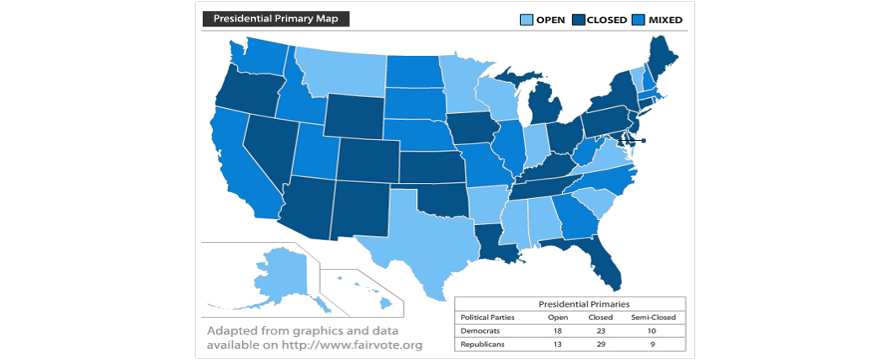
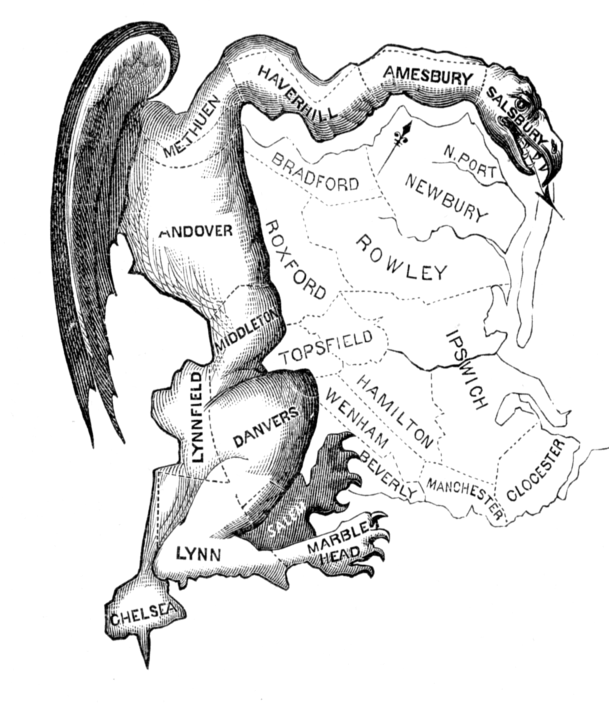

```{r preamble, child = here::here('preamble.Rmd')}
```


---
## Looming Deadlines 

- Chapters

- .bold[Exam 2]

???
So as the plan stands currently we will not have class on March 11th. Depending on how we much we get through today We will do media either thursday or next tuesday. Than depending on that we will do exam 2 review either in person tuesday or I will post a recording of me doing the review. Either way we won't have class March 11th. I am sure you guys have plans to take a much needed break plus my dad is coming into town so I also have plans to start off break.

To do some cleanup from last class. I mixed up sociotropic voting and pocketbook voting. I have had post comps brain and I am starting to come down from it

Sociotropic voting is assesing the overall economic performance of the nations


Pocketbook voting: is how well you are doing fincancially 

We  tend to be sociotropic voters because we can start to justify why our finances are doing bad. Our boss sucks, we overspent our budget a bit. Things of that nature. 


---


---
class: center, middle, inverse

# Campaigns and Elections 


---


---
## Primary vs. General Election

.hiro-red[Primary Elections]: An election conducted within a party to select its nominee for the general election

.hiro-dark-blue[General Election]: An election between two parties to select a candidate for office

???
Back in the day think like pre-Nixon these things existed. But more in the sense that they were there to placate the unwashed masses. Back in the day party elites would choose the presidential candidates they thought. You had to work your way up in the party be drinking buddies with the right dudes be a dutiful member of the party you may be selected to be your parties candidate for president

---

---
## Primary Elections

.bold[Types of Elections]:
  - Caucus
  - Primary

The type of contest that each state has depends on state laws and party rules
  - Some states even have both types of contests


.footnote[[1]:  [This](https://www.youtube.com/watch?v=_S2G8jhhUHg) is a good video for how wild this process can be]
???


Washington has both 


In practice this gets very confusing and delegates are awarded in a variety of ways and each party has some a way of putting their thumnb on the scale 

superdelegates are the democrats way of doing it: they are party elites that can basically vote for whoever 


delegates in GOP conventions are usually unbound after the first round of voting. Meaning they can start voting for whoever they want 
---


---
## Types of Primaries 


.vero-red[Primary Election]: A type of election where voters cast secret ballots for the candidate they want to represent their party in the General Election

.vero-blue[Caucus Convention]: A system of local gatherings where voters decide which candidate to support and select delegates for nominating convention

???
Caucus- A meeting of party leaders

Caucuses occur in a variety of places including libraries and schools, and even people’s living rooms

This occurs on one day, at a given time, and can last for HOURS

Caucus goers don’t just vote for a candidate. They debate issues that are important to the party as well as about the candidates themselves. This is done to try to persuade others to support your preferred candidate and issue

Voting takes place in a variety of ways, from standing in certain groups to raising your hand, but is always done publicly


---

---
## Tl;DR

```{r}
primary_ca = tibble::tribble(~' ',~Caucus, ~Primary,
                             "Voting Method", "Voting is conducted at local party meetings by raising hands or breaking into groups", "An election is held by secret ballot", "Who Can Vote", "Only members who physically attend the local party meeting can participate", "Depends on Open, closed, or semi-closed primary rules",
                             "States That Do it", "Only members who physically attend the local party meeting can participate
Alaska, Colorado, Hawaii, Kansas, Maine, Minnesota, Nevada, North Dakota, Wyoming, and Iowa", "Pretty Much Everyone Else")

gt::gt(primary_ca) %>% 
  gtExtras::gt_theme_538()

```

---

---
## Primary ELection Voting Rules 

.bold[Closed]: People may vote in a party's primary only if they are registered members of that party. Independents cannot participate.

.bold[Open]: A registered voter may vote in any party primary regardless of his own party affiliation

.bold[Semi-Closed]: As in closed primaries, registered party members can vote only in their own party's primary. However it allows unaffiliated voters to participate as well.

.bold[Run-Offs]: In some states, if neither candidate receives a majority vote (50%+1) then the two candidates must face each other in a run off.

???
Two-round system, a voting system used to elect a single winner, whereby only two candidates from the first round continue to the second round, where one candidate will win.

If you think back to the georgia senate runoff. Theoretically Senator Warnock could have won 50.1 percent of the vote and we wouldnt have gone to the january portion of the election. 

---


```{r}

```
---


---
## Primary Elections

Generally turnout is low in primaries and this doubles for caucuses. Why?
  - Rules vary on who can participates
  - Uninformed voters lack the cues they rely on 
  - Primary rules are often complex and not well understood
  
What effects does this have on primary elections?
  - Candidates tend to be more extreme

---


---
## Effects of the Current System 

1. More Candidates Run
2. Frontloading 
3. Campaings are longer
4. Campaigns are more expensive
5. Power fo the Media(Horserace coverage)

???
Way more people run- remember before, candidates had to work their way up the party structure, be beholden to party bosses, now they can have less political experience- also, many candidates who may not be the most popular in their party, but are very popular with the public will now run- that opens the field to a lot more people.

The early primaries are the most important- why? B/c candidates that win in the early primaries (Iowa, N.Hampshire, etc) often do much better overall- have a higher chance at capturing the nomination- b/c they can gain momentum (candidates get much more attention from the media, are able to raise a lot more money, are perceived by voters in other states to be more viable, get a lot more attention). Because the early primaries are so important, candidates spend a lot of time with those states (ex. Iowa, eating in pancake House, etc)- so states try to have primaries early to increase their importance on the nomination process.


 Campaigns are much longer now- example- look at the candidates now- many announced and started campaigning a full 12 months before the first primary, over a year and a half before the election- that is a SUPER long campaign. Candidates, like Clinton, have had offices in Iowa and N. Hampshire for over 1 year now- already on the campaign trial in early primary states. *states are making primaries earlier and earlier to draw candidates to them.

 B/c its so long, campaigns are VERY expensive- require several hundred million dollars to be competitive for the presidency now- in many cases the thing that keeps candidates in the race is their money - remember Kerry was behind in the polls going into the first few primaries, he had to mortgage his house to keep going- made the money back once he won the nomination, but it takes a lot.

Media coverage- media is crazy with primaries now- already telling us who is ahead, who is more popular, polling voters, etc. (horserace) – Contributes to how people vote in primaries….people want to vote for “winner”


---

---
## Who Votes When?

2020 Primary/Caucus Schedule 

- .bold[Frontloading]: Process whereby states schedule their primaries earlier in the year

- .bold[Bandwagon effect]: When people support a candidate because “everyone else does”


- Candidates who win early primaries are inclined to win future primaries because of the bandwagon effect; people view this candidate as the most successful

---

---
class: center, middle, inverse

# General Election

---

---
## General Election

- Officially Starts following the conclusion of the national conferences of both political parties 
  - National conferences are meetings held by both major parties to create the party platform and OFFICIALLY select the presidential candidates and their running mates

- Most voters, however, don’t really start paying attention to the election until Labor Day


---


---
## Electoral College

```{r}
knitr::include_url("https://abcnews.go.com/Politics/2020-Electoral-Interactive-Map/")
```


---


---
## Electoral College

- Article 2 Section 1

-   Details about Electors
  - Number of Electors per state
  - Qualification to be an Elector
  - The ACTUAL Elctions
  
- If no candidates wins a majority or there is a tie the vote goes to the House of Representatives
  
???
So when it comes to presidential elections, we do not directly elect our presidents. Instead, Article 2, Section 1 of the Constitution mandates that presidents be elected by an electoral college.

Elector Details
Number of Votes per State= The number of Representatives, plus the number of Senators

No one holding public office may act as an elector

Electors must submit votes to the President of the Senate, who counts the votes aloud in front of the House and Senate

Who is the president of the Senate?
Initially, the first place winner became president while the second place winner became vice president

Super awkward when the president and the vice president are from different parties
Solved with the 12th amendment

Now what happens if no-one wins a majority in the electoral college?

This does not mean that every representative gets to vote rather each state only gets one vote 
---


---
## Problems with the Electoral College 

1. Popular vote winner may lose the election
2. Contingency Problem 
3. "Constant Two"
4. Faithless Elector 


```{r}
vembedr::embed_url("https://www.youtube.com/watch?v=ZlwbTUs-17k")
```

???

In addition to the fact that the election may end in a tie, there are a number of problems with the electoral college. While each of these is a significant problem, they will all be discussed individually.

It’s important to keep in mind that ALL of these problems surfaced in the 2000 election.

It took 5 weeks to decide who had won the election

While early polls called the election in Florida for Gore (which both candidates needed to win), these polls were biased (they were collected wrong and in too many Democratic precincts)

Then came the re-counts

Finally, both candidate’s campaigns went to the Supreme Court, which stopped the recounts causing Bush to win the state

---


---
class:middle
## Problem 1

- Popular Vote Winner May Lose in the Electoral College
  - 1876
  - 1888
  - 2000
  - 2016

- Why does it happen?
  - Winner-take-all System

???
Why does it happen?

In all states, except Maine and Nebraska, the winner of a plurality of the vote, they receive all of that states electoral votes.

TX example: Whoever wins more of the popular vote than any other candidate receives all 34 of the states vote
Nebraska and Maine award candidates 1 electoral vote to popular vote winner in each district and then give their two remaining votes to state-wide popular vote winner

Why is it a problem?
This is particularly problematic for voters in the minority of each state (ex. Democrats in GA)

This is also a problem when the majority of Americans vote for someone else. While it is highly unlikely, it is possible to win the electoral college with a remarkably small portion of the popular vote

---

---
## Contingency Plan Problem 

- It isn't great
  - Each state only gets one vote
  - Only the House of Representatives gets to votes
  - Each delagate from each state must agreee on the vote
  - If there is a tie the VPOTUS is the tie breaker
  
???
While this is technically a thing that could happen it is not really going to 

Only 1 vote per state- so now it doesn’t matter if you come from California or North Dakota- you have the same influence on the election.

Only involves the house- no senate, so involves 435 people out of 300 million.

Since each state only gets 1 vote- what happens if state is split with its delegates (half dems., half rep.- like AZ is now- 4 and 4)? Within the state delegation or within the House itself, there may be a politically brokered deal- VERY undemocratic.

If there is no clear majority (very possible b/c while 1 party may hold the majority- that may be b/c of a few states) and there is a tie, the Vice President breaks the tie- b/c designated in Constitution to break ties (problem w/ Al Gore in 2000). 

This was a major concern in 2000 b/c the House would have been close (b/c so many Republicans came from a few states) so Gore would have had to break the tie- not really a good plan- may have resulted in political brokering like in 1824- although we mostly assume now it would be a straight party line vote. 

Remember in 2000 there were questions about the counting (hanging chads have a problem with machines- so machine recount was certified, but FL S. Court said their could be a hand recount in 3 counties- S. Court said no (b/c would have taken too long to recount by hand by time electoral college had to meet)
So essentially a Constitutional Crisis in 2000- need a new Plan!

---


---
## "Constant Two"

What is it

- $\text{Electoral College Votes} = \text{House Reps} + \text{Senators}$

- Citizens from small states have relatively more representation in the electoral college than their couterparts from large states


???
After 2, explain how small state citizens get relatively more vote than those in large states
ex. 

Wyoming = 504,294 people- in most states 1 district has approximately 640,000 citizens- but those 504,000 get 3 electoral votes, 

while in a big state like CA, every 640,000 get 1 vote and the extra 2 are dispersed among 54 districts and 34,132, 147 people (as of 2005). 

After #3- put up colored slide of 2000 & 1992 elections- show how candidates can win elections by carrying some small states and the South- since 1960’s- this is critical for Republicans. 

-So- in other words its important b/c small states can impact election if candidate wins a lot of them.

idaho = 1.87

utah 3.2

new mexic = 2.111

colorado = 5.7


wyoming  = 500,00

montana = 1.00

north dakota = 700,00

South Dakota = 888,894

nebraska = 1.934

kansas = 2.913

okalhoma = 3957000


1870000 + 3200000 +2111000 + 5700000 +1000000 + 700000 +888894 + 1934000 + 2913000 + 3957000 = 24,273,894
---

---
## Faithless Electors 

- What are they?
  - Few states have laws requiring electors to vote the way the population voted

- Why is it a problem?
  - Especially during a controversial election, like 2000, an elector may change his or her vote, altering the election


???
SO there are few laws (and those are usually fines) requiring electors to vote the way that they are supposed to, based on the popular vote. *However, electors selected by parties, usually very loyal.

*In fact 1 elector from DC abstained from voting in 2000 election- but was more of a concern in 2000 b/c of the close election and b/c so controversial.

Problem because if an elector or electors alter the course of the election, there is little recourse- pretty big deal, all those millions of votes not counting, etc. 

---


---
## Why is this still a thing

- Constitution

- Small States

- Political Parties 

???
So why do we keep the college if it is so problematic and in some ways undemocratic?

3 big reasons:

Constitution is hard to change- 2/3 votes in house, ¾ states have to ratify it.

Small states have a big incentive to keep it b/c it gives them more political power (otherwise candidates would NEVER come to their states)

Parties want to keep it b/c winner take all system keeps 3rd parties out (explain)

---


---
## Duverger's Law

- Imagine an election with three parties

- Two big parties and a third smaller party

- Context: First past the post system


???
Essentially Duverger's law argues that in first past the post systems there will likely only be two parties.
 
  So think of a congressional district in the United States there is a limmited set of voters to compete over. You have the democratic party and the Republican party. Then we have the party that you guys created competiting in that same election.

 Your party may represent that salient issue perfectly but either the democratic or republican party represents that issue imperfectly but other issues better than that party.
 
You the voter knows that one of the larger parties will likely win but will not have that interest perfectly represented. You do not want to waist your vote so you choose the big party.
---

---
class: center, middle, inverse

# Election Rules


---


---
layout:false

```{r}
vembedr::embed_url("https://youtu.be/rHFOwlMCdto")
```


---

---
## Gerrymandering 

.pull-left[

```{r}

```

]


.pull-right[
<gsu-blockquote-red>

The process in which district lines are redrawn to benefit specific political parties, protect incumbents, or to change minority proportions for representation


</gsu-blockquote-red>
]

???

The word gerrymandering is a portmanteau

the word was created in reaction to a redrawing of Massachusetts Senate election districts under Governor Elbridge Gerry, later Vice President of the United States. Gerry, who personally disapproved of the practice, signed a bill that redistricted Massachusetts for the benefit of the Democratic-Republican Party. 

When mapped, one of the contorted districts in the Boston area was said to resemble a mythological salamander. Appearing with the term, and helping spread and sustain its popularity, was a political cartoon depicting a strange animal with claws, wings and a dragon-like head that supposedly resembled the oddly shaped district.
---

---
## Types 

.bold[Partisan]: When state legislature draws district lines to favor members of a political party

.bold[Incumbent]: When the state legislature draws district lines to keep party incumbent in office 

.bold[Racial]: When state legislature draws district liines to advantage or disadvantage specific racial groups


---


---
## Try it out 

```{r}
knitr::include_url("https://projects.fivethirtyeight.com/redistricting-maps/georgia/")
```

---

---
## Gerrymandering Strategies 

- .bold[Cracking]: Diluting the voting power of the opposing party's supporters across many districts

- .bold[Packing]: Concentrating the opposing party’s voting power in one/a few districts to reduce their voting power in other districts


???
Electoral maps can and should be redrawn to reflect the underlying population trends however the problem. However the problem is that these lines are drawn more strategically. The ease of this is pretty remarkable. 

All you really need in census tract level data. I didnt actually want to go through the trouble of getting that data. But like it isn't hard to find and then code up. The census has an API that  you can use to download the data it produces and then if you would maybe need precint level data and then just wrangle the data a bit. 

---


---
## Midterm Voting Behavior 

Presidential popularity

Health of the economy

International issues

District composition

Redistricting


???
The number of seats that the president’s party loses varies significantly from election to election. These 5 indicators help us predict how severe the party’s loses will be. We’re going to discuss these indicators in a little bit more detail, so just write them down for now.

---


---
## Midterm Voting Behavior

- Presidential Popularity
  - Higher popularity generally means lower seat losses
- Economic Conditions
  - Better economic conditions generally mean lower seat losses
- International Issues
  - Exceptional international conditions generally mean lower seat losses
- District Composition
  - Competitive districts generally end in greater seat loss
- Redistricting
  - In the event that favorable redistricting has occurred since the previous election, the president’s party may have a slight advantage in midterm elections

???
Midterm elections are often considered a referendum on presidential performance on different issues- people can’t vote for or against the president, so they may vote for or against his party (b/c they don’t know very much about their representatives, so tend to vote for or against presidents’ party because they know about him)

Higher presidential popularity therefore leads to less seat loss- 

Also- remember people vote sociotropically  (ask class: what does that mean?)- so when the economy is bad, people vote against president’s party.

The thing that can counteract the effect of bad economy is exception international conditions (like war in Iraq)- example: 2002 economy not going well, but people perceive the terrorist attacks to be the reason for that and the presidents’ party actually picked up seats during the election.

So in predicting where the presidents’ party will lose seats- a big part is district competition- over 80% of house seats are not competitive- many do not even have challengers, but if they are competitive (large numbers of republicans and democrats) presidents’ party may pick up seats during presidential elections, and these are the first to go to the opposite party.

If there has been redistricting since the last election, usually to favor which ever party has been in power in the state legislatures- that will impact which seats are lost- ex. Redistricting in IL in 2000- political brokering led to a Democrat losing a district and the other districts becoming safer = less likelihood of loss for Rep. in those districts. 


---


---
## Theories of Midterm Voting Behavior 
Why do citizens vote against the president’s party in midterm election?
- Negative vote
- Checks and balances
- Strategic politicians


???
Negative Vote Theory

We’ve already discussed this, voters want to punish the president for bad economy, etc

Punish or reward president (more often punish) for things he’s done
Ex. Low approval of Iraq- voters may have wanted to punish president Bush in 2004 for the Iraq War, but they couldn’t because he wasn’t up for re-election. So they punished his party at the polls, instead.

Checks and Balances

Voters have a need to balance the power of the president by electing members of the opposition party

Voters believe that presidents’ had too much power since his election with a Congress of the same party, try to balance it by electing members of the opposition party

Problem with this?- voters probably don’t think in these terms about government or their vote. 

Most popular theory- Strategic politicians theory that 

Strategic politicians wait until they have a good chance at winning to throw their money at races and run quality challengers (Wait until popularity is low, economy is bad, no exceptional IR conditions, run in mixed districts)- explain what each of these mean

This is the most popular theory b/c we know that politicians are elites, parties are well oiled machines, and they are strategic thinkers- Quality challengers (popular, with money) will maximize their likelihood of winning by only running when conditions are right. 

---

---
## Challenges to Campaigning

- Campaign strategies that work in one place might not work in others. Members of Congress must develop a “home style” that meets the expectation of district voters

- Metropolitan v. Rural Districts
- Liberal areas v. Conservative Districts
- Richer v. Poorer Districts
- Homogenous v. Heterogeneous Districts


.footnote[[2]: Link to summary of study [here](https://www.vox.com/policy-and-politics/2017/9/28/16367580/campaigning-doesnt-work-general-election-study-kalla-broockman)]
???
We don't really spend a ton of times on campaigns. From what I gather the American Politics literature has generally found that campaigns don't really matter. By that I mean they don't find a lot evidence that people are all that persuaded or change their minds due to campaigns
---


---
## Campaign Strategy

- Campaign Manager
  - Responsible for the overall strategy and planning in a campaign organization
  - Responsible for making a number of decisions for campaigns

- Field Workers
  - Help with the smaller campaign duties
  - Play an important role in maintaining the positive image of the candidate
  
- Debates

- Stump speeches and rallies

???
The first major actor in a political campaign is the campaign manager

The campaign manager is responsible for the overall strategy and planning in a campaign organization

They are responsible for making many of decisions about the activities that campaigns will actually donate resources towards. They make decisions like:

Should the candidate wage an aggressive attack on their opponent?- This is frequently referred to as “going negative”

What should the theme or slogan of the campaign be?- In 2000, the Bush campaign’s theme was “compassionate conservatism”

What issues should be stressed?- In 1992, Clinton stressed the role of the economy and taxes (ie. “It’s the economy, stupid”)

How much money should be spent on TV/Radio/Newspaper advertisement?

What goes into advertisements?

Next are field workers

These are frequently volunteers (especially college students) who help perform many of the smaller duties of a campaign. These duties include:

Ringing doorbells

Manning phone banks

Hanging up signs

As representatives of the candidate, field workers strive to maintain the positive image of the candidate at all times


Turning to another important aspect of political campaigns, events play a fairly significant role in campaigns

Debates are some of the most high profile events that candidates will engage in
They allow candidates to come together and discuss issues publically
They has been included in every election since 1976
Their primary role is to influence undecided voters

Stump Speeches and Rallies are another prominent way that candidates attempt to persuade and engage with voters

Often given to specific interest groups, usually to encourage turnout amongst specific populations

Candidates tend to focus these appearances on key swing states
These are less about persuading voters to support a candidate, rather than trying to generate enthusiasm


---

---

```{r}
vembedr::embed_url("https://www.youtube.com/watch?v=Y_zTN4BXvYI")
```


---

---
## Notable Negative Campaign Ads

- [Daisy](https://www.youtube.com/watch?v=dDTBnsqxZ3k)
- [I'm Just Like You](https://www.youtube.com/watch?v=uxJyPsmEask)
- [Look at this Face](https://www.youtube.com/watch?v=ODfUOnw2x0g)
- [Swiftboat](https://www.youtube.com/watch?v=phqOuEhg9yE)
- [#TheseHands](https://www.youtube.com/watch?v=zkXDQ4l0Uhc)
- [America](https://www.youtube.com/watch?v=LIZW5trdE5o)
- [Squel](https://www.youtube.com/watch?v=zc8uLuHsNw0)
- [Got Ball?](https://www.youtube.com/watch?v=8Gl7xcy8ILU)
- [Role Models](https://www.youtube.com/watch?v=mrX3Ql31URA)


???
Negative campaign ads work in the sense that they are likely to inform people about policy positions of various candidates and are good at depressing turnout 
---
