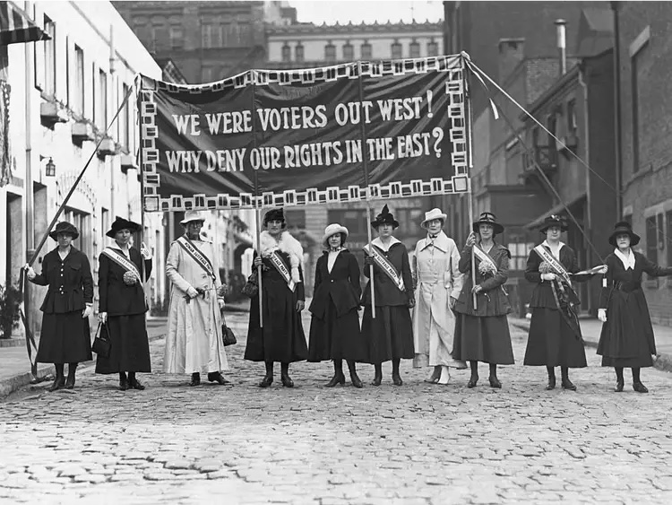
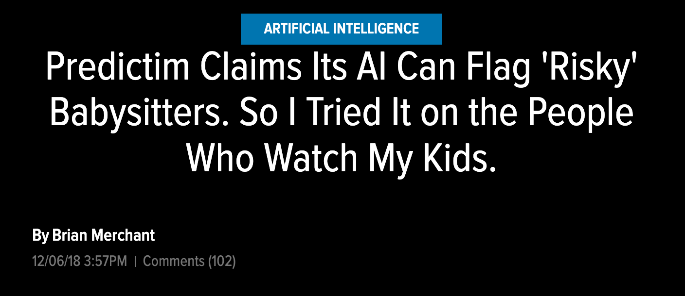

```{r preamble, child = here::here('preamble.Rmd')}
```


---
## Looming Deadlines

.bold[April 10] is the _last_ chance to submit NCCHR


???
Cards on the table scholars. Today will likely be unjustly short. I tried my best to supplement some of the information in the textbook. The portion of the textbook that covers other civil rights activism by historically excluded groups was incredibly short. To the point where I started ranting about it. Last class I dedicated maybe a minute or two to reconstruction. This is perhaps one of the most interesting periods of history to study because and something that I have been learning more about. It is also hard for me to give fair treatment to all of these fights. This is due to a grievous lack of knowledge and also because we are compressing entire scholarly careers into one chapter broadly labeled civil rights. We sort of teach these movements as exogenous shocks to the U.S. political systems when many activists put in work to build momentum


---


---
class: center, middle
# Gender Discrimination 

---


---
## Womens Suffrage  

<center>

<gsu-blockquote-alt>

All men would be tyrants if they could…If particular care and attention is not paid to the ladies, we are determined to foment a rebellion…we will not be bound by any laws in which we have no voice or representation…” 
</center>
`r tufte::quote_footer('--- Abigail Adams')`

</gsu-blockquote-alt>

???
The fight for woman's suffrage starts very early on. The sentiment expressed by Abigail Adams was reflective of a big sentiment at the time

In a letter dated March 31, 1776, Abigail Adams writes to her husband, John Adams, urging him and the other members of the Continental Congress not to forget about the nation's women when fighting for America's independence from Great Britain.

The future First Lady wrote in part, "I long to hear that you have declared an independency. And, by the way, in the new code of laws which I suppose it will be necessary for you to make, I desire you would remember the ladies and be more generous and favorable to them than your ancestors. Do not put such unlimited power into the hands of the husbands. Remember, all men would be tyrants if they could. If particular care and attention is not paid to the ladies, we are determined to foment a rebellion, and will not hold ourselves bound by any laws in which we have no voice or representation.“ She threatened him with rebellion! He responded in a very Rousseau-ian way, telling her that everyone knows women are the more powerful sex, as they rule the home and are able to manipulate their husbands….wtf John Adams


---


---
class: center, middle 
layout: false 

.pull-left[

```{r}
vembedr::embed_url("https://www.youtube.com/watch?v=TcYhuG1y3bc")
```

]


.pull-right[
```{r}
vembedr::embed_url("https://youtu.be/eUdxsQ0Qsrc?t=14")
```
]

---

---
## Women's Suffrage Movement 


.pull-left[

```{r}

```

]

.pull-right[
- Seneca Falls Convention July 1848

- Wyoming extends the franchise to woman 1869

- National American Woman Suffrage Association Formed 1890

- $19^{th}$ Amendment July 1920 ]


???


The Seneca Falls Convention kicks off the First wave of feminism and what many consider the start of the suffragist movement. Of the 200-300 members of the Seneca Falls convention there was only one member of the convention who was black. Frederick Douglas saw the issue of womens suffrage and abolition as intertwined. 

Douglass, Staton, and Susan B Anthony would eventually form the American Equal rights Association to push for universal suffrage. However, the question of the 15th amendment starkly divided this organization leading to its dissolution just 3 years later. The suffragist movement would start to reframe women's suffrage as a white women's issue. Staton and Anthony would frame black men as gaining the rigth to vote over white woman in about as racist ways as you could.

However, it is important to note that woman like Sojourner Truth and Jarena Lee were critical figures in the woman's rights movement in the United States. However their contributions to the movement would quickly be erased. 

Western states lead the charge in woman's suffrage with women getting the right to vote as early as 1869. Many states would pass some form of women's suffrage in subsequent years due to this activism. The only states not to have some form of women's suffrage any where were Alabama, the Carolinas, WV, VA, MD, and PA

However, the fight for universal suffrage would continue. Activists like Ida B Wells was a life long activist set up suffrage clinics to prepare black people for what to expect when they went to vote. Figures like Fannie Lou Hammer would take up this tradition organizing registration drives and speaking  

---


---
## Additional Laws

- Equal Pay Act 1963

- Title VII Civil Rights Act 1964


- Title IX of the Federal Education Act of 1972

- Lilly Ledbetter Fair Pay Act of 2009


???

Important advances on the legal front were the equal pay act which was the first attempt at outlawing employers paying women less. Title 7 of the civil rights act makes discrimination on the basis of sex illegal.

The stated goal of Title IX stated that colleges could not be excluded from any collegiate activity

Title IX is also a pretty landmark inclusion. Title IX affects any campus that receives federal funds of any kind. So basically the majority universities in the United States whether we are talking about financial aid or federal grants for research. Annually Colleges and universities receive around a trillion dollars in funding. Title IX allows the federal government to withhold money if schools are not in compliance.


There are two sort of prongs. The first prong is something you should all be aware of.

Initially Title IX was used to ensure equal opportunities in athletics but by the 90's it expanded to sexual violence. However, the implementation of this expansion could best be described as haphazard, uninterested in enforcement, and even hostile towards reporting. It was not until the Obama administration through a non-binding directive. The directive would change under the Trump administration relaxing punishments for perpetrators.  
---


---
## LGBTQIA Rights

- Stonewall Riots (June 28 – July 3, 1969)

- AIDS Coalition to Unleash Power (ACT UP) Forms (March 12, 1987)

- Defense of Marriage Act (1996)

- "Don't AsK Don't Tell" (1994)

  - Official policy of the US military that prevented military personnel from asking about sexual orientation of members or applicants to the US military 
  - Prevented overt discrimination and exclusion from military service 

- Oberfell v Hodges (2015)

???

The stonewall riots were a series of spontaneous demonstrations by members of the gay community in response to a police raid that began in the early morning hours of June 28, 1969, at the Stonewall Inn in the Greenwich Village neighborhood of New York City, New York, United States of America. Patrons of the Stonewall, other Village lesbian and gay bars, and neighborhood street people fought back when the police became violent. The riots are widely considered a watershed event that transformed the gay liberation movement and the twentieth-century fight for LGBT rights in the United States. 


During the 80's the gay community in particular was devastated by the AIDS epidemic. By early 1987, with the U.S. death toll topping 40,000  had already died. Yet the budget for AIDS research was a fraction of what the U.S. government spent on diseases that were far less threatening. In 1987 activists fed up with the lack of government response to the epidemic formed ACT UP. Through a long struggle these activists successfully managed to get accelerated approval for experimental drugs. In addition to the immediate response from the FDA a portion there is a special portion of the NIH's budget specifically allocated for HIV research


The policy prohibited people who "demonstrate a propensity or intent to engage in homosexual acts" from serving in the armed forces of the United States, because their presence "would create an unacceptable risk to the high standards of morale, good order and discipline, and unit cohesion that are the essence of military capability Repealed in 2011

DOMA - United States federal law that allows states to refuse to recognize same-sex marriages granted under the laws of other states.

The court invalidated the Defense of Marriage Act, which denied federal benefits to gay couples who are legally married in their states, including Social Security survivor benefits, immigration rights and family leave.

Justice Anthony Kennedy, writing for the majority in a 5-4 decision, said that the act wrote inequality into federal law and violated the Fifth Amendment’s protection of equal liberty.

Georgia Constitutional Amendment 1[1] of 2004, is an amendment to the Georgia Constitution that makes it unconstitutional for the state to recognize or perform same-sex marriages or civil unions. The referendum was approved by 76% of the voters.


Than we get Oberfell v Hodges which extends the the protections of the 14th amendment to sexuality basically.

Work place
Federal Law

 The Supreme Court ruled in 2020 that a landmark civil rights law protects gay and transgender workers from workplace discrimination, handing the movement for L.G.B.T. equality a long-sought and unexpected victory.


However up until than this was not thee case. Almost half the states and the District of Columbia have laws that currently prohibit sexual orientation discrimination in both public and private jobs: California, Colorado, Connecticut, Hawaii, Illinois, Iowa, Maine, Maryland, Massachusetts, Minnesota, Nevada, New Hampshire, New Jersey, New Mexico, New York, Oregon, Rhode Island, Vermont, Washington, and Wisconsin.
In addition, a few states have laws prohibiting sexual orientation discrimination in public workplaces only.


---


---
.pull-left[

```{r}
vembedr::embed_url("https://youtu.be/zm5QVcTI2I8?t=421")
```

]


.pull-right[


Affirmative Action: Programs by employers or schools aimed at favoring individuals belonging to groups with a history of discrimination.

- Regents of the University of California v. Bakke (1978)
- Fisher v. University of Texas (2016)


]
---

---
## Bias 


```{r}

```


???
one thing that I was left with is what else to discuss so I figured we should start with ways in which bias is perptuated by accident. This was one of lectures in my quant class.


Lots of stuff we interact with today whether it is your social media feed your google, netflix etc uses what you know as the algorithm. These are just models that take in a ton of data on you and people like you in order to make the best prediction about what people like you watch or want. 

In this case this company was trying to asses how "risky" babysiters were. If you are the parent of a child you would probably think that this is pretty important. 

in this article they found that the algorithm returned systemically lower scores for black baby sitters versus white babysitters 

Typically in these models you have a training set of data and what is known as a test set of data. You collect some data you get the model to look at it and see how well it does. Than you unleash it on the test set of data and than see if the model is worth anything. 

The problem with this is that what the model gets trained on is subject to our own systemic biases.

AI experts have found lots of training data was collected and hand coded. Meaning that I look at a sentence and determine what the vibes are. You may have some coding rules that help you determine what you should code it as. In the case of predictim there were validation checks by human reviewers built in. However, while the CEO of the company ensured the reporter in the story knew that reviewers went through extensive bias training. However, through the course of these reviews candidates with very similar social media feeds were assigned differently in many cases. Black women in particular were over penalized compared to white people. 

The model is dependent on good training data. The numbers in the spreadsheet are not in of itself racist. Nor is the algorithm racist. Barring a programmer setting an argument to make it so it is basically just a math equation. However the processing and data collection itself can be inherently biased. This can be because of implicit biases of the coder about what consitutes hostility in their speech or how the data is generated. Lots of judges use or used algorithms that set bail based on the characteristics of the offender. One prominent example of this problem was the algorithm was trained on historical prison data. 

What do you think would be a pretty good historical predictor long prison sentences?

The sort of motivation behind this rant is to say that we see lots and lots of news about the extent to which we are trying to relegislate bias. We have talked about voter id laws which disproportionatly impact historically excluded groups. While these are undoubtedly important 

---


