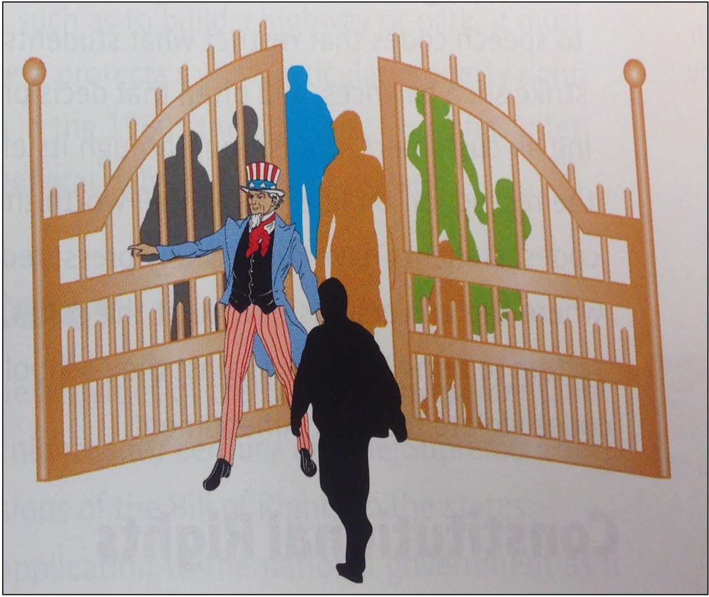

```{r preamble, child = here::here('preamble.Rmd')}
```


---
## Looming Deadlines

.bold[April 10] is the _last_ chance to submit NCCHR

---


---
## Civil Rights

.pull-left[

```{r}

```


]


.pull-left[

The rights that protect individuals from discrimination by other individuals and government. 

These protections are applied to the federal government, and are applicable to the states through incorporation under the 14th amendment Equal Protection clause. 

“Nor deny to any person within its jurisdiction the equal protection of the laws”


]


???
Gate analogy: Once again here is the mass populace of people. Here is the government. The gate here stands for civil rights. In this case the government is opening the gate to people that prior to now/then had been denied such rights and freedoms. 

The fight for civil rights spans races, social classes, gender, sexual orientation, religions, political affiliations, ages, disabled, and even veterans. All of these protected classes of individuals have at some point fought for the equality of rights related to the duties of citizenship and opportunities for participation in civic life. 

Most often the expectation or right that is wanted by these individuals is the right to vote. 

---


---
## Types of Discrimination 


.pull-left[

### Public Discrimination 

- Discrimination by national, state, or local governments

- Prevented by the equal protections clause of the $14^{th}$ Amendment
]

.pull-right[

### Private Discrimination


- Discrimination by private individuals, social groups, or businesses. 


- The 14th Amendment cannot  directly protect individuals from private discrimination 


- The Court has used its authority to broadly protect individuals  from this type of discrimination 


]

---
