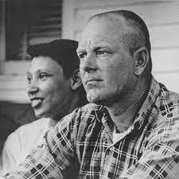
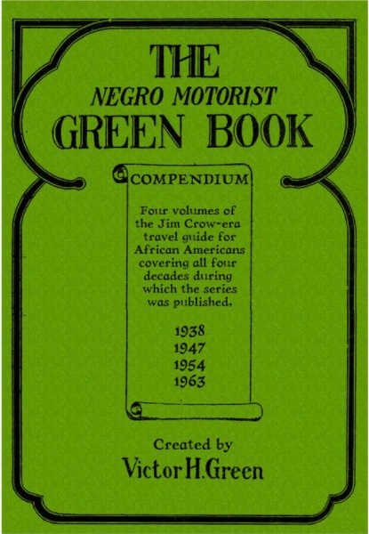
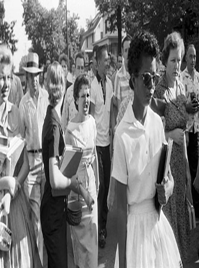
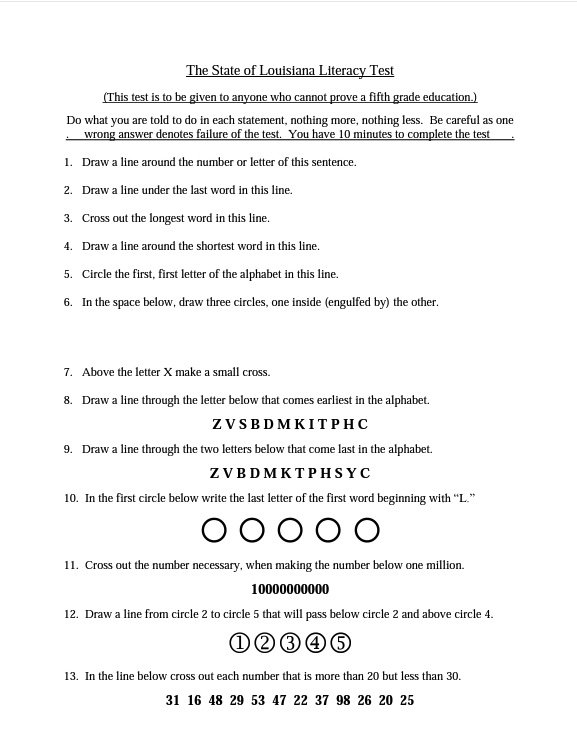

```{r preamble, child = here::here('preamble.Rmd')}
```


---
## Looming Deadlines

.bold[April 10] is the _last_ chance to submit NCCHR

---

---
## Two Dates 

.pull-left[

```{r}

```


]


.pull-right[
- Loving v Virginia Decided June $12^{th}$ 1967


- June $11^{th}$ 1967]


???
Many of you have gone and done the NCCHR assignment and many of you will do so in the next week or so. One thing that still strikes me is the recency of it all. Does anybody know the case of Loving v Virginia?

Mildred Delores Loving was the daughter of Musial (Byrd) Jeter and Theoliver Jeter. She self-identified as Indian-Rappahannock, but was also reported as being of Cherokee, Portuguese, and African American ancestry. During the trial, it seemed clear that she identified herself as black, especially as far as her own lawyer was concerned. However, upon her arrest, the police report identified her as "Indian".

Richard Perry Loving was a white man, the son of Lola (Allen) Loving and Twillie Loving. Their families both lived in Caroline County, Virginia, which adhered to strict Jim Crow segregation laws, but their town of Central Point had been a visible mixed-race community since the 19th century. The couple met in high school and fell in love.

Mildred became pregnant, and in June 1958, the couple traveled to Washington, D.C. to marry, thereby evading Virginia's Racial Integrity Act of 1924, which made marriage between whites and non-whites a crime. A few weeks after they returned to Central Point, local police raided their home in the early morning hours of July 11, 1958  hoping to find them having sex, given that interracial sex was then also illegal in Virginia. When the officers found the Lovings sleeping in their bed, Mildred pointed out their marriage certificate on the bedroom wall. They were told the certificate was not valid in Virginia

Their marriage was illegal because in Virginia and many parts of the South interracial was illegal. However, in a 9-0 decision the U.S. Supreme court ruled in favor of the Lovings. This made bans on interracial marriages unconstitutional. 
Just the day before Thao Nguyen had given birth to my mom in Saigon. My mom and her family would leave Saigon in 1975 and would settle in the San Francisco Bay Area. She would meet a white man named Tim sometime 1992 and would be wed in 1993. At that time interracial marriage had only been legal federally for 26 years.  


---


---
## Civil Rights

.pull-left[

```{r out.width="80%"}
knitr::include_graphics("images/civil_rights_gate.jpg")
```


]


.pull-right[

The rights that protect individuals from discrimination by other individuals and government. 

These protections are applied to the federal government, and are applicable to the states through incorporation under the 14th amendment Equal Protection clause. 

“Nor deny to any person within its jurisdiction the equal protection of the laws”


]


???
Gate analogy: Once again here is the mass populace of people. Here is the government. The gate here stands for civil rights. In this case the government is opening the gate to people that prior to now/then had been denied such rights and freedoms. 

The fight for civil rights spans races, social classes, gender, sexual orientation, religions, political affiliations, ages, disabled, and even veterans. All of these protected classes of individuals have at some point fought for the equality of rights related to the duties of citizenship and opportunities for participation in civic life. 

Most often the expectation or right that is wanted by these individuals is the right to vote. 

---


---
## Types of Discrimination 


.pull-left[

### Public Discrimination 

- Discrimination by national, state, or local governments

- Prevented by the equal protections clause of the $14^{th}$ Amendment
]

.pull-right[

### Private Discrimination


- Discrimination by private individuals, social groups, or businesses. 


- The 14th Amendment cannot  directly protect individuals from private discrimination 


- The Court has used its authority to broadly protect individuals  from this type of discrimination 


]

---

---
class: center, middle 

```{r}
vembedr::embed_url("https://www.youtube.com/watch?v=1suZiTIq3XI")
```


---


---
## Suspect Class


.pull-left[

<gsu-blockquote-red>

Any classification of groups meeting a series of criteria suggesting that they are likely the subject of discrimination. These groups generally have strict  or intermediate (if considered quasi-suspect) scrutiny applied to them

</gsu-blockquote-red>

]


.pull-right[
###  Criteria 

- The group has a history of being discriminated against or has been subject to prejudice, stigma, or genuine hostility 

- They are powerless to protect themselves via the political process. 

- They possess a highly visible and immutable trait, that does not inhibit them from contributing meaningfully to society 

- .bold[Protected Classes]: Race, Color, Age, Sex(orientation and gender identity), Pregnancy, Familial Status, Disability, Veteran, and pre-existing medical conditions

]


???

Is a class or group of persons meeting a series of criteria suggesting they are likely the subject of discrimination. These classes receive closer scrutiny by courts when an Equal Protection claim alleging unconstitutional discrimination is asserted against a law, regulation, or other government action, or sometimes private action.

Basically, race discrimination is treating people differently based on their ancestral or cultural characteristics.

Color discrimination is treating people differently based on their skin color, but can occur between persons of different and/or the same race.
---

---
class: center  


```{r}
df = tibble::tribble(~Test, ~Application, ~`Suspect Status`, ~`Standard Used`,
                     "Strict Scrutiny", "Race, Ethnicity, Religion, and Citizenship", "Suspect Class", "Law is assumed unconstitutional in the absence of an overwhelming justification", "Intermediate Scrutiny", "Gender or Sexual Orientation", "Quasi-Suspect Class", "Law is assumed  unconstitutional unless the law serves a clearly compelling and justified purpose", "Rational Bias", "Age, Disability, Wealth, Political Preference, and Criminal Background", "Not suspect category", "Law assumed constitutional unless no sound rationale for the law can be provided")

gt(df) %>% 
  tab_header(title = "How Do Judges Make Decisions") %>% 
  opt_align_table_header(align = "center") %>% 
  gtExtras::gt_theme_guardian()

```

???
Strict Scrutiny – Is the most stringent standard of judicial review. It is how the Courts weigh the interests of the government against the constitutionality of a law.  The law is considered not to have a compelling government interest, that it is not the least restrictive it could be, and that it is too expansive (not narrowly tailored) to the interest the law is trying to prevent. 

To use strict scrutiny the class of people in question must have a history of discrimination and be considered “politically powerless”. 


---


---
## Historical Battles of Inequality 

.panelset[

.panel[.panel-name[Race/Ethnicty]


- African Americans

- Japanese Americans

- Japanese Americans
]

.panel[.panel-name[Gender]

- Women

- Sexual Orientation

]

.panel[.panel-name[Physicality]

- People with disabilities

- Age

]

]


---

---
layout: false


- _De Jure_ - Equal protection under the laws

- _De Facto_ - Equal access to opportunity & societal benefits

???
We talked about this quote from the Declaration of Independence on the first day of class, but what does it really mean?  Thomas Jefferson wrote this very phrase at the Second Continental Congress, but at the time he owned over 200 slaves at his plantation home in Virginia (Monticello). Even on his death bed he refused to free them. It is even believed that he had several illegitimate children by his slaves.  So what the framers actually meant was that all “Free White property owning men were created equal….” Thankfully we have moved past this and have eradicated almost all means of inequality under the law (de jure), but within society we still continue to struggle with De Facto discrimination. 


---


---
class: center, middle

# Racial Discrimination 


---


---
layout: false 

```{r}
knitr::include_url("https://lincolnmullen.com/projects/slavery/")
```


???
August of 1619 is the first recorded instance of slavery coming to the shores of Americas. For 250 years millions of people were enslaved by what was sometimes called a "peculiar institution" would shape the political landscape and economic landscape of the south.  The legacy of Chattel slavery has not only affected current political attitudes and voting behavior but the lasting impact of the Atlantic slave trade has impacted attitude formation in sub-Saharan Africa


---

---
## The American Civil War & Reconstruction

.pull-left[
### Some Dates from the Civil War

- Dred Scott v. Sanford(1857)

- The Civil War(1860-1865)

- The Emancipation Proclamation(1863)
  - Ended slavery in 10 Confederate States


???
Dred Scott – the Supreme Court Decision declaring that blacks could not be citizens and that Congress could not ban slavery in the territories.  At this time blacks were considered of an inferior order and that they had no rights in the American system.  

Lincoln avidly opposed the expansion and continuation of slavery as a part of his presidential platform. The abolition movement is support of people like Lincoln had spread their fingers throughout most of the northern states. It was Lincoln’s advocacy for the end of slavery that pushed the Southern states to secede from the Union and form the Confederate States of America beginning with South Carolina. The first of the states wrote their reasons for secession. South Carolina's is perhaps most famous but the state of Georgia stated


When Georgia seceded the declaration stated


The people of Georgia having dissolved their political connection with the Government of the United States of America, present to their confederates and the world the causes which have led to the separation. For the last ten years we have had numerous and serious causes of complaint against our non-slave-holding confederate States with reference to the subject of African slavery. They have endeavored to weaken our security, to disturb our domestic peace and tranquility, and persistently refused to comply with their express constitutional obligations to us in reference to that property, and by the use of their power in the Federal Government have striven to deprive us of an equal enjoyment of the common Territories of the Republic.

The prohibition of slavery in the Territories is the cardinal principle of this organization.

For forty years this question has been considered and debated in the halls of Congress, before the people, by the press, and before the tribunals of justice. The majority of the people of the North in 1860 decided it in their own favor. We refuse to submit to that judgment, and in vindication of our refusal we offer the Constitution of our country and point to the total absence of any express power to exclude us


1862 Lincoln issued the Emancipation Proclamation as an executive order. It freed all of the slaves within the Confederate states as of January 1 of 1863. This was the first broad proclamation of freedom, but ironically it would not free all the slaves in the United States since it only applied to the Confederate states.  Several of the states still in the Union (MD, DE, KY, WV, and MO) still had some vestige of slavery. 


The sort of popular memory of the causes of the civil war are known as the "Lost Cause" narrative where the reasons for secession was recasted to fit American cultural values namely "States rights" this proposition was not only contested at the time by Black newspapers covering the dedication of Confederate memorial, under considerable threat of violence, but even in some cases by Confederate veterans themselves


---

## Reconstruction

- Reconstruction(1865-1877)

- Black Codes(1865-1866): laws that singled out African Americans for abuse, discrimination, and mistreatment. 
  - Prequel to Jim Crow Laws
  
- $13^{th}$ Amendment(1865) 
  - Ended Slavery in all States

- $14^{th}$ Amendment(1868)
  - Equal Protections and Due Process Clauses
  
- $15^{th}$ Amendment(1870)
  - Right to vote regardless of race


???
Reconstruction (1865-1877) – the period directly after the end of Civil War in which the former Confederate states were brought back into the Union as they ratified the new amendments to the Constitution. These period was characterized was avid military presence and civil unrest concerning the equality of African Americans in the South. 

13th Amendment – ended slavery in the United States (taking care of that pesky issue that the few Union states we had talked about with the Emancipation Proclamation. 
	
the southern states still refused to give up much of their resistance directly after the end of the Civil War so they passed a series of laws from 1865 to 1866. These laws singled out recently freed African Americans for further discrimination, abuse, and mistreatment.  These laws included involuntary work duty (due to new vagrancy laws), employment, and personal life restrictions. Most of these laws were repealed or suspended with the Union troop deployments through out the South. 

14th Amendment – the amendment (that hopefully we have beaten over the head in the last few weeks) that prevents states from denying rights of citizenship and due process based on any discrimination factor.  Specifically the use of the Equal Protection Clause. 

15th Amendment – The amendment to the Constitution that prevents states from denying individuals the right to vote based on race or ethnicity. 
Despite this addition to the Constitution Southern states continued to create barriers to voting for racial classes.  Under the protections provided by the Union troops still stationed in the South African American males had a period of short lived freedom without restrictions from their civil rights to vote and be engaged with a political voice. 

The Union troops withdrew their support in 1877, and shortly there after Southern states began to pass Jim Crow laws. These were social, political, and even economic restrictions meant to ramp up situations of inequality between the races. These laws included segregation, poll taxes, and prevention of intermarriage and copulation between races. 

---


---
## Jim Crow Laws 

.pull-left[

```{r out.width="60%"}

```


]

--

.pull-right[
.bold[Jim Crow Laws]: State and local ordinances that enforced standards of segregation and racial inequality in the South. 

Examples:

  - Intermarriage(Miscegenation)
  
  - Separation of restrooms, water fountains, etc
  
  - Transportation
  
  - Education and Medical Facilities 
  
  - Sun Down laws
]

???
Is anybody familiar with the Michelin Guide? The Michelin guide is an ongoing guide produced by the French Tire company Michelin. Back in the 1900's there was not a lot of cars and not a ton of commercial gas stations. As a way to boost demand for cars and tire sales. 36 years after the publication of the first Michelin guide a similar guide was produced by a black travel agent from New York named Victor Hugo Green. The goal of this little green book was different. A small but growing African American middle class started to own cars. This provided some benefits to public transportation because they could avoid some of the laws that characterize this era. 

However a much broader set of laws would affect them and even driving etiquette was racialized "local custom prohibited blacks from overtaking whites, to prevent their raising dust from the unpaved roads to cover white-owned cars." Jim Crow laws affected a whole host of other considerations the late Representative Lewis once wrote that as a child "Our map was marked and our route was planned that way, by the distances between service stations where it would be safe for us to stop"

---


---
class: middle
## Plessy v. Feguson 

<center>
<gsu-blockquote-blue>

We consider the underlying fallacy of the plaintiff's argument to consist in the assumption that the enforced separation of the two races stamps the colored race with a badge of inferiority. If this be so, it is not by reason of anything found in the act, but solely because the colored race chooses to put that construction upon it.” `r tufte::quote_footer('--- Justice Henry Brown')`

</gsu-blockquote-blue>
</center>

???
In 1880 the State of Louisiana passes a law that required separate accommodation for blacks and whites on railroads and within railway cars.  Homer Plessy was a mixed race man, and because of his lack of singular race he was classified as “black” and required to sit in the colored car even though he could pass in society on appearance as white. Taking a trip, he purchased a first class ticket and boarded the “whites only” car.  He was asked to vacate it by the conductor, he refused, and was arrested and imprisoned. He took the case to the Court as a violation of his 14th Amendment right to equal protection under the laws. Unfortunately, the Court found that his rights had not been violated by the Louisiana law since the accommodations were equal in quality ( this was not true for other accommodations that the court did not analyze).  Thus segregation law could stand and the doctrine of separate but equal became entirely legal in the United States 

---

---
## Brown vs Board of Education of Topeka Kansas I & II (1954-1955)

- Brown v. Board of Education I (1954)
  - “All deliberate speed” at the hands of  state (no official hierarchy)

- Brown v. Board of Education II (1955)
 - States are not integrating fast enough 
Places school districts in charge of plans for integration with judicial oversight 

???
A class action suit was filed in 1951 by 13 parents on behalf of their 20 children registered in the Topeka School district.  The group had been assembled by the NAACP to be sure to promote plaintiff diversity.  Each of the parents had attempted to enroll their children into schools that were closest to their homes, but were denied entry because of their race. The court accepted the case and in an unanimous decision they found that racial segregation was unconstitutional under the protections of the 14th amendment’s equal protection clause.  

“We conclude that in the field of public education the doctrine of “separate but equal” has no place. Separate educational facilities are inherently unequal.” 

The court ruled in Brown v. Board I that integration essentially be cared out with all deliverable speed. Can anybody put a hard timeline on that?
---

---
## Post Brown v Board


.pull-left[

```{r out.width= "60%"}

```

]
.pull-right[
- “There has been entirely too much deliberation and not enough speed in enforcing Brown...” (H. Black - 1964)
 
- The Civil Rights Act of 1964 
  - Withdrawal of federal funds from segregated schools 
  - 1966 – 32 school districts withdrawn $
  - 1969 – 634 school districts under investigation by courts and 120 with $ withdrawn ]

???
Even with the Brown decision, integration  was not an instantaneous thing. It would take years for most states to even begin procedures.  The Court had established no plan for integration, in fact they said the process should be enacted with all deliberate speed. 21 states had schools that were segregated, and by 1961 only 12 of them had actually begun integration procedures. 

The story of the Little Rock Nine was one of the most sensationalized. In this case Governor Orval Faubus of Arkansas defied federal orders and called upon the National Guard of Arkansas to support the segregationists and to prevent integration in the local high school.  President Eisenhower quickly responded by sending in federal troops in breaking up the protests and providing armed escorts to the students to get to class.  

By 1964 (10 years after brown) only 1 in every 85 Black children in the South went to an integrated school.
Only 42 of the 12,000 black students in Nashville county schools in TN were in integrated classrooms. 

By 1959 only 40 of NC’s 300,000 AA students attended integrated schools. 
No court order was filed in the state of Mississippi to integrate on behalf of a student until 1963 (Klan threats). 

---

---


```{r}

civil_rights = tibble::tribble(~Date, ~Action,
                               "July 26 1948", "Executuive Order 9981 Issued ending segregration in US Armed Services",
                               "May 17, 1954", "Brown v. Board I",
                               "August 28, 1955", "Lynching of Emmet Till",
                               "December 1, 1955", "Arrest of Rosa Parks",
                               "September 4, 1957", "Students in Little Rock Arkansas blocked from integrating into Central High School.",
                               "September 9, 1957", "Civil Rights Act of 1957 signed into law",
                               "February 1, 1960", "Woolworth lunch counter sit in", 
                               "May 4, 1961 - December 16, 1961", "Freedom Rides to protest segrated transporatation and segrated lunch counters",
                               "August 28, 1963", "March on Washington", "September 15, 1963", "Fire Bombing of the 16th Street Baptist Church",
                               "July 2, 1964", "Civil Rights Act of 1964 signed into law",
                               "March 7, 1965", "'Bloody Sunday'", "August 6, 1965", "Voting Rights act of 1965"
                               )

 gt(civil_rights) %>% 
  tab_header(title = "Notable Dates in the Civil Rights Movement") %>% 
  gtExtras::gt_theme_538()

```

???
I am not expecting you to write down all of these or memorize them for the last exam but sometimes I have hard time visualizing the events 

---


---
layout: false 
class: middle


.pull-left[
```{r}
vembedr::embed_url("https://www.youtube.com/watch?v=mT7xgLIYhaI&t=22s")
```

]

.pull-right[

```{r}
vembedr::embed_url("https://www.youtube.com/watch?v=uFQ3ZCAgAA0&t=167s")
```

]

???
 
---


---
## Racial Discrimination & Voting 

- Civil Rights Act of 1964 – signed in by President Johnson, it outlawed discrimination based on race, color, sex, religion, or national origin. It prohibited any unequal applications of voting registration and segregation in public facilities. 


- Voting Rights Act of 1965 – signed in by President Johnson, it outlawed any state or local barriers that prevented blacks from being able to exercise their right to vote.  Also , it created the “Coverage Formula”. 

???
Literacy Tests 

Political Education Tests 

Grandfather Clauses 

Character and Fitness Tests  

Poll Taxes 

Voter Intimidation or Harassment (qualifies as voter fraud) 

are all forms of voter supression

---

---
layout: false


```{r out.width= "50%"}

```


???
press s to start scribbling and s to conclude scribbling

For example, although question 5 says to “circle” something, questions 1 and 4 say to “draw a line around” something.  If the examiner insisted a circle was not a line, the applicant failed.   

Question 10 asks for something to be done to “the first word beginning with ‘L’” – does it mean the first word in this sentence, or the first word on the page?   

---


---
## New Forms of Disenfranchisment 


<gsu-blockquote-alt>
The requirements of the Coverage Formula create an unconstitutional burden on states concerning voting restrictions.  The burden on the states is no longer reflective of the conditions in the voting districts with the most “discriminatory behavior" `r tufte::quote_footer('--- Shelby County v Holder')`

</gsu-blockquote-alt>


---

---
layout: false


```{r}
knitr::include_url("https://archive.nytimes.com/www.nytimes.com/interactive/2013/06/23/us/voting-rights-act-map.html")
```
 
???
One thing that you have obviously been wondering is how do we have new stuff that disproportionately effects minorties in states that the coverage formula applies too. Historically the coverage forumula has applied to these states


If the state was included it was required to submit all changes to voting laws for approval to the federal government
---


