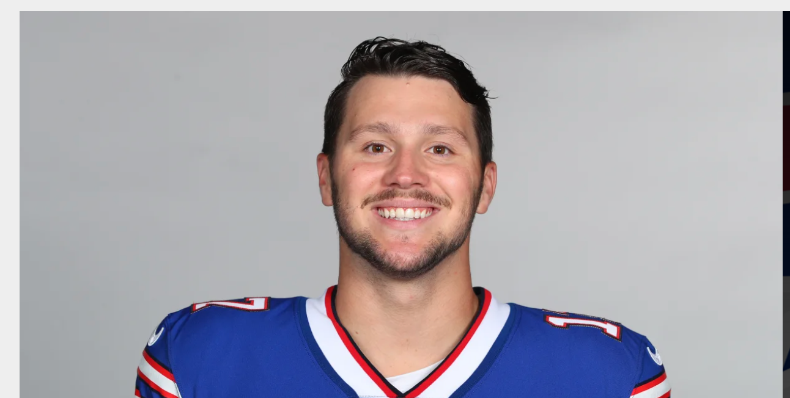

```{r preamble, child=here::here("preamble.Rmd")}
```


---
layout: false
# Outline 

- About me 

- About This Class

- misc

???
Today will be pretty light we are just going to go over some of the very very basics of the class. A bit about me and what not. Than hopefully we will get out of here pretty quickly. Just
a few notes if there is a nickname or name that you go by that isn't on the official 
role than just email me I'll put it into my little spreadsheet. If you have 
any trouble with reading the slides or the viz than also email me.
---


---
class: center, middle,  inverse
# About Me 

---

---
# What to Call Me

.panelset[
.panel[.panel-name[Josh Allen]
<center>
```{r, echo = FALSE, fig.cap= "Josh Allen ", out.width="90%"}



```
</center>
]

.panel[.panel-name[Mr Allen]
<center>
```{r, echo = FALSE, fig.cap = "Mr Allen", out.width= "90%"}


```
</center>
]

.panel[.panel-name[Professor Allen]
<center>
```{r echo = F, out.width= "40%"}


```
</center>
]
]

???
I mean if we are going to be honest I probably will respond to various versions of my name. But, I would prefer Professor Allen for a variety of reasons. I will get a little grumpy if you start calling me Mr. Allen because while the age gap between 18 and 27 may seem massive. I am in fact not my father. 

---


---
class: center


.pull-left[
## Professional Things
- I am a 3rd Year PhD Student in the Political Science Department

- Research Interests: Political legacies of Repression and Political violence

- Grade: 23?

- Number of Times I have taught this class: 1 

- Number of Times I have taught this class in person: 0]

--

.pull-right[
## Personal Stuff  
- Makes Graphs for Fun

- Bay Area Expat

- Walk up song: Man of the Year Schoolboy Q

- or with my dog Melonie at the dog park.
]

???
So this is like my first time teaching this class in person so there will no doubt be some struggles lecturing and responding to questions. So while I know it may be frustrating at times but I promise you I am trying my best
---


---

# Dog Pictures


.pull-left[

```{r echo = F}
knitr::include_graphics("images-all/melon.png")
```


]

.pull-right[

```{r echo = F}
knitr::include_graphics("images-all/melon_uno.png")
```


]


???
I have like a million pictures of my dog. These were from like a month ago. I will sprinkle in dog pictures whenever possible. So on the right there is the Melonie. On the right you have the melonie and one of her boyfriends. 
---

class: center, middle,  inverse
# About the class 


---
# Where are the Slides

- The slides live in the github repo at the top of the syllabus 

- Instead of putting them on icollege and fighting with iCollege they live in the youin public for you to use  forever

- Practically the HTML version of the slides are gonna be the ones I use in class. 

- The PDF versions of the slides will just be there for you guys to take notes on if you would like. 


???
Without getting into the the technical stuff to much basically each of the presentations are there own self contained webpage. The only difference between the HTML and PDF versions are going to be that some of the media and gifs are not gonna show up. 

---

---
##  Schedule for the Semester


```{r, include = TRUE, echo= FALSE}

advdate <- function(obj, adv) {
 ttues <- obj + 7*(adv-1)
 tthurs <- obj + 4 + 7*(adv-1)
 tues <- format(ttues, format="%m/%d")
 tthurs <- format(tthurs, format="%m/%d")
 zadv <- sprintf("%02d", adv)
 tmp <- paste("Week ",zadv,sep='',", ", ttues," - ",tthurs)
 return(tmp)
}


mon <- ymd(20220110)

tues = ymd(20220111)

# What are some dates you won't be here? In this example, I had a conference on 7 January 2022.
# Spring Break was 15 March 2022 to 19 March 2022.
not_here_dates <- c(
  # SPSA 2022,
  ymd(20220210),
  # Spring Break
  seq(ymd(20220314),ymd(20220320), by=1))

# You can adjust this as you see fit. Basically: add assignment types (e.g. papers, quizzes).
# My intro class was fairly simple: just exams.
exam_dates <- c(ymd(20220228), ymd(20220401), ymd(20220429))

# What are the full dates of the semester? Here, I'll exclude exam week as I like to do.
# In this case: 6 January to 23 April
semester_dates <- seq(ymd(20220110), ymd(20220503), by=1)

# Custom function for treating the first day of the month as the first week
# of the month up until the first Sunday (unless Sunday was the start of the month)
wom <- function(date) {
    first <- wday(as.Date(paste(year(date),month(date),1,sep="-")))
    return((mday(date)+(first-2)) %/% 7+1)
  }

# Create a data frame of dates, assign to Cal
tibble(date = seq(ymd(20220101), ymd(20220430), by=1))  %>%
  mutate(mon = lubridate::month(date, label=T, abbr=F), # get month label
         wkdy = weekdays(date, abbreviate=T), # get weekday label
         wkdy = fct_relevel(wkdy, "Sun", "Mon", "Tue", "Wed", "Thu","Fri","Sat"), # make sure Sunday comes first
         semester = ifelse(date %in% semester_dates, 1, 0), # is date part of the semester?
         exams = ifelse(date %in% exam_dates, 1, 0), # is it an exam?
         not_here = ifelse(date %in% not_here_dates, 1, 0), # is it a day off?
         day = lubridate::mday(date), # get day of month to add later as a label
         # Below: our custom wom() function
         week = wom(date)) -> Cal

# Create a category variable, for filling.
# I can probably make this a case_when(), but this will work.

Cal %>%
  mutate(category = NA,
         category = ifelse(semester == 1, "Semester", category),
         category = ifelse(semester == 1 & wkdy %in% c("Tue", "Thu"), "Class Day", category),
         category = ifelse(exams == 1, "Exams", category),
         category = ifelse(is.na(category) | (semester == 1 & not_here == 1), "NA", category)) -> Cal

calendar = Cal %>%
  ggplot(.,aes(wkdy, week)) +
  # custom theme stuff below
  # theme_steve_web() +
  theme_allen() +
  theme(panel.grid.major.x = element_blank(),
        panel.grid.major.y = element_blank(),
        axis.line.y = element_blank(),
        axis.line.x = element_blank(),
        panel.border = element_blank(),
        axis.ticks.x = element_blank()) +
  # geom_tile and facet_wrap will do all the heavy lifting
  geom_tile(alpha=0.8, aes(fill=category), color="black", size=.45) +
  facet_wrap(vars(mon), scales="free", ncol=3) +
  # fill in tiles to make it look more "calendary" (sic)
  geom_text(aes(label=day),family="Roboto Condensed") +
  # put your y-axis down, flip it, and reverse it
  scale_y_reverse(breaks=NULL) +
  # manually fill scale colors to something you like...
  scale_fill_manual(values=c("Class Day"="steelblue",
                             "Semester"="lightsteelblue",
                             "NA" = "white", # I like these whited out...
                             "Exams"="indianred4"),
                    #... but also suppress a label for a non-class semester day
                    breaks=c("Class Day","Exams")) +
  labs(fill = "", x="", y="")  


calendar

```


???
This calendar is just taken directly from the syllabus. For February 10
I will try and get somebody to cover the class. March 10th I don't anticipate many
of you will be here since it is the class before spring break. So I will try
and figure out a lecture that is kind of fun and useful. I will let you know closer
to the actual date, but I wouldnt anticipate y'all having class
---


---
## How to Do Well in This Class

- Do the reading

- Take good notes

- Ask questions when you do not understand something

- Participate

???
I know what you are thinking. "No shit professor Allen" and you know fair.
I tend to take the view that this class is more about you guys understanding the 
mechanics of politics. What I see the role of this class is for y'all to develop
skills that you will use a lot. Mostly how to collaborate with peers and learning
to ask for help when you do not understand something. This takes lots of practice.
But they are ultimately things you will use a lot. Lots of things in your professional
career are basically like large group projects. Free-riding in this case will have
consequences. So practice being a good teammate now because there are like next
to zero costs.
---

---
# Break Time 

```{r}
countdown::countdown(minutes = 5, play_sound = TRUE)
```


---


---
class: section, center, middle, inverse

# Stuff You Will be Tested On

---


---
class: center, middle
# Definining What We Mean
---


---

class: center, left
# What are Governments and What Do they Do?

.pull-left[

```{r, echo=FALSE}
knitr::include_graphics(here::here("images-all" ,"capitol.png"))
```

]

.pull-right[
```{r echo = FALSE}
knitr::include_graphics(here::here("images-all", "state_of_the_union.png"))
```

]

???
Typically we think of government as focused within these individuals. Which is fair
we see these people all the time in their various capacities. We know their names
and every 2, 4, or 6 years they are on tv 24/7 asking to be re-elected 
---

---
class: center, right

## Government 

.pull-left[
```{r, echo= FALSE}
knitr::include_graphics(here::here("images-all", "dmv.png"))


```

]

.pull-right[
```{r echo = FALSE}

knitr::include_graphics(here::here("images-all","highway.png"))
```


]
???
Government extends to lots and lots of stuff that you may or may not think about. Whether it be zoning, permitting, in some cases what policies universities can and cannot enact. Government pretty much touches everything.


---

## Defintion of Government
### Textbook's Definition
A Set of institutions that 

1. Endure overtime 
--

2. Has **authority over the people** of a specific territory
--

3. Authoritatively **makes and enforces laws**


---


---

## A Common Defintion


.pull-left[ 
### Long Version

we have to say that a state is a human community that (successfully) claims the monopoly of the legitimate use of physical force within a given territory...... Specifically, at the present time, the right to use physical force is ascribed to other institutions or to individuals only to the extent to which the state permits it..... Hence, 'politics' for us means striving to share power or
striving to influence the distribution of power, either among states or among groups within a state
]

--
.pull-right[

### TL;DR
we have to say that a state is a human community that (successfully) claims the monopoly of the legitimate use of physical force within a given territory
]

???
So the most common way we start to understand the state in Political Science is with 
this old dead white guy named Max Weber. He was a fellow writing in the late 19th 
century. He defines the state this way. The book takes great issue wit this definition for god knows what reason. But it is kind of focused on the all the other stuff that government does. All its forms
and what not. I personally think it is dumb
---


---

## Why is the Book's Definition longer?


--

- The minimalist aspect of it

--

- the overemphasis of the coercive aspects of government 

--

- Federalism

--

- Popular Sovereignty 

???
There are huge debates about the state and statemaking,
but in general it is accepted that the stuff that the book mentions is wrapped up in Weber. The debate is long and honestly kind of boring. But what you need to know is that the book has lots of opinions. Most of which I kind of disagree with
The Federalism thing is also technically wrong because Weber says that other things can use 
force if and only if the state delegates them that authority. The book also makes the point that highest authority aka soveriegnty resides in the people. And that there is an inherent tension between the governemtn and the people in this arrangement 
---


---

## Why is Weber so Popular

Think about other rule making organizations

--

The state is one among many in some respect (Midgal 1988, Spruyt 1996)

 What makes the state so special?

--

The definition is minimal

???
According Weber and many the most basic function of the state is to dominate other 
social organizations. The state is the sole authority to use violence to enforce 
their rules. The PTA, GSU student gov, etc cannot use violence to enforce those rules
It would be pretty jarring if the local HOA started to kill people for violations of 
HOA policies. 

---


