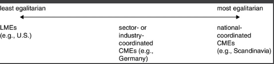
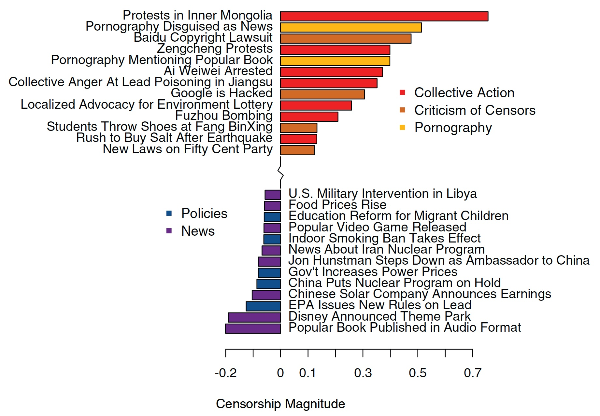
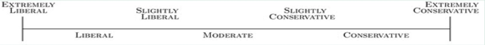
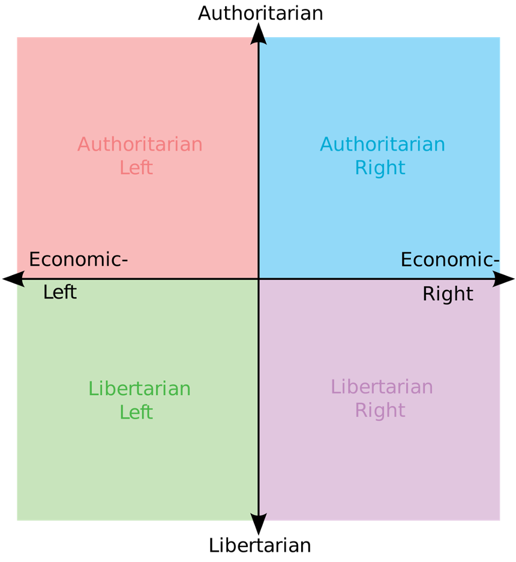
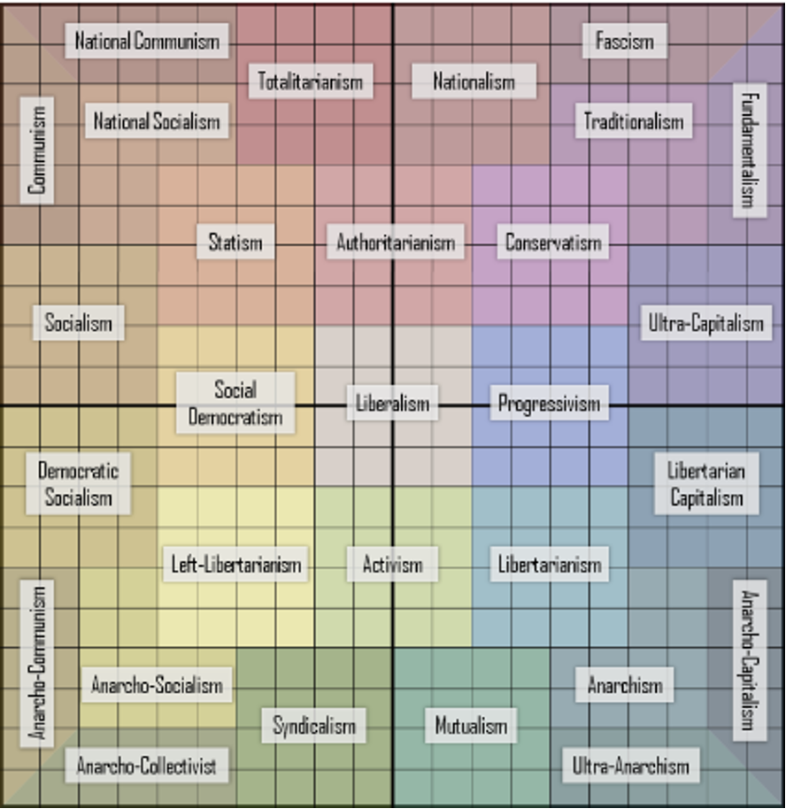

```{r preamble, child=here::here("preamble.Rmd")}
```


---

## Looming Deadlines 


- Pre-Course Survey 01/20

- Syllabus Quiz 01/21

- Chapters 01 & 02 01/24


---


---
## Where We Have Been 

- Governments as Public Goods Providers

- Types of Government 

- Types of Economic System

???
Last week we kind of did a crash course on some pretty difficult concepts which have been the subject of lots and lots of scholarship by some of the smartest people in economics, sociology, and political science. For my phd qualifying exam I literally wrote an answer about the first two bullet points that was 8 pages long.

---


---

## Where We are Going

- Loose Ends

- The American Way of Politics

  1. Ideology 
  2. American Values
  3. Partisianship a Brief Intro


---
---
class: center, middle, inverse

# Loose Ends

---


---
## The American Way of Government 
### What we see as innapropriate (According to the Book)

1. Promotion of an Explicit State Religion
2. Allocating the Factors (Land, Labor, and Capital)
3. Explicit Promotion of Racial Supremacy


???
Last week we talked about a whirlwind of topics and we ended with things we disagree over. We ended by talking about constitutional democarcy and the extent representative democracy. We covered authoritarianism a bit. But I think we should do some cleanup. We generally see these things as inappropriate. Imposition of one religion is seen as innapropriate because we are kind of explicitly violating rights outlined in the constitution. While religion is an important determinant of voting behavior and how we frame public policy. We see the explicit imposition of state religion as innapropriate. 

The third one is kind of recent. As we will discuss in later chapters. White supremacy is tightly intertwined with our political history and politics today. Promotion of equal rights under the law is still ongoing. Access to the right to right is still an issue. You do not have to throw a stone that far on the internet to find a clip about current state voting laws that do not have eerie echoes of the past. The DOJ currently has sued the State of Georgia over it voting laws. We will talk about Gerrymandering. We will talk about some of this in the coming weeks. But the persistence of our history in the way we vote is pretty astounding. 


---


---

## Varities of Capitalism 

```{r varieties-of-capitalism, echo=FALSE, fig.align='center'}



```

???
We talked about state socialism and its sort of related equivalent the command economy. Where the factors of production are allocated by the state. However, a lot of the political discourse about the role of the government in the economic sphere happens along this spectrum. There is a sliding scale of the coordination of labor unions sometimes referred to Coordinated Market Economies. To the area on the far right where there is a much larger social safety net. We are on the far left of the sliding continuum. Where among industrialized nations in the WEIRD countries the US has sort of the most pro-business approach to politics. Where we see government intervention in the economy kind of ranges along this spectrum. From more generous public goods to how governments deal with industry

---


---
## Participation 

- Elections

- Advocacy 

- Protest


???
In the little polyarchy slide and the authoritatrian exit slide I wanted to emphasize ways in which we exert power over government. One thing that is highlighted by both these things is that in liberal democracies is the varieties of participation. We can directly sanction our leaders or we can take official channels to argue for a particular policy position. In other cases we can organize collectively to protest the regimes treatment of people 


---

---
## Participation 


```{r censorship, echo=FALSE, fig.align='center', fig.cap= "Figure derived from King, Pan, and Roberts(2013)", out.width="60%"}



```

???
In particular one way that the U.S. differs is that the right to collective action is encoded. The right to talk about it is preserved. This figure is taken from an influential paper where the authors use natural language processing to dissect what kinds of content the CCP takes down. For established autocracies free experession is not neccessarily discouraged or always censored. Free experession isn't preserved because of the respect for the right to do so but because it is a good way for the government to understand the dissatisfaction of its citizenry. 

However, outright organization based off this is not protected. In general we think of the purpose of American government as responsible for protecting our rights to do these things. The purpose of governmetn in the American system is *now* thought of as securing these rights

---


---
class: center, middle, inverse
## American Way of Politics


---

---
## What is Politics 


.pull-left[
### Book Definition
<gsu-blockquote-red>

Nonviolent, open, and free activities through which people, bound by the same stable democratic government, and who often have different opinions and interests, struggle to exert power over what government does.” </gsu-blockquote-red>
]

.pull-right[
### Various other Definitions 

"War is a mere continuation of policy 'with other means'" - Von Clausewitz 

"Who Gets What, When, [and] How" - Lasswell
 
]


???
How we define politics differs. The book defines it this way however we have taken a stab at it throughout the development of the study of politics. Fundamentally politics is a struggle of preferences and the tactics we use to get them. Clausewitz is perhaps oft quoted because it is kind of provocative. I consider myself a conflict scholar so Clausewitz comes up as like a throw away citation. But it highlights that even the most gruesome of human endeavors boils down to contention among competing preferences. 

The book sort of makes the distinction that in the American political arena violence is not a part of politics. But as a conflict scholar this is not entirely true. War, the application of violence, and the allocation of resources to the coercive apparatus of the state is inherently political. 


---


---
## Political Ideology 


<center>
<gsu-blockquote-red>
A system of beliefs in which one or more general organizing principles connect an individual’s views on a wide range of issues

</gsu-blockquote-red>
</center>

???
Political ideologies are… (read definition), and can generally be categorized in a couple of ways

View about the proper role of the government are central to political ideologies. Generally, these views are focused on how responsible the government should be for providing safety and security from foreign and domestic threats, and how many goods and services the government should provide. This debate is usually boiled down to the size of the government.

Additionally, political ideologies generally provide a structure for organizing one’s ideas about wide range of issues. While abortion and tax policy don’t really have anything to do with each other, political ideologies provide a unifying structure that allows individuals to form preferences for both of these issues (and pretty much anything between) that are consistent.

Finally, in American politics at least, this is generally thought of as a liberal-conservative spectrum. Ideology is far more complicated than this, but we’ll talk about that in more detail later, so just hold onto it for now.


---

---
## Political Culture 

<gsu-blockquote-alt>

Collection of beliefs and values about the justification and operation of a country’s government.


</gsu-blockquote-alt>


???
Political culture is kind of interesting area of study in Comparative politics. Culturalist perspectives are no doubt powerful but hard to operationalize in statistical studies and in qualitative studies. Culture gives meanings to otherwise innocuous stimuli. Culture is the practice of making meanings from external stimuli and investing in those meanings. The sort of canonical example in the literature is with Gertz who uses a wink between people. The wink can signal mischeaviousness between people a joke etc. Or think of the (do the thing where you point at your arm). Political culture is important because it is how we parse certain stuff in our political lives and helps us orient how to think of new stimuli. Whether these are things that arise due to maturing or political events that arise. 


--- 

---
## American Political Culture 

- Size and Age

- Unique among nations 

???
NATION SIZE & AGE: America’s political culture is somewhat unusual to the extent that it defines such a large and diverse democracy and has done so for over 200 years. This makes us both one of the younger countries on the world stage, and also one of the oldest democracies. Additionally, with a population of (approximately) 330 million people, it is far more populous than most countries with developed democracies. Finally, America occupies a much larger landmass than many other democracies, which has a large impact on how citizens view the government and it’s proper role (i.e. the South, is really different from the Western plains, which is the opposite of the Northeast, which are all different from the West coast, which is even different from the Pacific Northwest).

UNIQUE AMONG NATIONS: Americans (more often than many people in other nations) agree on basic assumptions about the nature of a good society, they also heavily value liberty, individual responsibility, equality and religious faith – these values determine Americans’ political culture & impact policy making.  


---


---
## Core Values

.pull-left[

### Definition
<gsu-blockquote-blue> 


beliefs which are central in American political culture, and which people often rely on when determining their attitudes on specific policies. 

</gsu-blockquote-blue> 
]


.pull-right[
### American Core Values 
1. Individualism
2. Free enterprise
3. Egalitarianism
4. Humanitarianism
5. Limited Goernment & Popular Sovereignty

]
???
Free enterprise & capitalism: support for free enterprise/ capitalism, and distrust of government involvement in business.

In a sense, public support for free enterprise is the ‘business-side’ of the value of individualism.

Generally, Americans have varying levels of support for the values of free enterprise or capitalism. Generally, Americans have varying levels of support for the values of free enterprise or capitalism. In their support for free enterprise, some Americans may distinguish between smaller, individual-owned business (which they tend to be more supportive of) and large-scale business or ‘Laissez Faire’ capitalism (systems with very little big business regulation, which many Americans do not support).  


Egalitarianism: This value stresses the importance of equality for all Americans.

Americans have a deep belief in the value of equality. HOWEVER, they disagree over the definition of equality- namely, is it important to have equality of opportunity or equality of condition  for all Americans? (In this context, equality of opportunity means everyone has a equal chance at success, equality of condition means everyone enjoys the same success). 

The conflict for many Americans over this definition stems from their belief in the other core value of individualism. For example, If we believe individuals can do whatever they are capable of (if they work for it), it is difficult to expect that people will all enjoy equal conditions because their efforts are not likely to be equal…so, some people will be rich, others poor, etc. For many Americans, the lack of equal conditions among citizens are not troubling, as long as everyone has an equal opportunity to achieve success. 

Another Example: (This is in your book)- when asked whether “Our society should do what is necessary to make sure that everyone has an equal opportunity to succeed- 94% of Americans agree, but when asked whether “Blacks and other minorities should receive preference in hiring to make up for past inequalities” 80% of Americans disagree with the statement. *The difference between these questions is the first one asks about equal opportunity, while the second is about equality of condition- 

Since equality of condition conflicts with the value of individualism, Americans generally support equality of opportunity, but not equality of condidtion.


Humanitarianism: This value stresses concern for the well-being of other human beings. 

In particular, this value emphasizes the importance of helping those in need (who cannot help themselves.  


This value is often connected with particular types of social welfare programs (such as assistance to children, the elderly, the disabled, ect). However, the value of individualism negatively influences support for welfare policies aimed at those who are assumed to be capable of working. 
 


---

---
## Political Ideology 


```{r ideology-image-one-dim, echo=FALSE}




```


???
We typically view political ideology in American politics as one dimensional. Which is kind of just fancy for it falls along one line. However, this intuitively this seems pretty simplistic. American political scientists since the 60's have been fighting over the components of ideology and what it actually means for politics since like the 60's with Campbell and Converse. If you take a class with Dr. Thornton he has some work on this. 

---

---
## American Political Ideology

.pull-left[
### Liberal 

- Believe in government action to achieve equal opportunity and equality for all. 

- It is the duty of the government alleviate social ills and to protect civil liberties and individual and human rights. 

- Believe the role of the government should be to guarantee that no one is in need.

]


.pull-right[
### Conservative 

- Believe in personal responsibility, limited government, free markets, individual liberty, traditional American values and a strong national defense. 

- Believe the role of government should be to provide people the freedom necessary to pursue their own goals.


]

???
For short hand we use left and right. This comes from the French Revolution where the revolutionaries were sat on the left in the national assembly and the supporters of the King were sat on the right in the national assembly


To return back to the left right spectrum we genrally think of political ideology for liberals and conservatives like this 
---


---
## Political ideology continued 

<center>

```{r pol-ideology-table, echo= FALSE}
library(gt)
gt_theme_espn <- function(data, ...){
  data %>% 
    opt_all_caps()  %>%
    opt_table_font(
      font = list(
        google_font("Lato"),
        default_fonts()
      )
    )  %>% 
    opt_row_striping() %>% 
    tab_options(
      row.striping.background_color = "#fafafa",
      table_body.hlines.color = "#f6f7f7",
      source_notes.font.size = 12,
      table.font.size = 16,
      table.width = px(700),
      heading.align = "left",
      heading.title.font.size = 24,
      table.border.top.color = "#0000ffff",
      table.border.top.width = px(3),
      data_row.padding = px(7),
      ...
    ) 
}

gt_theme_538 <- function(data,...) {
  data %>%
  opt_all_caps()  %>%
  opt_table_font(
    font = list(
      google_font("Chivo"),
      default_fonts()
    )
  ) %>%
    tab_style(
      style = cell_borders(
        sides = "bottom", color = "#0000ffff", weight = px(2)
      ),
      locations = cells_body(
        columns = everything(),
        # This is a relatively sneaky way of changing the bottom border
        # Regardless of data size
        rows = nrow(data$`_data`)
      )
    )  %>% 
  tab_options(
    column_labels.background.color = "white",
    table.border.top.width = px(3),
    table.border.top.color = "#0000ffff",
    table.border.bottom.color = "#0000ffff",
    table.border.bottom.width = px(3),
    column_labels.border.top.width = px(3),
    column_labels.border.top.color = "#0000ffff",
    column_labels.border.bottom.width = px(3),
    column_labels.border.bottom.color = "black",
    data_row.padding = px(3),
    source_notes.font.size = 12,
    table.font.size = 16,
    heading.align = "left",
    ...
  ) 
}


ideology_dt = tribble(~`Issue Area`, ~Liberals, ~Conservatives, 
                       "Regulating the Economy", "Supports Govt Regulations", "Supports Less Govt Regulation",
                       "Economic Security", "More Supportive Programs", "Supports Programs but at lower levels",
                       "Government Promotion of Social Equality", "Wants laws/programs to increase social standing of historically oppressed groups", "Generally favor the status quo",
                       "Traditional Moral Values(Abortion, prayer in schools, same-sex marriage etc", "Generally oppose", "Supports laws/programs that uphold these traditional values",
                       "Law Enfroement and Criminal Justice", "Want body cams on police/dashboard.  Oppose: death penalty, long prison sentence, mandatory minimum sentencing laws, restrictions of felons after serving their time.", 
                       "Greater leeway to police.  More likely to support “Law & Order” policies like the death penalty, long prison sentences, mandatory minimums, restricted rights for former felons.")


gt(ideology_dt) %>% 
  gt_theme_538() 


```


</center>

???
To sort of contextualize this more I just took the table out of the book. Essentially each ideology has a sense of what the government should and should not provide. Even within these ideologies we see the ways in which there is disagreement within coalitions. AOC and Joe Manchin are Democrats but where they fall along the ideological spectrum is pretty stark. I haven't peaked to far ahead but the difference this makes in voting behavior in Congress. While they may agree in some respects on the actual policy the ways and means by which they do this will differ

---

---
## Ideology in More Dimensions 

.pull-left[
```{r echo=FALSE, out.width= "90%"}

```


]

.pull-right[
```{r echo=FALSE}



```

]
???
Instead, we can think about ideology as being dependent on the level of government power that one prefers (ranging from authoritarianism to libertarianism) and economic freedom (with the economic-left preferring more government/societal control, and the economic-right preferring less) As I mentioned we have some faculty that kind of looks at this exact question. When we collapse ideology to one dimension we start lumping stuff together in ways that aren't neccesarily capturing the full range of variation. When we think of the issues and issue areas they can kind of range the span of whether it is more social or more economic. Importantly it is also kind of difficult to group these preferences because they may not always fit together in a neat way. Stufff we kind of don't care about or don't know much about are going to be more sensitive. 
---

---
class: center, middle, inverse 

# Partisianship 

---

---
## Social Identity

 Group Orientation: The phenomenon of viewing politics through a groups lens


???
Finally, American politics, and thus ideology, is highly impacted by group orientation, and the number of groups that are present in American society.

Group orientation is the phenomenon of viewing politics through a group lens. This is most influenced by age, race, and gender; but several other groups have a significant impact as well.


---

---
## Social Identity Theory

<gsu-blockquote-blue>

Holds that individuals derive their self-concept from knowledge of their membership in a group (or groups) and that they place value and emotional significance that group membership, with resulting perceptual and attitudinal biases

</gsu-blockquote-blue>

???
Social Identity theory has become a huge part of the present day literature on partisanship. This was developed in the 70's by Tajfel & Turner. Membership of the group is self-perceived and reinforced by meaning making and practices. The recent literature posits that interpreting contemporary politics just as a bundle of preferences along these dimensions kind of misses the point. Increasingly how we view members of the other party holds up this way


---


---
## Partisianship and Social Identity

- Acquired at a young age and rarely changes 

--

- Formal occasions to express this identity

???
Why this is a good analytical approach is because social identity arises for a lot less reasons. The conflict between groups is almost always relevant and is periodically. We are frequently primed to think about various political stimuli along these lines. How we feel about universal healthcare is a good example of this. 

---