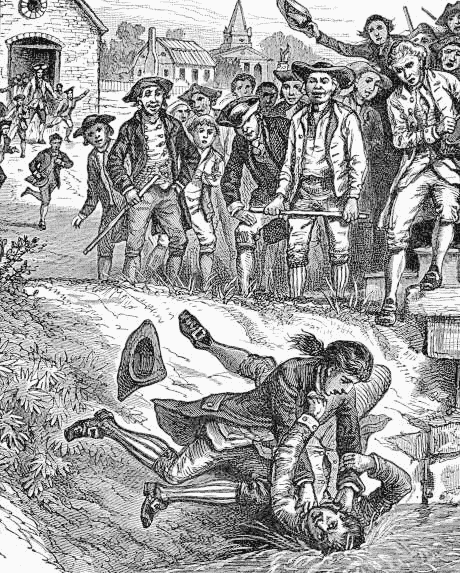

```{r preamble, child=here::here("preamble.Rmd")}
```


---
## Looming Deadlines 

- Your readings


---


---
class: center, middle, inverse 

.col[# The Road to the Constitution

]
--
.col[
  # How we Got the Institutions we Have

]

---


---

## What is in the Thing

.pull-left[
### The First Founding

- The Original Constitution (ratified 1788)

- Bill of Rights (Amendments 1-10, ratified 1791)

- $11^{th}$ and $12^{th}$ (ratified 1795 & 1804)


]

--

.pull-right[
## The Second Founding

- $13^{th}$ Amendment (ratified 1865)

- $14^{th}$ Amendment (ratified 1868)

- $15^{th}$ Amendment (ratified 1870)


]

???
How I learned about the founding of the U.S was through the lens of picking up the pieces left behind from the American Revolution and the articles of confederation. 


However we also can start to think of the subsequent amendments to the constitution we can start to think of these amendments as additional foundings. The 13th amendment is the first of the reconstruction Amendments that started to expand who is considered a citizen and who is granted the de jure protection of the constitution. Many have likened the American Civil war as a second revolutionary war where The industrial capitalist north defeats the landed slave owning aristocracy in the south. 
---

---
## The Early Colonies 


- People Migrated to America for a variety of reasons

- America has unique qualities when we think about its early days

 1. Lots of Land
 2. Lots of Cheap Land 

???
Permanent lack of economic freedom oppression/feudal restrictions. There was very little land for people outside of the traditional landed aristocracy. The early colonial period in Europe was one the first major periods of globalization with inter-continenal trade. This greatly benefitted merchants and artisans but they had no real ability to gain property which was important for status and power in the traditional english system 

Poverty
Starvation

Political Oppression Religious oppression – pilgrims, Puritans – Winthrop and Cotton in Mass Quakers – William penn’s holy experiment Hugonauts - protestants Vast open spaces Cheap land Diverse population leads to freedom equality and liberty. 

For the puritans they saw the church of england as insufficiently devout and the corrupt vestiges of the catholic church irredeamable. They left because they thought they could do better.
---

---
## Settler Mortality 


```{r settler-graph, echo= FALSE}


settler_dat = haven::read_dta("data/maketable1.dta") %>% 
  mutate(name = as.factor(shortnam),
         flag = ifelse(name == "USA", TRUE, FALSE)) %>% 
  filter(!is.na(logem4), !name %in% c("GBR", "FRA")) %>% 
    arrange(logem4) %>% 
  slice(1:20)

ggplot(settler_dat, aes(x = logem4, y = fct_reorder(name, logem4), fill = flag)) +
  geom_col() +
  labs(x = "Log of Settler Mortality", y = NULL) +
  theme_allen() +
  scale_fill_manual(values = c("grey70", "#f2ad22")) +
  guides(fill = "none")


```


???
Another kind of interesting aspect about American political development is the extent to which America had some advantages due to climate.I just took data from Acemoglu, Johnson, and Robinson and plotted it. I subsetted the data to include the only Top 20 lowest colonies by settler mortality. As you can see the U.S. is one of the lowest this is partially because the east coast of the United States does not have some of the diseases that Central, South America, and Africa have that killed lots of European settlers. 

We see very different institutional development in European colonies. They posit that the mechanism that links the kinds of institutions that were and present economic performance their main dependent variable is differences in protection from expropriation. Because white settlers actually lived in these colonies early institutions were more likely to protect rights 


---

---
## The Effect of Instituions 


```{r og-plot, echo = FALSE, warning=FALSE, message=FALSE}

ggplot(settler_dat, aes(x = logem4 , y = avexpr)) +
  geom_smooth(method = "lm", se = FALSE) +
  geom_text(aes(label = name)) + 
  labs(x = "Log of Settler Mortality", y = "Average Expropriation Risk in 1985-1995", caption = "This is a replication of figure 3 in Acemoglu, Johnson, and Robinson (2001)") +
  theme_allen()

```
???
We will not get into how instrumental variables work. While many have critiqued this piece for violations of their causal identification strategy we will kind of set those  But this shows the naive relationship between the average number of protections against expropriation. The establishment of instituions has lasting economic and political legacies. S


---


---
## Early Interst Groups 

1. New England merchants
2. Southern Planters
3. Royalists 
4. Shopkeepers, artisans, and laborers
5. Small farmers 


--- 


---
## The Seven Years War (1756-1763)

- Turning point in British colonial relations 

--

- British Parliament Enforces taxes on the colonies to amend war debt

- Philosophical issue over these new taxes 

???
North America in the early 1750’s was a hodge-podge of lands claimed by a variety of powerful European countries, for the most part by this time it was predominately the French and the British. The French territories ranged from the peaks of Canada down to the bayous of what are now New Orleans and Biloxi. The British claimed lands were concentrated along the east coast hugging from Georgia all the way up to what is now present-day Maine and Nova Scotia. Sandwiched in between these two were large swathes of empty unclaimed land and Native American settlements. 

The hostilities between the French and the British were localized and escalating as each group tried to gain larger and larger footholds in the unclaimed lands between the two swathes of settlements.  The hostilities began in Fall of 1753 when then British major George Washington moved into the Ohio River Valley in an effort to oust the French that had settled there. The hostilities would continue for roughly the next decade, claiming more live then the American Revolution and spanning two continents (North American from Canada down to the Caribbean and Europe) 


Alongside the expansion of their territorial holdings in the Americas Britain and France had waged war in Europe over the question of Austrian succession. The death of Charles VI ignited a war between major European powers because each had allied themselves with one side laying claim to the Austrian throne. 

The Seven years war also included conflicts across both Western and Eastern Europe India and parts of West Africa


Eventually after years of strife and battle the French were mostly pushed from their hand-holds throughout most of North America and the American colonists were battle weary and broke from the various taxes imposed by the crown to fund the war.  The philosophical issue at the time of course being, was it right for the colonists to be taxed so heavily without representation of some sort in the British Parliament? 

As you might say Britain was down bad because well war is expensive even in the early 18th century 

DQ: Were the taxes imposed by the British really unjust considering the financial ramifications of the war against the French? 


---

---
## The Infamous Taxes

- Sugar Act (1764)

- Currency Act (1764)

- Quartering Act (1765)

- Stamp Act (1765)

- Townshend Acts (1767)


- Tea Act (1773)


???
Sugar Act – placed a heavy tariff on the imports of sugar, molasses (used to make alcohol), lumber, and many other raw materials being imported in to the colonies from other foreign nations. 

Currency Act – an act prohibiting the colonies from producing or issuing any type of currency.

Quartering Act – early action of this was met with avid vehemence and it was later repealed that year. It forced local governments to provide food and lodging for soldiers. This is essentially just a form of taxation. 

Stamp Act – the first direct tax on all colonists that taxed all things written or printed on paper (newspapers, pamphlets, maps, insurance policies, and even playing cards) and required all documents to have a specific stamp to be considered legal documents. 

Townshend Acts – a heavy tax (named for the English Chancellor at the time) that taxed all vessels entering and leaving the colonial harbors. 

Tea Act – the final straw for many colonists and a tax imposed by the British to help bail out the East India Company. It imposed a high tax on tea and restricted sale to only one company. 

---

---
## The Bubble Bursts 


???

Protests against the British Tax Acts were springing up all around the colonies, but none was more memorable then that of the Boston Tea Party on December 16th, 1773 staged by the radical patriot group the Sons of Liberty. Dressed as American Indians they boarded all of the East India Trading Companies ships docked in the Boston harbor and destroyed the entire shipment of tea (340 chests valued at over 10,000 pounds).  The British responded in kind by passing what became known as the Intolerable Acts (Coercive Acts) which closed the Boston Harbor, revoked the colonial charter of Massachusetts, and reinstated the quartering act of 1765 for all British soldiers. 


---

---

## The Course of Events 

- The First Continental Congress (1774)
  - Boycott British goods
  
- Second Continental Congress 
    1. Declaration of Independence 
    2. Drafting and Ratification of the Articles of Confederation (1777 & 1781)
    3. War ends with the Treaty of Paris (1783)


---


---
## The Declaration of Independence 

The general sketch of the American Creed


List of Grievances 


---

---

## The American Creed & Self Evident "Truths" from the Declaration 

1. All $men^*$ are created equal. 
2. Life, Liberty, and the Pursuit of Happiness 
3. To secure these rights and deriving their just powers from the consent of the governed
4. Whenever any form of Government becomes destructive we have the right to overthorw it 
---


---
## Self Evident Truths & What they Really Meant 

.panelset[
.panel[.panel-name[All men are created equal]

- Minimum is that there are no divine kings or nobles

- Did they really mean all people?

]

.panel[.panel-name[Government Derive Their powers from the consent of the governed]

- Purpose of government is to secure those rights

- Government is only legitimate when it has the consent of the people

]

.panel[.panel-name[It is the Right of the People to Alter or Abolish it]

- Ultimate sovereignty belongs with the people. 

]


]
---


---
## Break Time


```{r echo = FALSE}
countdown::countdown(minutes = 10, play_sound = TRUE)
```


```{r mel-picutre, echo=FALSE, out.width= "60%"}
knitr::include_graphics("images/mel.jpg")
```


---

---
class: center, middle 
.col[# The Founding Documents]
--

.col[# Both Attempts ]
---


---
## The Articles of Confederation 

- Was our first try at this thing

- Lasted till 1789

- Key Features
  1. Weak Central Government
  2. No Executive Branch
  3. Legislative domination
  4. Statutory execution left to the states

???
Notes: “Name “confederation” is important here.  In a confederation, each unit (in this case, the states) maintains its sovereignty and independence.  No way for central government to force states to do anything.
The AOC was a constitution concerned primarily with limiting the powers of the central government.  (Given their experience with King George, colonists were reluctant to lodge too much power in any one institution. A faction called the Antifederalists were particularly concerned about giving too much power to the national government.)
It took 3 years from adoption (by the Continental Congress in 1777) to ratification.  This is because all states (instead of being called colonies) were required to agree to it before it took effect.


Congress – was a unicameral body. Had the power to enact, but not enforce that was left to the states. Members were elected from each state to serve only one year terms. 

Weak central government – in open revolt of the power of the British monarchy, the Framers established a system that was based only on the loose confederation of states rather then a strong central body. 
each state maintained autonomy and reserved the ultimate powers of governing and function for themselves 


---

---
## Weaknesses of the Articles of Confederation 

- No power to tax

- No power to regulate interstate or foreign commerce 

- No powers of enforcement to enact laws

- Required approval of $\frac{2}{3}$ states to pass a law

- Amendments to the articles required .bold[unanimous] consent

- No Judicial System

- No National Army or Navy

- No National Unity

???
To be fair to the articles of confederation there are lots of systems that do not have an executive branch. The problem was that there was no ability to coordinate anything 

No power to tax – effect: the central government had no money 
No power to regulate interstate or foreign commerce – Effect: the states were constantly quarreling over tariff and levies on trade. Treaties between states and foreign bodies were numerous, varied, and confusing as hell to both parties. 
No power of enforcement – Effect: the states were often spotty or non-reactive to statutory laws that had been passed 
Approval of 9 states (2/3) needed to enact laws – Effect: little to no laws were actually passed or effective 
Amendments required unanimous consent – Effect: they were stuck in an endless spiral of doom with no way to change their powers/structures of government
No national court system -  effect: scattered and shody judgment at both the individual level by states and at the national level in case of state vs. state 

---

---
## Trouble Arises

```{r shays-rebellion, echo=FALSE, out.width= "40%"}





```

???
Shay’s Rebellion – the economic conditions of the new Confederation of the United States were dismal after the completion of the American Revolution.
Trade was down exponentially since relations with Britain were still so poor and farm incomes were disastrously low due to lack of regulation and recovery from after the war. 
The state governments were each issuing their own currency in massive quantities in an effort to pay down the debt that was incurring rapidly at the local (individual) and state levels. 

This massive deflation of value caused many farmers (the backbone of the colonial structure to lose their homes and lead to imprisonment. 
Remember farmers at this time were the backbone of most of the country and made up two very crucial groups in society (the small crop farmers and the massive southern planters). 
Daniel Shays  was a revolutionary war veteran and farmer that was watching the slow crumbling of the farming society. 

In September of 1786, Shays and his followers (other farmers and merchants)  marched on the local court houses in Springfield, Massachusetts
and closed down the courts thus impeding the “justice” that was being served to the failing and now debtor farmers. 

The rebellion was eventually put down after MA finally raised enough money for a private militia to put down the rebellion

Shays rebellion highlighted all the weaknesses of the articles of confederation, the lack of ability of the federal government to raise funds for a national army (the local militia failed to stop them until well into December),
the problems with currency, and all of the weakness of the decentralized state governments. 

---


---
## From Compromise to Constitution

- Constitutional Convention 1787
  - Established a central government
  - Strong executive branch
- Congress
  - power to declare war
  - power to raise a national military
  - Bicameral legislature 
- Judicial System 
  - It exists
- Separation of powers
  - checks and balances 

???
The constitutional convention was kind of a critical because it sets out to create a commitment device to stabilize elite interactions. Part of the beauty of constitutions is that they stabilize relations between elites because good constitutions address a range of bargaining problems that will arise. Part of the issues with bargaining is the issue of private information.

Commitment problems arise all the time because we do not know whether the other side will hold up their end of the bargain or there is no mechanism to enforce bargains. institutions come into play because they can enforce these things, they can punish, they alleviate information problems, and they iterate the prisoner's dilemma

---

---
## What Were the Major Disagreements 

- Centralized vs Decentralzied Government 

--

- Representation Plans 
  - Small States vs Large States
  
--

- Bill of Rights 
   - Protections for the individual
   
--

- The Three-Fifths Compromise
  - South vs North 


---

---
## The First Partisan Divide

.pull-left[
### Federalists

- Property owners, creditors, merchants
-Favored stronger central government
-Feared excessive democracy and promotion of political elites
- Members: Alexander Hamilton, John Adams

]

.pull-right[
### Anti-Federalists

- Small farmers, debtors, shopkeepers
- Favored retaining power in state governments
- Generally, more democratic
- Members: Samuel Adams, Patrick Henry


]
---


---
## "Compromises" & Uniting Two Visions


```{r list-of-stuff, echo=FALSE}

library(gt)
gt_theme_espn <- function(data, ...){
  data %>% 
    opt_all_caps()  %>%
    opt_table_font(
      font = list(
        google_font("Lato"),
        default_fonts()
      )
    )  %>% 
    opt_row_striping() %>% 
    tab_options(
      row.striping.background_color = "#fafafa",
      table_body.hlines.color = "#f6f7f7",
      source_notes.font.size = 12,
      table.font.size = 16,
      table.width = px(700),
      heading.align = "left",
      heading.title.font.size = 24,
      table.border.top.color = "#0000ffff",
      table.border.top.width = px(3),
      data_row.padding = px(7),
      ...
    ) 
}


plans = tribble(~Issue, ~`The New Jersey Plan`, ~`The Virginia Plan`, ~`The Conneticut Compromise`,
                "Supported By", "Small States", "Large States", "The Great Compromise",
                "Legislative Structure", "Unicameral", "Bicameral", "Bicameral",
                "Represention Plan", "Equal Representation for each State", "Representation based on population", "The Senate is 'equal' and the House is population based ")


gt(plans) %>% 
  gt_theme_espn


```


---

---
## Slavery and The Constitutional Convention
.col[
<gsu-blockquote-red>
“It seemed now to be pretty well understood that the real difference of interests lay, not between the large and small but between the northern and southern states.  The institution of slavery and its consequences formed the line of discrimination.”
		- James Madison
</gsu-blockquote-red>

]


???
The inherent tension between the small and large states was the large population of enslaved people in the southern states. In the coming weeks when we talk about the second founding and the reconstruction amendments. However, the big battle that was set to occur that could threaten the constitutional congress was slavery.

The issue was not necessarily whether or not to abolish  of the 55 members of the constitutional convention 25 owned slaves. Only three founding fathers were members of anti-slavery societies John Jay, Alexander Hamilton, and Ben Franklin (a former slave owner). The pro-slavery compromises were framed as the price that they had to pay to keep the south in the talks. However the major compromise was not whether slavery should be abolished. But how the landed southern aristocracy could use slaves to increase their political power to preserve the practice to further their economic interests. 

https://www.gilderlehrman.org/history-resources/teaching-resource/historical-context-constitution-and-slavery


Like how profitable slavery was during this period is still a hotly debated topic but 


---

---
## Slavery in 1790 


```{r}
knitr::include_url("https://lincolnmullen.com/projects/slavery/")
```


???
If you are viewing the HTML version of the slides you can see county level data of slavery in the United States. Lincoln Mullen made this really fantastic data vizualization  and deserves all the credit. If you scroll a little bit you can move the slider to see how this progresses over times as the US expands westward


---


---
## What They Agreed to


- *The Three-Fifths Compromise*: held that three of every five slaves would be counted for the purpose of apportioning seats in the House of Representatives.

- The Slave Trade would continue, and not be considered a point of conversation till 1808 

- Fugitive Slave Clause stated that any “person held to service or labor” (slave, apprentice, or indentured servant) who flees to another state (free or slave) should be returned to the owner in the state from which that person escaped. 


???
As you can see there are pretty significant concessions to ensure slavery persisted and entrench the political power of the landed elite. Can anybody think of the other one that is not on here that should be here? 

It is the electoral college! Does anybody know how we calculate electoral college votes? It is the number of representatives + 2


---


---
## Fun Facts about the Constitution 

- Rhode Island boycotted the Convention (and eventual ratification.. They were the last state to do so) 

- Our Constitution is the shortest written document of any democratic nation in the world today 

- Only 4,400 words….. Roughly 9 pages single spaced (original) 
    - Amendments extend it to 7591 words. 

- There is 1 state’s name that is misspelled in the document 

- Nearly 11,000 amendments have been proposed to the Constitution 

- 500 alone are about the elimination of the Electoral College 

- The words “God”, “democracy”, and “slave” are not written in the Constitution 

- Ben Franklin was the oldest delegate (81) to sign (and he had to have help) 

- The original title for the President was  “His Highness the President of the United States of America and the Protector of their Liberties”  (I think they settled….) 

???
Pennsylvania is spelled with one n 


---


---
## Legislative Branch 

- Article I  of the Constitution 

- 17 Enumerated Powers

-Enumerated Powers – powers listed explicitly in the Constitution 

- Implied Powers – powers that are considered necessary for the execution of government, but are not legibly defined within the Constitution. 

- Necessary and Proper Clause  

???
Tax, provide for defense and general welfare, borrow money, regulate commerce (foreign and domestic), establish naturalization laws, coin money, establish post offices/roads, to punish counterfeiters and security criminals, devise copyright and patent laws, punish pirates and felonies committed on the high seas, to declare war, to raise/support armies, to provide and maintain a navy, to make rules/laws for governing, to organize/arm/maintain a militia, to control this seat of government, to make laws to carry out other powers listed above (essentially the founders fail safe) 

Leads to the concept of enumerated vs. implied powers 
	enumerated – listed explicitly in the constitution 
	implied – those powers that are considered necessary for execution of government function but are in no way clearly (legibly) defined within the constitution 

The N and P clause/Elastic Clause  – found in article I it is the clause that gives Congress the power to create whatever laws are necessary and proper (implied) to carry out its enumerated responsibilities. called the elastic clause because it gives Congress a lot of leeway in how the Constitution can be stretched. 

You could theoretically try and figure out everything that could possibly arise but that is tedious 


---


---
## Neccessary and Proper Clause 
.pull-left[
 <gsu-blockquote-red>Congress shall have the power… “to make all laws which shall be necessary and proper for carrying into execution the foregoing powers and all other powers vested by this Constitution in the Government of the United States”  </gsu-blockquote-red>]

.pull-right[
- Article I, Section VIII, Clause XV 

- Elastic Clause
- Gives Congress leeway to decide how the Constitution can be applied to create new statutes 
- Examples ] 

???
Judiciary Act of 1789: Congress has power to organize the federal court system 
Affordable Care Act:originated as an appropriations bill (interpreted by the court under taxing and spending clause) 

---

---
## The Executive Branch 

- Article II of the Constitution

- A single “Energetic” holder of Executive power  

- Roles 

- “Take Care” Clause 

???
Battle of executive Council vs. Executive officer – this was a battle between the two state plans on an issue which had never existed before. The position of president was decided upon to avoid comparison to royalty or other tyrannical office holder. 

Roles – the president is identified with many roles. Can any of you name one? 
	Chief Diplomat 
	Commander in Chief  
	Head of State 

Take Care Clause – the executive power shall take care that the Laws be faithfully executed. 


---


---
## Take Care Clause 

<gsu-blockquote-alt>


Endows the President with the duty to enforce the laws of the United States even if he/she disagrees with the purpose of the law 


</gsu-blockquote-alt>

???
Worchester v. GA – Ga law was put into place that required white individuals that entered Cherokee lands to have a license/be registered. Worchester was a missionary and was helping to educate Native Americans about their rights against being forcibly removed from their territory (pre-Trail of Tears). His actions upset many of the local GA officials so they passed a law requiring a license. Worchester was arrested and appealed his case to the SC. SC decided in favor of Worchester stating that only the fed government could regulate native american nations since they were sovereign nations.  President Jackson was unhappy with the decision and announced “John Marshall (the CJ of the SC) has made his decision, now let him enforce it” 

Suspension of habeas corpus – Lincoln suspended the privilege of habeas, but after receiving such vehement response to the actions, he went to congress to get authorization of the power habeas corpus are petitions to the court for relief against unlawful imprisonment.  During the onset of the civil war, maryland mob attacks a group of Union soldiers in Baltimore that were passing through to get to DC and defend the capital.  The army arrested the individuals and detained them. Lincoln suspended habeas in areas that were critical for Union troops to pass through to be able to reach the capitol. 

---


---
## The Judicial Branch 

- Article 3 

- "One Supreme Court and such inferior courts as the Congress from time to time shall ordain"


???
Not a whole lot given about the judicial branch, it was to be considered the “least dangerous branch” of the government 


---

---
## Supremacy Clause 


<gsu-blockquote-blue>

This Constitution, and the Laws of the United States which shall be made in pursuance thereof; and all treaties made, or which shall be made, under the authority of the United States, shall be the supreme law of the land; and the judges in every state shall be bound thereby, anything in the constitution or laws of any state to the contrary notwithstanding

</gsu-blockquote-blue>

???
It means that in all cases the law of the land or the Constitution is supreme (over-powering) over all other laws created within the United States. This eliminates many of the problems that the original states had with the Articles of Confederation and the conflicts of power that seemed to ensue.  This will become very important when we talk about the courts as well as civil liberties and rights over the next few weeks. 


---

---
## Full Faith and Credit Clause 
.pull-left[
- Article IV, Section I 

- Requires each state to recognize and honor the laws, public records, and judicial decisions of any other states. ]

.pull-right[
### Examples 
- Drivers Licenses 
- Marriage Licenses 
- Same-Sex Marriage 
- Does not apply to “kinship prohibitions” 
- Child Support Judgments ] 

---

---
## Checks and Balances 


---


---
## Amending The Constitution

.pull-left[
### Proposing an Amendment

- By $\frac{2}{3}$ of the members of both the House and Senate

- At convention called by $\frac{2}{3}$ of the States


]


.pull-right[

### Ratification 

- By $\frac{3}{4}$ of the State Legislatures 

- By $\frac{3}{4}$ of ratyifying conventions in the States 


]


???
The most common way is: proposal #1, and ratification #1.  No amendment has ever been passed by proposal #2.  Ratification #2 has only been used with the 21st amendment (repealed the 18th amendment ban on alcohol).

--- 

---

## The Bill of Rights 


```{r}
knitr::include_url("https://billofrightsinstitute.org/primary-sources/bill-of-rights")
```


---

---
## TL;DR of the Bill of Rights 

1st Amendment: Freedom of Speech, Press, Religion, Assembly, and Petition 

2nd Amendment: Right to Keep and Bear Arms 

3rd Amendment: Quartering of Soldiers 

4th Amendment: Protection from Unwarranted Search and Seizure 

5th Amendment: Rights of the Accused Person in Criminal Proceedings 

6th Amendment: Trial Rights for Accused

7th Amendment: Trial by Jury in a Civil Trial 

8th Amendment: Protection from Excessive Bails, Fines, and Punishment 

9th Amendment: Reservation of Various Rights to the People 

10th Amendment: Reservation of Powers to the State or People 

???
The fifth amendment has lots of stuff in it in particular. Trials can only be had upon indictment by a grand jury. Double jeopardy is in the which states you can only be tried once in federal court for the same offense. You have the right to not incriminate yourself. And limits the power of eminent domain by requiring the government to pay you for seizing land that it intends for public use. Which hasnt always been done in practice 

---

---
## The Rest of the Amendments 

- 11th- Prohibits the federal courts from hearing certain lawsuits against states

- 12th - Changes Electoral procedure for the Vice President

- 13th – 15th: Reconstruction Amendments 
  - 13th – Abolition of Slavery and Involuntary Servitude 
  - 14th – Due Process Clause/Equal Protection Clause 
  - 15th – Ends Voting Prohibitions based on Race 

- 17th - Direct election of senators

- 19th -  Ends Voting Prohibitions based on Sex  

- 18th and 21st - Prohibition and its repeal


- 22nd Limits the Number of Times you can run for president

- 24th Extended Voting Rights protections 

- 25th - Presidential Succession

- 26th - Voting age lowered to 18 

- 27th - Congressional Pay 


---