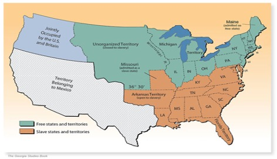

```{r preamble, child = here::here('preamble.Rmd')}
```


---
## Looming Deadlines 

- Chapters 

- Know Thy Political Self .bold[01/30]


---


---
class: center, middle

# The Constitution 


---


---
class: center, middle 

.col[## The Virginia Plan]
--
.col[## The New Jersey Plan]

???
During the drafting of the Constitution I don't think I did a good enough job highlighting that there lots of competing intersts during our founding. These are informed not only by the contemporary political considerations of the time and there experience with the crown. 

We generally focus on the representation plans. Where the Virginia Plan focused on proportional representation and the New Jersey Plan where each state would get the same number of delegates. Critically however they also differ on how we elect our representatives. The New Jersey plan largely kept the spirit of the of the Articles of confederation. People would not directly elect their representatives. Whereas the Virginia Plan there was a more direct role for the people to elect their representatives 

The representation issue is highlighted because fundamentally this would shape the allocation of legislative, executive, and judicial power. In the coming century how senate seats were elected would change. However the original plan only allowed for people to directly elect their member or the house (This was in the Virginia plan) while senators would be elected by the state legislatures(New Jersey Plan).

---


---
## The Branches 

```{r branches, echo=FALSE, out.width= "80%"}

knitr::include_graphics("images/Branches.jpg")

```


???
I kind of ran out of steam last week making the slides and kind of just figured we all knew. But it is important to get the mechanics right. As you can kind of gather you can see the ways in which each branch has checks. Treaties are interesting because the executive goes out and deals with other countries but the senate has to approve of the treaty by two-thirds. This creates interesting bargaining dynamics because those doing the negotiating have to very mindful of this. 

---

---
class: center, middle
## Checks and Balances


???
So I showed you guys this slide without really going over it. The interesting thing about our version of liberal democracy is that we have conflict built into the system. The legislative branch checks the executive branch by approving executive appointments and appropriating money to presidential priorities. It can override presidential vetoes (needs 2/3's in both the house and senate). 


Congress can impeach both the president and the judicial branch. Right laws or amendments that circumvent judicial decisions. The judicial branch can declare executive actions and laws as unconstitutional. We will go over a lot more procedure when we 
---


---
class: center, middle 

.col[# Federalism]

--
.col[# Experiments Everywhere]

---


---

layout:false 


```{r, fig.align='center'}
knitr::include_graphics("images/federalism.png")
```


???
Modern applied economists love federalism because of states make policy that allow them to talk about how policy causes certain outcomes. One of the economists that won this years noble prize in economics wrote a very influential paper on the effect of minimum wage because New Jersey increased minimum wage in 1992. However we for quite a while we have referred to states as laboratories of democracy. This was a term coined by Walter Brandeis and has stuck. Federalism allows states to implement various public policy. Theoretically efficient policies enacted by one state will lead to staggered adoption by other states while inefficient policies will not be enacted by other states 
---


---
## What is it?  

```{r}
vembedr::embed_url("https://www.youtube.com/watch?v=J0gosGXSgsI&t=5s")

```

---


---
class:center, middle 
## Hurricane Katrina 

```{r echo=FALSE}


```
 

???
The Federal Emergency Management Agency (FEMA) was created in 1979 particularly to provide coordination and organization for governmental responses to natural disasters and emergencies that may occur. Staff and administrators were very through in training on emergency management and disaster relief coordination through the Clinton administration. In response to the September 11th, 2001 attacks the Bush administration reorganized the disaster response structure to focus more on terroristic threat response and away from natural disaster relief. It was placed as an administrative agency under the newly created Cabinet department of Homeland Security.  With this switch came a decrease in funding, a decrease in access as an agency to key executive officials, and a new senior staff that had little or no experience with emergency management. 

The new head of FEMA, Michael Brown, appointed by George W. Bush was the former head of the Arabian Horse Association. By 2005, the structure and management was for all intents and purposes considered unprepared to be able to effectively respond to a natural disaster by professionals in and out of the field of emergency management. 

Sadly, on August 29th 2005, Hurricane Katrina, a category 5 hurricane made landfall directly outside of New Orleans, LA.  Levies broke and considerable flooding occurred throughout the entire area. Low income citizens of the city had no resources with which to follow through with evacuation procedures so many remained trapped in their homes as the storm battered the coast and flood waters rose. After the  passing of the storm, FEMA went into a mad scramble to provide food, water, shelter, and medical attention to those in the city, but their efforts were futile and took several days to not only organize but reach those in need. Thousands died in the ensuing chaos without food, water, or medical attention a disproportionate amount were African American. 


---

---
## Who Governs

- 87,576 governments within the United States Federal System

  - 1 National Government 
  
  - 50 State Governments
  
  - 3,034 County Governments
  
  - 19,429 Municipalities 

  - 16,504 Townships
  
  - 13,506 School Districts
  
  - 35,052 Special Districts
---


---
## Federalism 

<gsu-blockquote-blue> 

  is a principle of government that means authority is partly divided and partly shared between the federal (aka “central” or “national”) government and the state governments </gsu-blockquote-blue>

???
Can someone tell me how sovereignty relates to federalism?
Federalism means that states relinquish some of their sovereignty to the federal government. Similarly, the federal government also relinquishes its sovereignty to the states. They share authority and power.

---


---
## How is it Different 

.pull-left[
### Federalism 

- A system of power in which power is divided, by a Constitution, between local, state, and federal governments 

- promotes individual intention 


]

.pull-right[ ### Alternatives

- .bold[Unitary System]: A centralized government system in which lower levels have little power or autonomy from central government

- .bold[Confederacy]: Authority is held by individual states, and powers are delegated to the central government sparingly 

]

???
Think about your neighborhood. What is one thing that you feel that you need from the government that other neighborhoods may not need/want? How are you going to get them to change that? 

In a unitary system you would have to rely on the change occurring slowly and as a order from the centralized government. The local townships and such are limited in the amount of power that they can wield to make actual change. 

In a confederation you would rely on the state governments which while maybe effective will also differ from state to state. Say you want a pothole filled on the street. One state may decide to fill the hole with actual asphalt solving your problem, but another state may just decide to fill the hole with sand. The protections or coverage vary from state to state thus making it difficult for uniformity. Who can think of the most widespread example of federalism we have in the US? It is currently limiting where the Offensive Coordinator of the 49ers will interview for jobs


---

---
## Benefits and Weaknesses 

.pull-left[
### Greater National Authority
Preserves the union

Reduces compliance costs

Provides national public goods

Reduces negative externalities

Protects minority rights

Prevents races to the bottom

]

.pull-right[
### Greater State Authority
Protects liberty

Represents local diversity

Allows for policy experimentation

Benefits from foot voting

Fosters democratic citizenship


]

???
There are kind of two competing visions for what kind of union we benefit most from with adovcates from both sides
---

---
## Who Has Authority Over What?

```{r, echo=FALSE}

pacman::p_load("ggwordcloud")

words = read_csv("data/federalism.csv")


ggplot(words,aes(label = word)) + 
  geom_text_wordcloud() + 
  theme_minimal()


```
???
Answers: 
Money – National 

Issue Licenses – State 

Highways – Concurrent 

Conduct Elections – State

Regulate Commerce – Concurrent

Borrow Money – Concurrent

Establish A and N – National 

Establish Treaties – National 

Establish P,F, and EM depts. – State 

Collect Taxes – Concurrent 

Declare War – National 

Regulate the Post Office – National 


---

---
## State Powers 

- Regulating economic activities with no relation to, or affect on, commerce outside the states

- Creating public schools 

- Family Law

- Regulating and facilitating elections

- Issuing Licenses for hunting, driving, operating businesses 

- Traffic Regulations 

- Designing and staffing state court system 

- Promoting health, safety, welfare, and morality through powers not delegated to the federal government 
---


---
## Federal Powers

- Taxing imports and exports

- Diplomacy and treaty making 

- declaring and fighting wars 

- Recruiting and equipping the armed forces

- Regulating interstate commerce 

- Coining money 

- Making and enforcing immigration laws 

- issuing patents and copyrights

- designing and staffing the federal court systems 


---


---
## Concurrent Authority 

- Taxing, income, goods, services, and land 


- using the power of the purse to promote the general welfare 

- borrowing money 

- establishing banks 

- building roads 

- regulation of economic activities within a state that have a relation to, or affect on, commerce among two or more states 

???
Concurrent powers

---

---
## What about The Supremacy Clause? 

<center> 
<gsu-blockquote-red>
“This Constitution, and the Laws of the United States which shall be made in pursuance thereof; and all treaties made, or which shall be made, under the authority of the United States, shall be the supreme law of the land; and the judges in every state shall be bound thereby, anything in the constitution or laws of any state to the contrary notwithstanding” 


</gsu-blockquote-red>

</center>

???
If there is going to be one thing you take away from todays class it is going to be the crucial nature of the Supremacy Clause.  Found in Article 6, Clause 2 it establishes the Supreme law of the land for everyone. It binds all of us, from the individual citizen all the way up through the top tiers of government to the highest law in the land, the Constitution.  It was essentially a fail safe put in place by the Founders to ensure that the national government could execute its job fully. 

---

---
## Two Supreme Court Constitutional Doctrines Essential to American Federalism
### Other Than the 10th Amendment

- Dillon's Rule 

- Police Power

???
Dillon's Rule: It subordinates municipal level governmnts 

Police Power: States may enact any law with the aim of promoting the health, safety, welfare, and morals of the people unless the law violates a limit on the states’ authority provided in the U.S. Constitution or their state constitution. The limits of state police power has been in a constant push and pull with the federal government 


 the states are not limited to the powers delegated to them in their constitutions. Instead, so long as states do not violate a legal limit placed on them by the U.S. Constitution or their state constitutions, the states may do whatever they choose to promote the health, safety, welfare, and morals of the people


Critically the Supreme court has interpreted the 10th amendment as only giving states police power
---


---
class: center, middle 

## The Evolution of Federalism


```{r echo=FALSE}


```

???
Dual Federalism – Layer Cake – the view of federalism in which the national government is limited to a strict interpretation of the powers granted in the constitution while states have a broader  policy power within their own territories.  Clear concise lines between the two national and state. “States rights”  

This thought dominated the first 150 years of American history. It was a period characterized by strong actions of the Supreme Court against national power especially when it came to regulating commerce. It wasn’t till the 1930’s and the New Deal that things began to change. 

Cooperative Federalism –  Marble Cake – a  view on federalism in which the national government expands its powers and blurs the lines between national and state authority. The new deal opened many doors between the roles to state and federal government, mostly giving the national government a long needed boost in support and power. This time is also characterized by protection of minority rights (Child labor laws, women working laws, and eventually Civil Rights Legislation). 

---


---
## What Drives Changes in Power Between the Federal and State Governments 

- Crises (Civil War, Great Depression, 9/11)

- Technology 

- Politics 

- The Supreme Court


???

Crises: Great depression led to many increases in the power of the federal government into the realm of financing and the economy
9/11 created large bureaucracies to secure the country, but this meant a large growth in the power of the federal government

The internet now means that I can sit in my office and order fuzzy socks from Oregon.  This now means that there is commerce from other states, and now Congress can pass legislation that regulates that commerce (minimum wage, workplace safety, etc)

Politics In general Dems support a larger role for the federal government Repubs are the opposite

Supreme Court We will see in the next 3 slides

---

---
## Dual Federalism 

- "Layer Cake" Federalism 

- Two systems working independently from one another 

- The system of government that dominated the US for the first 150 years in which the powers were shared equally between the two levels of government, state and federal

???
There are much clearer divisions of authority. During the federal government regulated foreign affairs and interstate commerce, and soloed coordination issues where roads or canals spanned more than one area

---

---
## McCullough v. Maryland (1819)


- Dual Federalism and the dominance of the federal government 

--

- SUPREMACY CLAUSE meets the NECESSARY AND PROPER CLAUSE 

???
McCullough v. Maryland – The US decided to charter a bank and open branches in several states including Maryland. At the time, a variety of thoughts were running rampant through the states about government corruption and scandal. The quickest way to corruption and scandal was concerning issues of money. Placing money in a bank provided no guarantees and only further scared those individuals that were afraid of a massive centralized government. 

The state of Maryland decided to pass a law as a way to rectify this and hopefully force the bank of the United States to close. So they proposed an astronomical yearly tax upon any bank that did not originate within the state. Well one of the federal employees at the bank, James McCullough refused to pay the tax and he decided to sue.  The case made it all the way to the SC, where it ran into the Chief Justice of the Supreme Court, John Marshall. Marshall was a known Federalist supporter so it was no surprise that he found the tax by Maryland unconstitutional.  The federal government was perfectly within its job description by passing new laws so that they could faithfully execute the enumerated powers (coin money, raise taxes, etc.) found in Article I, Section 8. 

---


---
## Dred Scott v. Sanford (1857)


.pull-left[

```{r echo =FALSE}



```


]


.pull-right[


```{r echo=FALSE}


```

]

???
At the time of the Dred Scott case the Country was in turmoil. The South was still powering on with Cotton as the King of the crops. Pulled in by the labor of now near 4 million slaves in the country. They solidly refused to give up slavery stating it was an issue of “state’s rights” and if ended would result in the dissolution of the Union. The North on the other hand  was battling with a newly discovered moral compass that clearly demarcated all the obvious evils of slavery that most individuals had seemed to ignore before.  It was in this turmoil that Lincoln came to power, but it was the Supreme Court that would utilize its powers of federalism in this case. 

The Story: In 1820, the United State passed the Missouri Compromise, which most importantly stated that any new state brought into the Union could decide whether it was to be a free state or a slave state.  In 1834, slave Dred Scott was purchased in Missouri and then brought to Illinois, a free (non-slave) state. His owner and he later moved to present-day Minnesota where slavery had been recently prohibited, and then back to Missouri. When his owner died, Scott sued the widow to whom he was left, claiming he was no longer a slave because he had become free after living in a free state. At a time when the country was in deep conflict over slavery, the Supreme Court decided that Dred Scott was not a “citizen of the state” so they had no jurisdiction in the matter, but the majority opinion also stated that he was not a free man. In effect, this meant that Congress had no power to prevent the spread of slavery and that the expansion of slavery would be left up to the states. the decision is also notorious because it limits citizenry to Whites and that black person, free or enslaved, were not citizens 


Thus the union was preserved for a very short time.  Yet the belief of state’s rights, the principle that the states should oppose the growing authority of the national government was growing. 

Why was this important? Can someone explain to the class how this fits in to our discussion. What was the federal interest in this case? What about the state’s interest? Who had the power? How did it change? 


---

---
## Cooperative Federalism 

- "Marble Cake Federalism"

- Expansion of the Federal Government 

- Blurs the lines between national and state authority 


- Started in the 1930’s during the Great Depression 

  - “Switch in Time that Saved Nine” 

???
In 1933, FDR took office amidst the raging Great Depression that had been plaguing the United States for over a decade. 25% of the entire eligible workforce was unemployed and they were clamoring for intervention by the new president and the federal government. So he turned around and did what they asked. Legislation after legislation was proposed with massive efforts to reform the nation and help everyone get back on their feet. Roosevelt's policy efforts were heavily influenced by Keynes. Keynes was an economist at the time that essentially argued that for an economy to prosper you need to manage counter-cylical demand.  Because of the vast amount of unemployment people weren't buying stuff leading to businesses cutting costs in lots of ways including firing people. Leading to more problems. 

FDR's proposal was a vast expansion of the reach of the federal government in the eyes of the court. The traditional interpretation of the commerce clause was. Commerce Clause does NOT let Congress regulate economic production.

After a little trouble with the Supreme Court, (anyone ever heard of the switch in time that saved nine) the programs finally began to be implemented and the federal and state governments no longer had such clean lines concerning their responsibilities and powers. Things tended to be shared. 

Switch in Time that Saved Nine – The Supreme Court at the time of Roosevelt’s election and first term was a bunch of grumpy, old, and White conservatives that felt that the programs that FDR were proposing were too liberal thus an overextension of the clearly stated powers that Congress and the President had. So each time legislation would come before them, it was declared unconstitutional and the status quo of the depression stayed the same. Finally Roosevelt got fed up, and he has a bill proposed that would allow him (as the president) to add justices to the Court for every justice at the time sitting on the court that was over the age of 70. This would add 6 judges to the court bringing the total to 15 and an obvious majority in favor of Roosevelt. In fear of the this drastic threat to their job and the institution of the court itself, the subsequent cases were all found in Roosevelt’s favor and ultimately lead to the social and economic programs that would save the country. 


Substantial Effects Doctrine: Commerce Clause lets Congress regulate any economic activity that has a substantial effect on interstate commerce.


---

tim.allen

---
## Federalism in Recent Years

- Gonzales v. Raich (2005) 

  - Weed Island and the Legalization Battle 

???
Gonzales v. Raich – In 1996 California passed a law legalizing the sale and use of medical marijuana. Under the CSA (Controlled Substances Act it was still a Schedule I narcotic and it was illegal to sell/distribute) Angel Raich, was a user and also grew a little bit at home. In 2002, his home was raided by members of the DEA and the local sheriff’s department. The govt (federal) claimed violation under the CSA as well as under the Commerce clause since it effected the market for the consumption of marijuana intra and interstate. Despite the medical necessity that Raich claimed, the Supreme Court ruled against her. The CSA was considered a legal exercise of the implied powers of Congress under the Necessary and proper clause. 

 Marijuana is regulated by the Federal government under an interpretation of the power to regulate commerce between the States. It is the same power that justifies the existence of the FDA and its regulation of pharmaceuticals. Congress has passed laws declaring certain active materials of no medical virtue, imposing extraordinary taxes and regulations that do not ban them outright, but do ban their transportation and sale. State laws that make possession and use a crime are in addition to Federal law. If a State does not make possession and use of marijuana a crime, it is not, even though its transportation and sale are still Federal crimes. The Federal power cannot ban local production, manufacture, and trade that does not cross any State lines at all, but they can arrest people and take the case to court for the violation of federal sale laws of schedule I narcotics. 


---