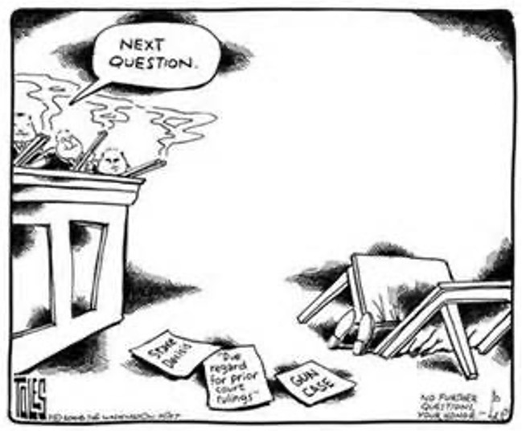

```{r preamble, child = here::here('preamble.Rmd')}
```


---
class: center, middle
.col[# Rights of the Criminally Accused]

---

---
## Amendments that Encode Them

- $4^{th}$ Amendment Protections from Search and Seizure

- $5^{th}$ Amendment Right to Remain Silent, Protection from self incrimination, Right to a Grand Jury, Protection from Double Jeopardy

- $6^{th}$ Amendment Right to be informed of charges, Right to Counsel, Right to confront witnesses, Right to a speedy trial

- $8^{th}$ Amendment Protection from excessive bails and fines, protection from cruel and unusual punishments


???
These rights are where some of the toughest battles concerning incorporation occur outside of the various First Amendment challenges. These are all rights granted to those that are accused of crimes, are suspects in the commission of crimes, those who have been convicted of crimes, and those that are brought forward as witnesses to crimes. 

These are all of the rights most associated with due process of law (the right of every citizen against arbitrary action by both national and state governments). They are mostly procedural limitations on what the government can do.

---


---
## $4^{th}$ Amendment 

<center>
<gsu-blockquote-red>

The right of the people to be secure in their persons, houses, papers, and effects, against unreasonable searches and seizures, shall not be violated, and no Warrants shall issue, but upon probable cause, supported by Oath or affirmation, and particularly describing the place to be searched, and the persons or things to be seized
</gsu-blockquote-red>
</center>
???
This is the first of the amendments in a series (4 through 8) that discuss the rights of the individual as it pertains to committing a crime. These are some of the most contested and controversial of the amendments over the last 20 years as the attention to the rights of the victim have grown and changed. 

---


---
## Important Points About the $4^{th}$ Amendment

- The Court has adjucated both search and seizure

- Search 
  - Terry V. Ohio(1968)

- Seizure
  - Mapp v. Ohio(1961)
  - Incorporation 
  - Exclusionary Rule
  
???
Search – The main point I want you all to take away when we are talking about the fourth amendment and the element concerning search is that an individual has a reasonable expectation of privacy into which the government cannot intrude. This is a moveable bubble, and covers an individual rather then a specific location. (Prior cases had limited to only the home). Privacy is portable!!! 
One exception to this rule is in the case of a Terry stop or what you and I know it as “a stop and frisk”. A stop and frisk is a legal warrantless search by the police due to the police’s belief that one is about to commit a criminal activity. The officer can perform a pat down looking for a weapon because he fears for his safety as well as the safety of others. (Case facts: An individual was walking down the street doing a little window shopping (aka looking to see which stores lacked security and were easy to break into without alerting the police) and he was stopped by the police for suspicious behavior.) 

Mapp v. Ohio – incorporation to the states - Ms. Dollaree Mapp, was at home hanging out when she heard a knock on the door. It was the police and Ms. Mapp was under suspicion for being in possession of materials with which to make a bomb and as well some illegal gambling equipment.  The police asked nicely if they could come in but she refused. So one of the officers left, and a few hours later returned with a few extra officers and a random piece of paper they called a warrant. Mapp took the warrant and shoved it down her dress so  she could later verify its legitimacy. The officer wrestled her to the ground and she was placed in handcuffs. The officers executed the search and found nothing but a box of porn that map claimed belonged to a former tenant. It was still illegal in Ohio so they tacked it onto her other charges.  She sued and the Court said, your Fourth Amendment rights were violated. So sorry, and we are glad you were not making a bomb in your basement or garage. 

Exclusionary rule – evidence that is seized during violations of the fourth amendment are excluded from use as evidence in the court of law. As it was stated by one Felix Frankfurter – “it becomes fruit of the poisonous tree” and is useless

---


---
## Warrants 
.pull-left[
 ### Probable Cause 
- The state of knowledge that an officer of the law has concerning whether or not an individual is committing or has committed a crime. 
- Must be substantiated by knowledge of a trustworthy nature ]

.pull-right[
### Exceptions
- Consent 

- Plain view or open fields

- Exigent circumstances(when getting a warrant is too dangerous/impractical)

- Motor vehicles 

- When in the act of being arrested 
  - to avoid the destruction of evidence 
  - To avoid coming to the officer
]

???
The officers must have cause to issue a warrant. Cause is established when the facts and knowledge the officer has is of trustworthy nature and can lead to an individual that has committed or is in the act of committing a crime.

---

---
## $5^{th}$ Amendment

<center>

<gsu-blockquote-blue>

“No person shall be held to answer for a capital, or otherwise infamous crime, unless on a .bold[presentment or indictment of a Grand Jury], except in cases arising in the land or naval forces, or in the Militia, when in actual service in time of War or public danger; .bold[nor shall any person be subject for the same offence to be twice put in jeopardy of life or limb; nor shall be compelled in any criminal case to be a witness against himself, nor be deprived of life, liberty, or property, without due process of law; nor shall private property be taken for public use, without just compensation]”


</gsu-blockquote-blue>

</center>

???
The right to a grand jury 
Protection against double jeopardy 
Protection against self incrimination (pleading the fifth) 
DPC –applicable only to the federal government 
Takings without just compensation – goes back to Barron v. Baltimore 

---


---
## Fifth Amendment Terms

.hiro-light-blue[Grand Jury]: a step within the criminal/civil trial in which a jury decides whether there is sufficient evidence available in a case to justify a trial

.hiro-red[Double Jeopardy]: the instance where an individual is being tried before a court of law for the same crime twice. 


.hiro-orange[Eminent Domain]: the right of the government to take private property for public use with just compensation


.hiro-dark-blue[Habeas Corpus]: a protection against illegal imprisonment requiring that those detained have access to a court of law concerning the reasons for their detention


---

---
## Self-Incrimination and Right to Counsel
### Miranda v. Arizon(1966)

<center>
<gsu-blockquote-red>

You have the right to remain silent. Anything you say can and will be used against you in a court of law. You have the right to speak to an attorney, and to have an attorney present during any questioning. If you cannot afford a lawyer, one will be provided for you at government expense.” 

</gsu-blockquote-red>
</center>

???
On March 13, 1963, Ernesto Miranda was arrested, by the Phoenix Police Department based on evidence linking him to theft of $8 dollars from a bank employee.  After several hours of interrogation, Miranda not only confessed to the theft but also to the rape and kidnapping of a 18 year old girl nearly 10 days before. Miranda both confessed verbally and via a written confession to the crimes. However, at no time was Miranda told of his right to counsel (Sixth Amendment) Prior to being presented with the form on which he was asked to write out the confession he had already given orally, he was not advised of his right to remain silent, nor was he informed that his statements during the interrogation would be used against him. At trial, when prosecutors offered Miranda's written confession as evidence, Miranda’s lawyer objected that because Miranda was not advised of his rights, the confession was not truly voluntary and should be excluded. Moore's objection was overruled and based on this confession and other evidence, Miranda was convicted of rape and kidnapping and sentenced to 20 to 30 years imprisonment on each charge, with sentences to run concurrently. Moore filed Miranda's appeal to the Arizona Supreme Court claiming that Miranda's confession was not fully voluntary and should not have been admitted into the court proceedings.  And the court said, while you are an unfortunate human being, you still deserve to have your rights read to you. 

This covers both the 5th and the rights of the 6th amendment. 

Specifically, the right to counsel is a guarantee that extends to any trial, with or without a jury, which holds the possibility of imprisonment. This is generally a felony charge, but others apply as well. (Such as traffic court).

---


---
## $6^{th}$ Amendment: Fair Trial

Trial by Jury

Speedy Trial

Right to an Attorney
---


---
## Rigth to Legal Counsel
### Gideon v. Wainright
<center>
<gsu-blockquote-alt>

If an obscure Florida convict named Clarence Earl Gideon had not sat down in his prison cell with a pencil and paper to write a letter to the Supreme Court, and if the Court had not taken the trouble to look for merit in that one crude petition ... the vast machinery of American law would have gone on functioning undisturbed. But Gideon did write that letter, the Court did look into his case ... and the whole course of American legal history has been changed- Attorney General Robert F. Kennedy


</gsu-blockquote-alt>
<center>
???
Between midnight and 8:00 a.m. on June 3, 1961, a burglary occurred in a bar in Panama Beach, Florida. An unknown person broke a door, smashed a cigarette machine and a record player, and stole money from a cash register. Later that day, a witness reported that he had seen Mr. Gideon in the poolroom at around 5:30 that morning, leaving with a wine bottle and money in his pockets. Based on this accusation alone, the police arrested Gideon and charged him with breaking and entering with intent to commit petty larceny. 

Gideon appeared in court alone, as he was too poor to afford counsel. However, at this time Florida state law only provided appointed counsel to indigent defendants charged with a capital offense. As a result, he was forced to act as his own counsel and conduct his own defense in court, emphasizing his innocence in the case. At the conclusion of the trial the jury returned a guilty verdict. The court sentenced Gideon to serve five years in the state prison.

From the prison cell he made use of the prison library and wrote his petition to the Supreme Court on a piece of prison stationary paper and pencil. Gideon appealed to the United States Supreme Court in a Gideon argued in his appeal that he had been denied counsel and, therefore, his Sixth Amendment rights, as applied to the states by the Fourteenth Amendment, had been violated. The Supreme Court heard his case, and decided that despite the type of case (capital or not), all indigent defendants had a right to counsel. After 4 years in prison, Gideon was released from prison when he was found not guilty due to a lack of evidence.


---


---
## $8^{th}$ Amendment 

- Protection from excessive bail and fines 

- Protection from cruel and unusual punishment 
  - The Death Penalty

???

1. Against – What about the risk of executing innocent people? Nearly 140 people have been freed from jail after being proven innocent due to advanced technology. 
2. For – It lowers crime rates since criminals are scared. Studies show that states with the death penalty actually have higher crime rates. 
3. For – It’s an eye for an eye. It’s all about fairness. – An eye for an eye makes the whole world blind. What is actually fair? 
4. Against – Execution costs are expensive. It is true, execution is expensive, but the expense is comparable to the life/care costs of an individually on a life sentence with no chance at parole.
5. The main arguments are not about morality but rather about the discrimination that occurs in convictions. 

Facts:  
Since its reinstatement in 1976 the federal government has executed 1348 people (2013). There are currently 35 states that utilize capital punishment. 

141 other countries have abolished its use. The majority of executions today occur in Iran, North Korea, Iraq, Syria, China, and the United States. 

80% of those executions have taken place in a southern state with 37% of that being contributed solely by the state of Texas. 

Five authorized methods: Lethal injection, electrocution, Gas chamber (3 states – AZ, MO, WY), Hanging (DE, NH, WA), or Firing Squad (OK, UT)

Additional video about currently accepted methods in picture (if discussion moves that way)


---


---
## The History of The Death Penalty 

Justice Brennan's Four Qualifications: 

The punishment shall not degrade human dignity. 

The punishment shall not be inflicted in an arbitrary fashion 

The punishment shall not be a type that is totally rejected throughout society 

The punishment shall not be considered unnecessary 

???
Ironically, the State of Georgia has taken a very crucial role in this issue before the Courts. They were party to both cases Furman v. Georgia (1972) and Gregg v. Georgia (1976), which first abolished the death penalty and then reinstated it. 
Justice Brennan’s standards for considering capital punishment established in Furman v. Georgia. No state should pass a law concerning capital punishment that violated any of these 4 test prongs. Specifically the court has faced many cases concerning the third part of this test. They have found that many types of execution that have been utilized throughout history can be defined as excessive or unnecessary including drawing and quartering, dissection, beheading, disembowelment, and burning alive. 

The court has made several other stances on the death penalty including that children under the age of 18 shall not be sentenced with it and specifically that no one with mental handicaps will be considered eligible. The death penalty is also considered an excessive punishment for crimes in which a life has not been taken, such as rape of adult or child. 

---

---
## $9^{th}$ Amendment 

<center>
<gsu-blockquote-red>

The enumeration in the Constitution, of certain rights, shall not be construed to deny or disparage others retained by the people

</gsu-blockquote-red>
</center>

---

---
## Enumerated vs. Implied Righs

.vero-red[Enumerated Rights]: Rights that are clearly defined and  explicitly stated within the wording of the Constitution 
  
  i.e. .vero-red[The Right to Bear Arms]


.vero-blue[Implied Rights]: Rights that are not clearly stated within the Constitution, but the Court has found basis to extend them to individual protection. 
  
  i.e. .vero-blue[The Right to Privacy]

???
We already discussed the concept of enumerated vs. implied when we were talking about the powers of the branches of government. This same concept applies here. 

The court has found that while the rights in the first 8 amendments are basic and fundamental in liberty they are by no means exhaustive and that there still exist ways and means in society for the government (at first only the federal government with the creation of the Bill of Rights) and then the states (after the addition of the 14th amendment and the Due Process Clause which allowed for selective incorporation).  

---

---
## Right to Privacy

- Birth Control 
  - Griswold v. Connecticut(1973)

- Abortion 
  - Roe v. Wade(1973)
  - Modern Complications 

- LGBTQIA Rights
  - Lawrence v. Texas(2003)
  - Modern Implications
  
???
The right to privacy is not established or enumerated clearly within the Bill of Rights, but the courts have found the means to protect it in the 4th, 5th, 9th, and 14th amendments. It is essential defined as the protection from government intrusion. We are going to talk about several of these areas. Once again the same warning is extended about classroom behavior. We are in a “safe environment” and opinions shall not be trampled upon simply because you think or someone thinks they are wrong. 

Griswold – There was an old Connecticut law placed on the books in the 1850’s that prohibited the use of contraceptive materials of any form (pills, shots, etc.). Well fast forward a hundred and twenty years or so and we are in the midst of the sexual revolution and its attempts to educate people about sex, STD’s, and contraception. So along comes Estelle Griswold and a few of her doctor buddies and they decide they are going to open a clinic directly across the street from a police station. To make it even more obvious they are giving out birth control they put a big sign in the window saying that they are doing so. The police of course arrest them and they take the case to court. They argue under the ninth and 14th amendment that their rights have been violated. The courts believe them and the law is struck down. Thus the right to privacy is protected. 

Roe – 1969 a young woman (using the alias of Jane Roe) found out she was pregnant with her third child. Without the financial means to support the coming child Roe sought out alternatives for terminating the pregnancy and had no luck. At this time every state had some form of anti-abortion law in place since roughly the 1900’s. So she decided to go to court. Eventually her case made it to the Supreme Court (by this time the case would be moot, since the child was turning 3 years old at the time). The Supreme Court reaffirmed her right to privacy and that this was a decision to be made between a woman and her doctor. But limitations were put on the abortions, the reason must be because a detriment to the mother’s health and that the abortion can occur no later then the 2nd trimester, to avoid interfering with the potentiality of life. 
Modern complications – the states have begun creating new laws that are slowly chipping away the Roe standard.  Some of these standards include a 24 hour waiting period prior to an abortion, having pre-abortion counseling and requiring parental consent for minors. Public opinion data shows that the United states is very clearly divided on the issue 48% that are pro-choice and 46% that are pro-life.  Some state have enacted trigger laws that if Roe were overturned would automatically make abortion illegal, and others has specifically stated they will continue with legalization by state law. 

Lawrence – Legal punishment for sodomy often came with heavy fines and jail time up to life imprisonment.  By 1960 every state had anti-sodomy laws on the books. 1986 dealt a huge blow to gay rights movements when the court refused to strike down anti-Sodomy laws as a violation of sexual privacy stating that the right to privacy only extended to sexual acts that were procreative in nature.  Until Mr. Lawrence came along. He just happened to be the apple of two different men’s eye. Well one of his lovers didn’t like not being the center of attention so knowing that Mr. Lawrence was having the other man over he called the cops and reported that a crazy man was waving a gun around and making threats. The cops were immediately dispatched and entered his home. They found the two men engaged in sexual acts and immediately arrested them for violations of sodomy laws and being engaged in acts of deviant sexual behavior. So they decided to go to Court, and the court said that you are right. We were incorrect and that sexual privacy is a right as part of the 9th amendment. 

Modern perspective – Georgia still has sodomy laws on the books, but they are mainly to be utilized as tools in rape cases. The sentences for sodomy law were so severe here that an individual could go to jail longer for what was considered deviant sexual acts (anal and oral sex) then they would for being convicted of necrophilia and bestiality at the same time. By the way these deviant sexual behavior laws still exist making it illegal to have sex in any position other than missionary. (Fortunately the state does not take the time to enforce them otherwise a whole lot more people would be in jail today).

---


---
## $2^{nd}$ Amendment

<center>
<gsu-blockquote-red>
A well regulated militia being necessary to the security of a free state, the right of the people to keep and bear arms shall not be infringed.”
</gsu-blockquote-red>
</center>


???
The origin of the second amendment traces back long past that of the Bill of Rights. It stretches itself all the way to the natural right of self defense that each man is endowed with. This is of course an extension of the right to life that Thomas Jefferson expounded upon in the Declaration of Independence. Along with what two other rights? (Liberty and pursuit of happiness). Its English origins arise from the English Bill of Rights from 1689, in which the citizens were trying to avoid the encroaching powers of the British Monarchy. Fearing such power they required a guarantee to insure that their arms could not be removed outside the bounds of proper behavior and accordance with the laws. 

These feeling carried over to the colonies, and became an even further necessity for the people after the Revolution much of which the British spent trying to disarm the disgruntled colonists. They very clearly failed in this endeavor for the most part. 
As far as the militia, some of the founders (Patrick Henry in particular) believed the only true way to liberty was through a properly trained and armed populace. In fact this belief was so rampant, that the founders also felt that the federal government could never actually raise a standing army strong enough to actual defeat a local well armed and organized militia. How many of you think this is the truth today? 

---

---
## DC v. Heller

- Commerce Clause

- Plaintiff Diversity

- Still no Incorporation to the States

???
This case is unique for a variety of reasons and an interesting story to tell. 

This was the first case since Cruikshank concerning that first amendment that did not attempt to incorporate to the states using the Commerce Clause of the First Amendment.  Most of the attempts up till then had used the Commerce clause since the federal government had the right to control interstate commerce. (Remember interstate commerce – David’s Cake for Emily’s bagels or Ben’s pens). 
What the lawyers did was similar to what was done in the case of Brown vs. Board of Education, they tried to find the perfect set of plaintiffs with which to bring the case before the Court. So they auditioned people/their cases. They wanted a group that was economically, racially, and sexually diverse to ensure that the case was taken. They eventually settled on 6 individuals with which they would attempt to get the case heard. 

Finally they find away to get the case heard, through the case of Mr. Dick Heller. He was a special police officer for DC who followed regulations to a T. He lived in a rather rough part of town, and at the time DC regulations stated that he could not carry a weapon in his own home. Yet, as a police officer he could always carry on duty. So he decide to take the issue to the Court since he feared for his own safety in the part of town that he lived in when he was at home.  We the Court issues a decision, but it is a confusing one.  Individuals can and do have a right to have arms for lawful means such as personal safety in their own homes, but since DC is not a state this does not apply to anywhere but federal enclaves

---


---
## McDonald v. City of Chicago

```{r echo = FALSE, fig.align='center'}

```

???
Old Man Otis McDonald had lived in the same neighborhood in the city of Chicago for almost 45 years. As the years passed Mr. McDonald became more and more incensed about the state of his neighborhood and how many gangs and drug dealers he could see wandering the streets each and every day. It got worse when he retired since he was home so much more to see it. His home had been broken into 4 times, but the final straw was the last time when he recognized the man breaking in as one of his neighbors who lived right down the street! He already owned several shotguns legally for hunting purposes, but they were unwieldy for self defense so he wanted to buy a handgun for his protection. The city had a law in place requiring registration of all handguns, but they had suspended the registration practices since 1982! So Mr. McDonald decided to sue. The Court said we can allow this finally to the states, but with certain restrictions for felons, the mentally ill, and certain zones (schools and such) that were to remain gun free. 

This is very important, since this was the original way the Founders thought to get the Bill of Rights incorporated to the states. It states that “No State shall make or enforce any law which shall abridge the privileges or immunities of citizens of the United States” but it had been gutted and deemed of no use by the Court very early. The predominate means of incorporation occurs via the Due Process Clause of the Fourteenth and Fifth amendments
---

---
## Gun Rights Today 
- What kinds of challenges are open to gun rights today? 

- Does this kind of thing include assault rifles?

- Submachine guns? 

- What about Magazine size restrictions? 

- Does it include grenades? 

- Missile/rocket launchers? 

- What about open carry? What kind of restrictions should this have? 

- What about Castle laws?

- What about Stand Your Ground Laws?

- What about Peaceable Journey Laws? 

???
Castle laws – the right an individual has to self defense when their home is attacked. This is currently allowed in 46 states. 

Stand Your Ground laws – the right an individual has to self-defense when they fear themselves under attack in any circumstance. An individual has no duty to retreat or abandon a place which they have the right to be in (26 states). 
Peaceable Journey laws- a Law in which If an individual is in legal possession in their home location as well as their destination, then they may Peaceably transport their firearms through the intervening jurisdictions without fear of violating law. 

These are all issues that a current issues in the United States concerning gun rights today. 

---

