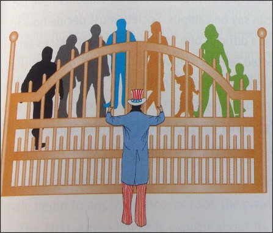
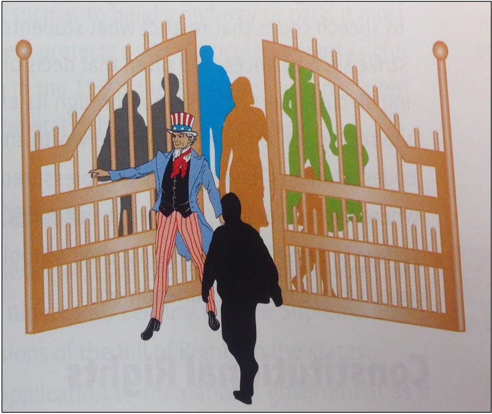
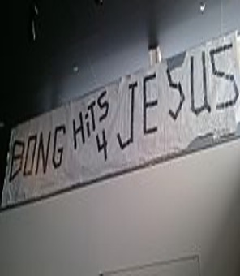
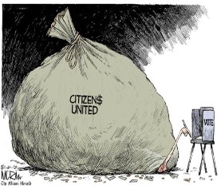
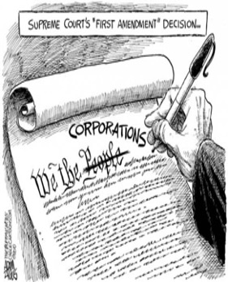
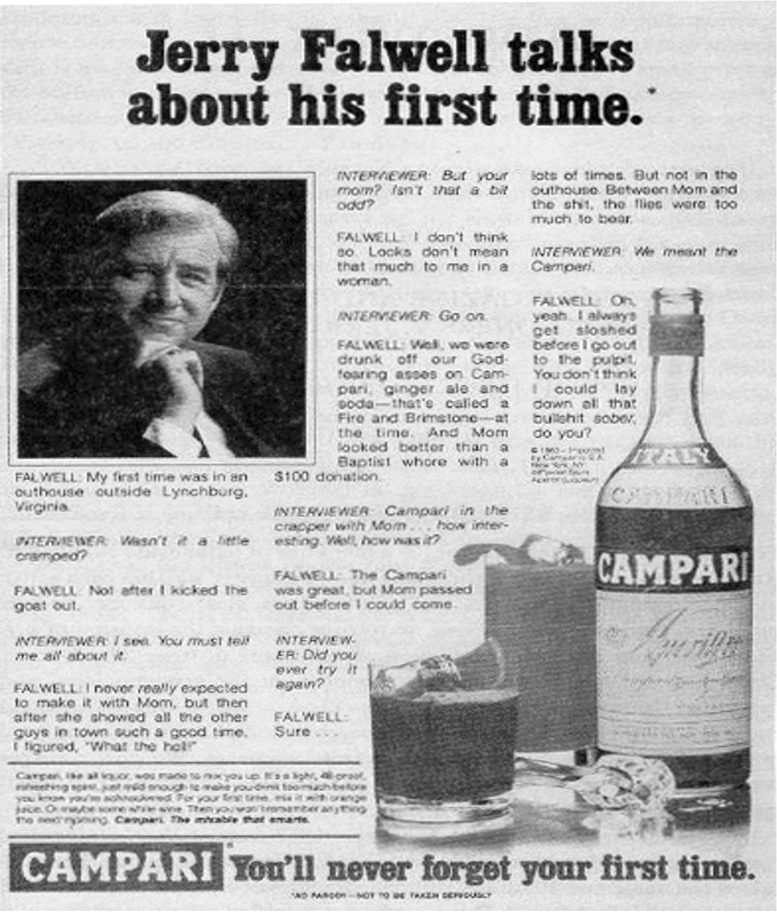

```{r preamble, child = here::here('preamble.Rmd')}
```


---
## Looming Deadlines:

- Check in survey .bold[02-20-2022]

- Chapters

???
Overall the Tests went really well! The average was a 77% with. I still have to look at the question data to go over and see what the contents of the questions were that the class writ large did not do as well on. From there I will go through and adjut your scores accordingly. I have the data I just need to actually transform it and then upload it into icollege. 

I have a first cut of the data but I just need to go through it a little more thoroughly
---


---
class: center, middle, inverse
# Civil Liberties


---


---
## Federalist 51
<center>
<gsu-blockquote-red>

“It is of great importance in a republic not only to guard the society against the oppression of its rulers, but to guard one part of the society against the injustice of the other part.” - James Madison

</gsu-blockquote-red>
</center>

???
So today we are going back again to Philadelphia and the Constitutional Convention in 1787. I know you all are so excited to be learning more history, but I promise we will get to talk about some fun stuff today as well. (porn, curse words, etc.) When the Constitution was proposed not everyone was happy. (surprise surprise). The Constitution was essentially a flawed document, it told everyone what the government could do, but in no way limited what the government was not allowed to do. Those that were most upset about this were the anti-federalists. 
 
 DQ: Can anyone name one of the critical features of the anti-federalist party (no big government, limited federal power, policies that favored artisans/workers/farmers)? 
Can anyone name a key figure in the anti-federalist party? (George Mason, Patrick Henry, Samuel Adams, etc.).  

In fact, several of these individuals refused to sign the Constitution because of the lack of the individual protections provided by the constitution.  They feared the overwhelming power of a centralized government, and were fearful that the lack of such protections would lead them back under the rule of a tyrannical despot like the monarchy of GB. Thus, the Bill of Rights was born. 12 amendments were originally proposed by James Madison to the Continental Congress with 10 of those finally being adopted and ratified.  Amending the Constitution for the first time. 

---

---
## Amending the Constituion

.pull-left[
### Requirements

- $\frac{2}{3}$ vote in both Houses of Congress

- Ratification by $\frac{3}{4}$ of the States Legislatures or Constitutional Convention

]

.pull-right[

- 18 Times throughout history

- $1^{st}$ was the Bill of Rights  


]


???
In the 200 plus years since our constitution was created hundreds of thousands of amendments to the constitution have been proposed including (a flag burning amendment, a school prayer amendment, a federal marriage amendment) and some even more ridiculous like renaming the country the United States of Earth, one to ban drunkenness in the United States, one to ban divorce, and one to limit the personal wealth of individuals to 1 million dollars).  

Thankfully (in many of these cases) only 27 amendments have actually been ratified and added to the Constitution. 

--- 


---
## Bill of Rights 

1st Amendment: Freedom of Speech, Press, Religion, Assembly, and Petition 

2nd Amendment: Right to Keep and Bear Arms 

3rd Amendment: Quartering of Soldiers 

4th Amendment: Protection from Unwarranted Search and Seizure 

5th Amendment: Rights of the Accused Person in Criminal Proceedings 

6th Amendment: Trial Rights for Accused

7th Amendment: Trial by Jury in a Civil Trial 

8th Amendment: Protection from Excessive Bails, Fines, and Punishment 

9th Amendment: Reservation of Various Rights to the People 

10th Amendment: Reservation of Powers to the State or People 
---

---
## What are Civil Liberties

.pull-left[
```{r echo = FALSE}

```

]

.pull-right[

The political freedoms that protect individuals from abuses of powers by the federal government 

These are restraints found in the Bill of Rights for the federal government, that are applicable to the states under the $5^{th}$ and $14^{th}$ Amendment Due Process Clause.

“Nor shall any person/any state deprive any person of life, liberty, or property, without due process of law”


]

???
Gate Analogy – 

Here are the people. Here is the government. Between them is a gate. This gate represents civil liberties. Civil liberties are those protections that keep the government “out” of the lives of the people. They prevent them from getting too involved. 

Let me make this very clear statement: THESE RIGHTS ARE NOT ABSOLUTE!!! And as we will discuss in the coming days they have lots of limitations. 

---


---
## What are Civil Rights?

.pull-left[

```{r echo=FALSE}

```

]

.pull-right[
The rights that protect individuals from discrimination by other individuals and government. 

These protections are applied to the federal government, and are applicable to the states through incorporation under the 14th amendment Equal Protection clause. 

“Nor deny to any person within its jurisdiction the equal protection of the laws”

]
???
Gate analogy: Once again here is the mass populace of people. Here is the government. The gate here stands for civil rights. In this case the government is opening the gate to people that prior to now/then had been denied such rights and freedoms. 

Can anyone name an example of a class of people that formerly did not have such guarantees or protections afforded to them by the government? 
A: Races, social classes, gender, sexual orientation, religions, political affiliations, age, disabled, veterans, etc. 

These two terms while often conflated, mean very different things and the next few days we will focus on civil liberties. This lesson is one of several that provide broader implications for understanding your role as citizens and specifically the rights that you have. The civil rights lecture will come later in the semester.

---


---
## Baron v. Baltimore and Incorporation 

.pull-left[
<gsu-blockquote-blue> .bold[Selective Incorporation]: A constitutional doctrine under which certain rights and freedoms of the Bill of Rights are selectively applied to the states through various vehicles of the 14th amendment, specifically the Due Process Clause.  

</gsu-blockquote-blue> 
]

.pull-right[
Due Process Clause 

Can anyone name one of the freedoms in the Bill of Rights that the Supreme Court has yet to incorporate to the states? 


]
???
While the Framers had done a good job in creating the Bill of Rights, they had failed to do one extremely crucial thing. They had failed to ensure that these rights applied at the state level. Many of the new state constitutions provided these freedoms or similarly worded freedoms to their citizens, but not all. So in 1833 this was put to the test before the Supreme Court. 

John Barron, was a powerful and wealthy businessman in the city of Baltimore. He owned vast amounts of property, but specifically he owned a wharf in the Baltimore harbor that was very profitable for his shipping business. Problem was the city of Baltimore had decided when doing some construction to divert the flow of water. This had deposited a large amount of dirt and sand at the end of Barron’s wharf making practically unusable which was bad for business. So he sued the Mayor and the city of Baltimore one the grounds that he deserved just compensation for his damages.  He utilized the 5th amendment’s takings clause, to justify the government giving him said compensation.  The takings clause is found in the 5th amendment and limits the federal government’s power of eminent domain. 

Can anyone define eminent domain for me?  The power to take private property for public use. New eminent domain laws require what is called just compensation. (Examples: Taking land to build highways, sidewalks, etc.) 
 It rose through all the levels and the court ultimately found that the bill of rights protections were not guaranteed to the states and were reserved only for the federal government. So unless a state constitution had these “rights” written into them, most individuals were in trouble if the government interceded into their “business”. This judgment stood till 1925 when some lawyers finally wised up and found the Due Process Clause of the 5th and 14th amendments. Since then a veritable flood of cases have come before the Supreme Court in an effort to incorporate and understand how the bill of rights freedoms apply and protect individual citizens at the state level. 

“Nor shall any person/any state deprive any person of life, liberty, or property, without due process of law” 

The Third Amendment it its entirety: Quartering of soldiers, the Seventh Amendment it its entirety: The right to a jury in a civil trial, the Eighth Amendment partially: Protection against excessive bail and fines 

---

---
layout: false


```{r cleaning, echo=FALSE}

incorporation_dat = read_csv("data/years_incorporated.csv")

incororation_1900 = incorporation_dat %>% 
  filter(Year_Incorporated > 1900 & Year_Incorporated <= 2000)

not_incorporate = incorporation_dat %>% 
  filter(Year_Incorporated == "not incorporated")
  
incorporation_1800 = incorporation_dat %>% 
  filter(Year_Incorporated >= 1800 & Year_Incorporated <= 1900)

incorporation_2000 = incorporation_dat %>% 
  filter(Year_Incorporated == 2010 | Year_Incorporated == 2019)

```


```{r echo = FALSE}
gt(incorporation_1800) %>% 
  gtExtras::gt_theme_nytimes()
```


---

---
layout:false 

```{r echo = FALSE}
incororation_1900 %>% 
slice(1:11) %>% 
gt() %>% 
gtExtras::gt_theme_nytimes()
```


---

---
layout:false


```{r echo = FALSE}
incororation_1900 %>% 
slice(12:22) %>% 
gt() %>% 
gtExtras::gt_theme_nytimes()
```


---

---
layout: false

```{r echo =FALSE}
gt(incorporation_2000) %>% 
  gtExtras::gt_theme_nytimes()
```


---

---

layout:false
```{r echo = FALSE}
gt(not_incorporate) %>% 
   gtExtras::gt_theme_nytimes() 
```


---

---
class: center, middle

.col[# The First Amendment]
--
.col[# It's Bits and Pieces]

---

---
## Freedom of Religion
### Free Excercise Clause

- Laws .bold[cannot] interfere with religious practice or opinion, but laws can be made to regulate certain religious practices

- Employment Division v. Smith 1990

???
Individuals have the right to hold whatever religious beliefs that they would like, but this does not mean that they are exempt from criminal prosecution under other laws. 

Employment Division v. Smith – Two employees of a private drug rehabilitation center were members of the Native American Church. One evening during a ceremony the two ingested a form of peyote, a powerful hallucinogenic that they used to commune with a higher power. The next day the two decided to go to work, business as usual, not realizing that evidence of their high was still very clear.  As a result, they were fired from their jobs as drug rehab counselors and were criminally charged based on Oregon state law that penalized the use of peyote.

They sued under the Free Exercise Clause as a violation of their religious rights, and the Supreme Court finally decided to hear their case.  Unfortunately, the Court decided against the two employees, the law that they had been charged for was not aimed at religious practices specifically. It was a neutral law put in place to protect all the citizens of that state from the repercussions that could have happened from peyote use. 


---

---
## Freedom of Religion
### Establishment Clause 

.pull-left[
Sepeartion of Church and State

Everson V. Board of Education (1947)

Lemon v. Kurtzman(1971)

]

.pull-right[
According to the Lemon Test, the Law must:

1. Have a non-religious Purpose
2. Neither Advances nor prohibits religion
3. Not Promote excessive government entanglement 

]

???
So what does freedom of religion mean? 

Freedom of Religion has two key components under the Constitution. The Establishment Clause and the Free Exercise Clause. 

The Establishment clause of the First Amendment is the primary pronouncement in the Amendment, stating that Congress cannot institute a law to establish a national religion for the preference of the U.S. government. 

Thomas Jefferson wrote in 1803 , That religion is a matter that lies solely between a Man and his God, and that no other shall be owed an account of such practice. 

To take it even further, he wrote often of a wall that should be present between the two creating a clear divide or wall between the state and established religion. This wall was to be built between the federal government and religion not between the states. Actually, at the time many of the states had declared religions (Massachusetts, Virginia, etc.). This would obviously very clearly change and the line between Secular and Non-Secular states would disappear and states would lose their religious classifications. 

Everson – the case that selectively incorporates the Establishment Clause to the States. Once again, this does not incorporate the entire First Amendment, but instead only this part.  From this point on the Supreme Court has created a variety of tests to make sure that the wall between the state and religion is not breached. The Lemon test is the most comprehensive and current of these tests. 

Lemon – Pennsylvania passed a law that allowed for the Superintendent of schools to reimburse private schools (mostly Catholic) for the salaries of their teachers and the cost of their books.  This was in clear violation of Federal law, so it was brought to the Court. The Court said, this is very clearly a bad thing.  The government and the church cannot be this entangled in one another, and if it happens again here is a test that will tell us whether or not it is a violation of the Establishment Clause. 

---

---
## Burwell v. Hobby Lobby
<center>
```{r}
vembedr::embed_url("https://www.youtube.com/watch?v=zSQCH1qyIDo")
```

</center>

???
Congress enacted the Religious Freedom Restoration Act (RFRA) in 1993. This statute required governments to exempt persons from laws and regulations that had the effect of interfering with their free exercise of religion unless the interferences could withstand strict scrutiny. This applied regardless of whether the law was neutral or generally applicable. In other words, the RFRA sought to require all courts and levels  to follow the Sherbert Test.


Thus, it is understood that, under the RFRA, courts are essentially required to apply the Sherbert Test to all federal government actions that potentially infringe upon religious freedom

strict scrutiny: 
The action is then ruled constitutional only if the government can prove the action in question was 

(1) in furtherance of a compelling government interest and 
(2) the least restrictive option available to the government for pursuing that compelling government interest.


Sherbert test: used for determining whether a government action interferes with the legal right to the free exercise of religion. By this test, if a government action imposes an actual burden on the ability for a person to act upon a sincere religious belief, then the government action is unlawful unless it can withstand strict scrutiny. 


It does not, to reiterate, apply the Sherbert Test to state government actions. For state government law and actions, the Court follows the approach established in the Peyote case. That is, it applies strict scrutiny only if it appears the state government lacked neutrality among religions or showed hostility toward a particular religion or religion in general.


Hobby lobby filed a lawsuit against the federal government alleging that the so-called “contraception mandate” portion of the Affordable Care Act (aka Obamacare) placed a burden on its religious freedom in violation of the RFRA.

In the Hobby lobby case they ruled in favor of Hobby Lobby
---


---
## Break


```{r, echo = FALSE}
countdown::countdown(minutes = 5, play_sound = TRUE)
```


---


---
## Freedom of Speech 

<center>

<gsu-blockquote-alt>


Congress shall make no law.. abridging the freedom of specch

</gsu-blockquote-alt>


</center>
---


---
## What Constitutes Speech? 

- What are some types of speech?

- Should all types of Speech be protected?


???
What constitutes speech. Well lots of things and what is protected has changed significantly 

---


---
## Types of Speech

Symbolic Speech 

Commercial Speech 

Hate Speech 

Obscenity/ “Fighting Words” 

Political Speech 

Student Speech 

Libel and Slander 


???
These are all types of expressions under the 1st amendment. Can anyone tell me which one is classified as unprotected speech?


Answer: Obscenity/Fighting Words; Libel and Slander; Hate Speech (that probably doesn’t mean what you think it means)

---


---
## Hate Speech 

- Gitlow v. New York (1925) : Incorporation


- Bradenburg v. Ohio (1969) : Iminent Lawless Action


???
Gitlow – Member of the Socialist Party Post WWI. Red Scare and fear of communism, socialism, and revolution rampant in the United States.  Published his “Left Wing Manifesto”.  It advocated for a change from democracy to socialism and was considered anti-government so he was thrown in jail. The words were found to provide a clear and present danger to government interests and were thought to have inspired anarchy.  This led to incorporation to the states of the freedom of speech clause. 

Brandenburg – Bradenburng was a member of his local chapter of the Ku Klux Klan or the KKK. Well Brandenburg and his fellow Masters and Wizards (no I am not joking…that is what their organization members are called) decided they wanted to hold a rally, and at this rally they said some horrible things about the government, Congress, and of course most people that weren’t white or male and someone recorded it. Well Ohio had a law, that stated such action was illegal under the Criminal Syndicalism act because it “promoted the duty, necessity, or propriety of crime, sabotage, violence, or unlawful methods of terrorism as a means of accomplishing industrial or political reform”. So Brandenburg and his wizards were sent to jail and they decided to sue. 

So the Court finally came back with a decision (unfortunately) in their favor creating a new test. 

The government cannot punish inflammatory speech (essentially they thought Brandenburg was just making a bunch of noise he wouldn’t/couldn’t follow through on) unless that speech is directed to inciting, and is likely to incite imminent lawless action (essentially an actual violent over throw of the government/military coup/junta etc.) 


---

---
## Symbolic Speech 

.pull-left[
```{r echo = FALSE}

```

]

.pull-right[
- Tinker v. Des Moines(1969) :
  - Action/Speech that purposely conveys a particular message to those that are viewing it
  
- Morse v. Frederick(2007) ] 

???
Tinker - Iowa public school students (4 – The Tinker Family) decided in protest of the Vietnam War and in support of the Christmas Truce decided to wear black armbands to school. They were a symbolic protest as well as in honor of the fallen soldiers.  They were sent home and suspended from school since it was considered to disturb the classroom setting. So they decided to go to court, and the Court says that this is a protected form of speech. This case is important b/c it defines symbolic speech, but also because it protects (for the first time) students and their constitutional rights in school. 

Morse – Frederick was a student at a public school in Alaska and during the Olympic Torch relay (a school sponsored event) thought it would be a good idea to go across the street and display this sign. Morse, the principal suspended him and Frederick decided to sue saying his constitutional rights had been violated. The court said, yes this is considered school speech, but since it was promoting the use of illicit drugs it was not considered protected speech. 

But students in school (or at school-sponsored events) can constitutionally face restrictions on free expression that would be unconstitutional outside of school.
---


---
## Fighting Words 

- Chaplinsky v. New Hamphsire(1942)
  - Fighting Words Doctrine 
  
  - A narrowly defined type of speech made up of lewd, profane, and insulting words which are not protected under the First Amendment. 

- Hate Speech

???
In late November 1941, Walter Chaplinsky, a Jehovah's Witness was using the public sidewalk as a pulpit in downtown Rochester passing out pamphlets and calling organized religion a "racket." After a large crowd had begun blocking the roads and generally causing a scene, a police officer removed Chaplinsky to take him to police headquarters. 

Upon seeing the town marshal (who had returned to the scene after warning Chaplinsky earlier to keep it down and avoid causing a commotion), Chaplinsky attacked the marshal verbally. He was then arrested. The complaint against Chaplinsky stated that he shouted: "You are a God-damned racketeer" and "a damned Fascist". 


For this, he was charged and convicted under a New Hampshire statute forbidding intentionally offensive speech directed at others in a public place. Under New Hampshire's Offensive Conduct law (chap. 378, para. 2 of the NH. Public Laws) it is illegal for anyone to address "any offensive, derisive or annoying word to anyone who is lawfully in any street or public place ... or to call him by an offensive or derisive name."

Chaplinsky appealed the fine he was assessed, claiming that the law was "vague" and that it infringed upon his First Amendment and Fourteenth Amendment rights to free speech.

The court upheld the Chaplinksy arrest 

But stated There are certain well-defined and narrowly limited classes of speech, the prevention and punishment of which have never been thought to raise any Constitutional problem. These include the lewd and obscene, the profane, the libelous, and the insulting or "fighting" words – those which by their very utterance inflict injury or tend to incite an immediate breach of the peace

Fighting words in practice just means that the only reasonable action is in light of this speech is to punch them in the face. Which is pretty tough

Also not a form of protected speech, Hate speech refers to expression that belittles or intimidates persons based on race, color, religion, national origin, or sexual orientation, or that may, because of its content, have the effect of inciting violence or prejudicial action against people based on those traits. The problem is that hate speech can practically only be regulated if there is a direct tie to action 

---

---
## Commerical Speech 
.pull-left[
```{r echo = FALSE}

```

]

.pull-right[
```{r echo=FALSE}

```

]
???
Campaign Finance stuff 
Money = speech??? 
Corporations = people?? 

Money is Speech – Citizens United vs. FEC (2010) –  case that states no limits can be placed on campaign donations through direct advocacy made by corporations. Donations by individual persons though cannot exceed $2500. 

Takeaways: 
 Money is a protected form of speech and corporations can now be considered people, for speech purposes 

Commercial speech is speech done on behalf of a business, company, or client with the intent on assisting in procuring a profit. It is most often associated with advertising. 

---


---
## Obscenity 

- Miller v. California(1973)
  - The Miller Test: 
    1. Is the speech of lewd interest to the average person?
    2. Does the speech depict or describe sexual acts or conduct in an offensive manner?
    3. Does the speech have a serious literary, political, artistic, or scientific interest

???
Obscenity definition before the Court till now had been quite “fuzzy”. No one could actually decide what it was or if it should be a protected form of speech.  Potter Stewart, an associate justice on the Supreme Court once said, I can’t define it exactly, but I will know it when I see it. 

Miller, was the owner and operator of a mail order pornographic magazine company. To boost business he sent out a brochure that had graphic representations of men and women engaging in sexual acts to various individuals/addresses in the Newport Beach area of California.  Unfortunately, one of those recipients happened to be a sweet little old lady and upon opening it she called the cops. Miller was arrested for violating California penal code by distributing lewd and obscene subject matter. He thought it a violation of his first amendment rights so he sued. The supreme court said sorry buddy, this is not a protected form of speech and to avoid further confusion we are going to create a test so you know whether your material is safe or not. 


---

---

## Freedom of the press 


.pull-left[

```{r echo=FALSE}

```


]
.pull-right[
- Incorporation in 1931

- Public Figures:
  - New York Times v. Sullivan(1964)
  - Hustler Magazine V. Falwell(1988)]
  
???
New York Times v. Sullivan – established the standard of actual malice in First amendment standards concerning the press. When discussing/writing/etc. about an individual the press much avoid making statements of malice (knowledge that they are false or in reckless disregard of their truth or falsity) especially against public figures. If such statements are made then the individual has the right to sue/you are not protected by first amendment.  This is partially where the Snyder v. Phelps decision rises from. 
 
Falwell - Hustler Magazine, for those that don’t know, is a magazine known for its display of nudity and often outrageous and humorous content. Well one day Hustler went a little bit too far and they published an ad for Campari Liquor with the catch phrase “you will never forget your first time”. The subject of the ad was Jerry Falwell, a prominent fundamentalist minister, and it detailed a story in which his first time happened in an outhouse with his mother when they were drunk on Campari. (Yes, the double entendre is there). Supposedly this was not uncommon behavior for his mother, who had a very active sex life (with all the boys in town) or so the ad implied.   Well of course, Mr. Falwell was less then pleased about this so he sued Hustler for libel and infliction of emotional distress. Unfortunately, the Court didn’t believe Mr. Falwell either. 

The First Amendment is about provoking the free expression and exchange of ideas on matters of public interest and concern. Holding to its decision prior in New York Times v. Sullivan the court found that public figures are not immune from scrutiny as long as there is no malice within the speech. Since Hustler was known for it’s parodies and comedy they were protected under their first amendment rights. 

---


---
## Libel vs Slander

- .bold[Slander]: defamation of an individual that takes place in a transient form. It is most often speech. 

- .bold[Libel]: defamation of an individual that takes place by written or printed words or pictures. 


---


---
layout:false 

<center>
```{r}
vembedr::embed_url("https://youtu.be/UN8bJb8biZU?t=1245")
```

</center>

---