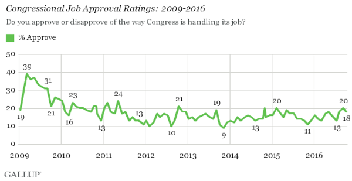

```{r preamble, child = here::here('preamble.Rmd')}
```


---
## Looming Deadlines 


.bold[NCCHR] due Sunday


---

---
class: center, middle, inverse

# Representation


---


---
## Where We Have Been 


```{r}
plans = tibble::tribble(~`Issue`, ~`The New Jersey Plan`, ~`The Virginia Plan`, ~`The Conneticut Compromise`,
                "Supported By", "Small States", "Large States", "The Great Compromise",
                "Legislative Structure", "Unicameral", "Bicameral", "Bicameral",
                "Represention Plan", "Equal Representation for each State", "Representation based on population", "The Senate is 'equal' and the House is population based ")


gt::gt(plans) %>% 
  gtExtras::gt_theme_guardian()

```
???
If you think back to something like lecture 4 we talked about our founding documents. One of the big fights was over what representation looked like. 


As has been discussed earlier in the semester, many plans for representation were proposed at the Constitutional Convention by the Framers. In the end two were decided upon in an effort to address two different types of constituencies:

The Virginia Plan – provided for a bicameral legislature in which representation in which representation in both chambers would be based on population, advantaging larger states

The New Jersey Plan – provided for a unicameral legislature in which representation would be equal for every state.


As we know, the founders ultimately settled on the Connecticut Plan, or the Great Compromise. Under this plan, the Legislative branch was to have two chambers, one in which representation would be based on population and called the House of Representatives, and the Senate, in which representation would be equal for each state.

Additionally, Section 8 enumerates the powers of Congress and contains the “Necessary and Proper” (or Elastic) Clause. This clause grants Congress all powers that are necessary and proper for enaction of their enumerated powers. These “necessary and proper” powers are the Implied powers of Congress.


---

---
## House of Reps vs. Senate 

```{r}
bicameral = tibble::tribble(~"Basics", ~"House", ~"Senate",
                            "Minimum Age", "25", "30",
                           "Mininimum Years of Citizenship", "7", "9",
                           "Term Length", "2", "6",
                            "Representation", "Local", "State",
                            "Type of Election", "Direct", "Direct")

gt::gt(bicameral) %>% 
  gtExtras::gt_theme_guardian()

```
???

Go through chart for basic differences between house and senate. (age, required citizenship, representation and term lengths) 

Senatorial Representation – is based on a statewide level thus representing heterogeneity of state populations. The Framers intention was to create a body of statesmen that based their decisions on wisdom and deliberation with their interests attuned to the interests of those with property rather then population. 

House Representation – the house was created for the direct link that it provided to the people with interests attuned to public opinion.  Thus the shorter term lengths to reflect societal change that occurs with shifts in population. 

Discuss the change in type of election that occurred in 1913 with the 17th amendment. Change from the indirect election of Senators through the legislatures to direct elections. 

Powers of the House exclusively – origination of all tax bills; vote to impeach 

Powers of the Senate exclusively – nomination and confirmations of  federal officials; Holds the trial to impeach, and ratify all treaties. 

Advice and Consent – this is a special “power” of the Senate in which they are consulted/approached by the executive branch to approve treaties and appointments made by the President to various government positions (cabinets seats, federal judges, ambassadors, and US attorneys) 


---

---
## Differences Between the the First Congress and the 117th Congress

- Position and Workload

- Size 

- Political Parties  

- Size of the Staff 

- Amount of Legislation 

- Length of Bill 


???
Position and Workload – The position of Senator/Congressman was not the elite role that it is considered today. For the most part being a member of Congress in 1789 was not a full time job. The representatives for the most part were full time farmers, merchants, and artisans at home. Senators and Congressman assembled for roughly 2 sessions a year for between 10 and 14 days. Congress now on the other hand is a full time job with 40+ hour work weeks. Meeting 48 of 52 weeks of each year. 

Size – First Congress – 91 members: 65 representatives and 26 senators: Current Congress – 539 members 435 HOR 100 Senators 6 non-voting members 

Political Parties – There were no clearly defined political parties in the first Congress. Members were grouped as voting factions based on their record, not on pre-defined party characteristics.  

Size of Staff – the original congress had no additional staff with which to serve their constituency. Current members have an average 15 member staff in DC office as well as 100  member staff in home office. The size of staff fluxes greatly during campaign season with full time staff, part time staff, and volunteers numbering in the thousands depending on the size of the state/district. 

Amount of Legislation – The average session in Congress in 1789 last 14 days and produced roughly 25 bills per session . Current Congresses average between 10,000 and 15,000 bills, resolutions, and votes each year.  Roughly 1-3% of all the legislation that is proposed is actually enacted during each session.  The 113th Congress is the least productive Congress since 1947 passing only  251 pieces of legislation. 

Length of Bill – The average Bill length in 1789 was 2 pages. This average length of a bill now is 20 pages. The ACA was 2400 pages. The Longest bill in history prior to its passage was the 2007 budget bill passed by Bush. It was 1437 pages. 

Upon ACA’s passage a Senate staffer decided to bring home a completed copy in his suitcase. He had to remove it to avoid paying excess baggage charge

---

---
## Redistricting 

.pull-left[

```{r}
knitr::include_url("https://projects.fivethirtyeight.com/redistricting-maps/georgia/")
```

]

.pull-right[
- .bold[Redistricting]: the process of redrawing the geographic boundaries of legislative districts.
  - This occurs every 10 years with the Census to ensure that populations remain balanced within each district to ensure equal representation. 

.bold[Apportionment]: the process of adding and subtracting districts to add or subtract number of representatives in the House. 

- .bold[Gerrymandering]: the process in which district lines are redrawn to benefit specific political parties, protect incumbents, or to change minority proportions for representation


]


---

---
class: middle,center


```{r}
vembedr::embed_url("https://www.youtube.com/watch?v=A-4dIImaodQ")
```


---

---
##  How Do We Know This is a Problem?

- Efficiency gap – a measure created by political scientists to show which political party is benefiting most from a gerrymandered district
  - A gap of 7% or higher is the proposed point that unconstitutional gerrymandering may have occurred 
 
  - Basic Intuition $\text{Efficiency Gap} = \overbrace{\text{Seat Margin}}^{\text{share of all seats held by a party}} – (2*\underbrace{\text{Vote Margin}}_{\text{The  vote share received by a party}})$

- Partisan Dislocation: a measure of the difference between the partisan composition
of a voter’s geographic nearest neighbors and the partisan composition of the district to which
they have been assigned (DeFord et al. Forthcoming)

  - Basic Intuition: $\text{Partisan Dislocation} = \text{Vote Share}_{p,v} - \text{Voteshare}_{k,v}$

???
There is actually a heated debate over how to best measure this. The simplest way to do this is through what is known as the efficiency gap 

it uses the concept of a wasted vote. A vote is wasted if it is cast for a losing candidate or for a winning candidate but in excess of what she needed to prevail.

This is clever in its simplicity but all together ignores lots of information that we have. One set of information would be like actual voter location n

Partisan vote share is the newest one where it looks at the difference between vote shares for a district where somebody votes and the nearest neighbor. Determining the nearest neighbor is done through a technique called k-nearest neighbors.  The KNN algorithm assumes that similar things exist in close proximity. In other words, similar things are near to each other. You can think of this as minimizing the distance between points on a graph. You interact with more complex implementations of this with recommendation systems or fraud detection software


---


---
## Is it Gerrymandering all The Way Down


- Ehh no

--

- .bold[Partisan Sorting]: An effect in which similar voters migrate to specific areas, becoming more concentrated than in the wider electorate


???
Much like KNN birds of a feather flock together

One important aspect that is frequently neglected in the gerrymandering debate is the role that citizens play in this process. Bill Bishop argues in The Big Short that people are increasingly choosing their neighborhoods based on criteria that correlate highly with political preferences. This argument suggests that political segregation is a product of the movement of voters between neighborhoods—as kids grow up and move out of their parent’s homes, their subsequent choice of housing increases the political homogeneity of the American neighborhood.

This theory contends that as much of a problem as gerrymandering may pose, removing gerrymandering from the political process may not necessarily result in more competitive districts, because our neighborhoods are likely to politically homogenous, regardless.

---


---

class: center

<a href="https://www.statista.com/chart/18905/us-congress-by-race-ethnicity/" title="Infographic: How Diverse is U.S. Congress? | Statista"></a> You will find more infographics at <a href="https://www.statista.com/chartoftheday/">Statista</a>


??? 

As you can see the racial diversity of congress is some what on the lacking side 
---


---
## Gender


```{r}
gender_raw = read_csv("data/gender.csv")  %>% 
  select(-`Total Number of Members*`)


gender = gender_raw %>% 
  pivot_longer(names_to = "sex",
               cols = Men:Women,
               values_to = "count")  %>% 
  slice(1:10)

gt::gt(gender) %>% 
  gtExtras::gt_theme_guardian()
 

```


---

---
## Two Models of Representation

.bold[Descriptive Representation] – member of Congress that shares the characteristics of constituents

.bold[Substantive Representation] – member of Congress that represents constituents interests on policy concerns

???
The relative lack of diversity in Congress is important because it has a profound impact on how elected officials represent their constituencies. One of the more obvious ways that representatives can represent their constituencies is descriptively.
Descriptive representation – (key term) – a member of Congress that shares the characteristics of constituents (race, gender, religion, etc.) 

This theory of representation contends that a representative that shares some kind of descriptive characteristic with the majority of their constituency is going to do a better job of representing that community. The idea is that representatives that have shared a similar life experience to their constituency is going to have a better idea of the kinds of problems that their constituents might face and the kinds of policies or changes would best help those communities.

Another theory of representation focuses on the substantive representation a member of Congress can offer their communities.

Substantive (key term) – a member of congress that represents constituents interests on policy concerns. 

This theory contends that it matters less how much a representative looks like their constituency. Rather, it is more important these members pursue policies that will have a positive impact on their constituencies or reflect the will and desires of their constituency

Each of these types of representation has an important impact on how members of Congress behave. Generally, there are two ways that representative can think about the votes that they take while in Congress.

First, a representative may choose to act as a delegate. These members strive to loyally represent the will of their constituents, regardless of how those preferences may impact the rest of the country or whether they personally agree with those preferences or not.

Delegate – (key term) – a member of congress that loyally represents constituents direct interests. 


Second, a representative may choose to act more as a trustee. These members see their role as to represent their constituents, while also balancing those interests with what is good for the WHOLE nation. These representatives may sometimes act in contrast with what their constituents would prefer because of national or moral concerns.

Trustee – (key term) – a member of congress that represents constituents interests while also taking into the bigger picture of national political concerns.


---


---
## What Does it Mean to be "Represented"

Three models on the National level:

.bold[BurkeanModel (Edmund Burke)] – Legislators work for what they know is best for their districts and the nation
Trustee

.bold[Instructed Delegate Model] – Legislators will follow the will, or the voice, of the people in their districts exactly
Delegate

.bold[Responsible Party Model] – National party leadership with compromise between the two parties for the best outcome for the people 


???
First, the Burkean Model, named for Edmund Burke, states that legislators work for what they know is best for their districts and the nation. This may sometimes align with the will of their constituents, but may at other times be in conflict with those interests. This model is most inline with the Trustee representation type from the previous slide.
Delegate – (key term) – a member of congress that loyally represents constituents direct interests. 

Second, the Instructed Delegate Model, contends that representatives will follow the will of their constituents at all times, exactly as they prefer, without concern for what the representative believes is best or what is in the best interest of the nation as a whole.
Trustee – (key term) – a member of congress that represents constituents interests while also taking into the bigger picture of national political concerns.


However, I’m sure we can all think of problems with both of these models of representation. While we certainly want representatives that will represent our preferences and advocate for policies that we would personally prefer in Congress, doing so without regard for what the nation as a whole wants or needs is not ideal. After all, we all have to live with federal policies even if our representatives didn’t vote for them. Because of these concerns, there is a third model of representation that an elected official may strive to uphold.
The Responsible Party Model, contends that national party leadership should seek to compromise on their ideals in order to provide the best policy solutions for the nation. The idea here is that leadership can debate and work to craft policy that provides some advantages to each ideological position, while balancing the needs and preferences of everyone. Once this policy is crafted, these leaders can communicate the “wins” that their party has secured, guaranteeing support among their party members, and providing the best solutions to the nation.


This is where we are going to end today. On Thursday, we will spend a little more time taking about what the American people think of Congress and the electoral impact of those attitudes. We will then spend a significant amount of time talking about the powers of Congress, how the legislative process functions, and the role party leadership in this process.

---


---
## Do People Like Congress?

```{r}

```


???
Congress is almost comically hated in fact Public policy polling was curious about how it compared to other things
---

---
## "What do you have a higher opinion of?"

.pull-left[
### Things Congress Lost to

- Lice 67% vs. Congress 19%
- Colonoscopies 58% vs. Congress 31%
- Root Canals 56% vs. Congress 32%
- Used Car Salesmen 57% vs. Congress 32%
- Traffic Jams 56% vs. Congress 34%
- Carnies 39% vs. Congress 31%
- Nickelback 39% vs. Congress 32%
- Genghis Khan 41% vs. Congress 37%
- Cockroaches 45% vs. Congress 43%


]

.pull-right[
### Things Congress Won Against

- Lindsey Lohan 41% vs. Congress 45%
- Playground Bullies 38% vs. Congress 43%
- Telemarketers 35% vs. Congress 45%
- The Kardashians 36% vs. Congress 49%
- Gonorrhea 28% vs. Congress 53%
- Ebola 25% vs. Congress 53%
- North Korea 26% vs. Congress 61%
- Meth Labs 21% vs. Congress 60%


]

.footnote[Poll Conducted in 2013]


---


---
## Does this translate to re-election?

.pull-left[
### House of Reps
```{r}
house = read_csv("data/house_re-elect.csv")

ggplot(house, aes(x = Election_Cycle, y =   relection_rate )) +
  geom_col() + coord_flip() +
  labs(x = "Year", y = "Percent Re-Elected") + theme_allen()


```


]

.pull-right[
### Senate
```{r}
senate = read_csv("data/senate_relect.csv")

ggplot(senate, aes(x = election_cycle, y =  re_election)) +
  geom_col() +
  coord_flip() +
  labs(x = "Year", y = "Percent Re-Elected") + theme_allen()

```

]
???
Despite almost universal hatred by the the general public congress has a pretty extraordinary level of retention

---

---
## Incumbency Advantage 

- Incumbency Effect
  - “Throw the rascals out! …but not my representative”

- Definition: the tendency of those already holding office to win reelection
  - Stronger for members of the House than members of the Senate

???
The tendency for incumbents to win reelection despite Congress having relatively low approval ratings is largely due to the Incumbency Effect. This is the tendency of those already holding office to win reelection. This is largely because most voters see their representatives as the one good member in the entire Congress. Essentially, the problem with Congress lies with everyone else.

---


---
## Dimensions of the Advantage 

- Incumbency Advantage
  - Name Recognition    
  - More Visible
  - Media Exposure
  - Credit Claiming
  - Experience
  - Voting Record
  - Casework
  - Fundraising Ability


???
Additionally, being a sitting member of Congress provides a number of advantages that can be used in elections to ensure that an incumbent wins their race. These advantages include:

Name Recognition – By being a member of Congress, people are just more likely to be familiar with who you are. They may not always know why they know a members name, but they do know it.

More Visibility – Member of Congress are able to be more visible to voters, in large part because they can leverage their position to get more media exposure. News shows are always looking for members of Congress to come on and explain what Congress is working on, or potential solutions to whatever problems are currently being discussed through out society.

Credit Claiming – This media exposure also allows member to claim credit for the work they are doing. If a member has written a bill or is spearheading a new initiative, they are able to discuss those activities and demonstrate that they are working to improve the lives of their constituents.

This credit claiming is an example of how members leverage their experience serving on specific committees (which we will discuss later today) and their voting records. Each of these allow voters to understand the tangible benefits that their representatives provide them. These two things allow voters to rely on retrospective voting (which we discussed in detail in the last unit), which is easier for most voters to do, and provides less uncertainty about what the member will do in future terms in Congress.

Additionally, a significant amount of work that members of Congress actually do is known as Casework. There are a number of ways in which individuals rely on the federal government to directly provide benefits to them through programs like Social Security, Medicare and Medicaid, VA benefits, and SNAP benefits. However, there are sometimes problems with how these programs are rolled out, which can create significant delays in individuals receiving their benefits. When this happens, frequently, the easiest thing to do is to reach out to your elected member of Congress to get them to pressure those institutions in releasing benefits. This work is known as Casework and provides a significant advantage to a member of Congress.
This activity allows member of Congress to very directly provide tangible benefits to their constituents. Additionally, constituents who receive assistance through Casework are far more likely to tell their friends and family about the help that they received. This positive word of mouth can provide a much better electoral advantage than many other forms of campaigning.

Finally, by being a member of Congress, incumbents have a much greater ability to raise funds for their reelection campaigns than their challengers can. First, members of Congress have access to the biggest donors within their political party and can personally reach out to them in ways that challengers can’t. Secondly, these donors are extremely unlikely to contribute to politicians that may not win. Again, the best way to demonstrate that you can win an election, is to win an election. Thus, by being a member of Congress, incumbents already have a proven track record of winning elections, and are therefore much more likely to receive those donations.


---