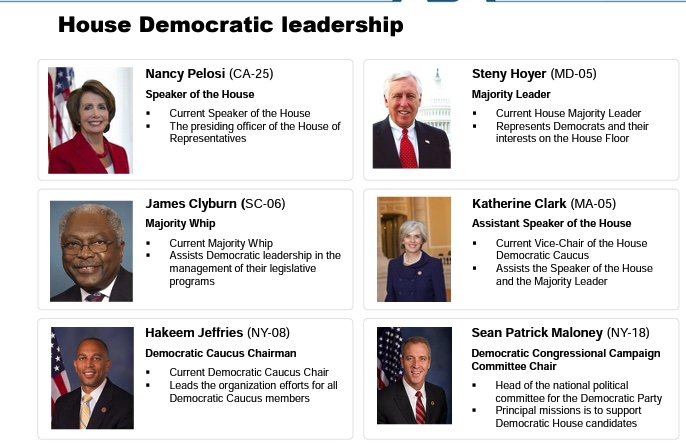
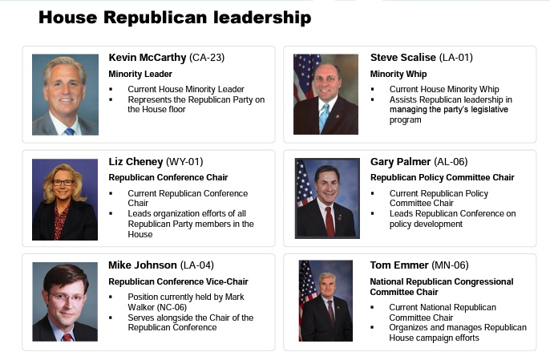
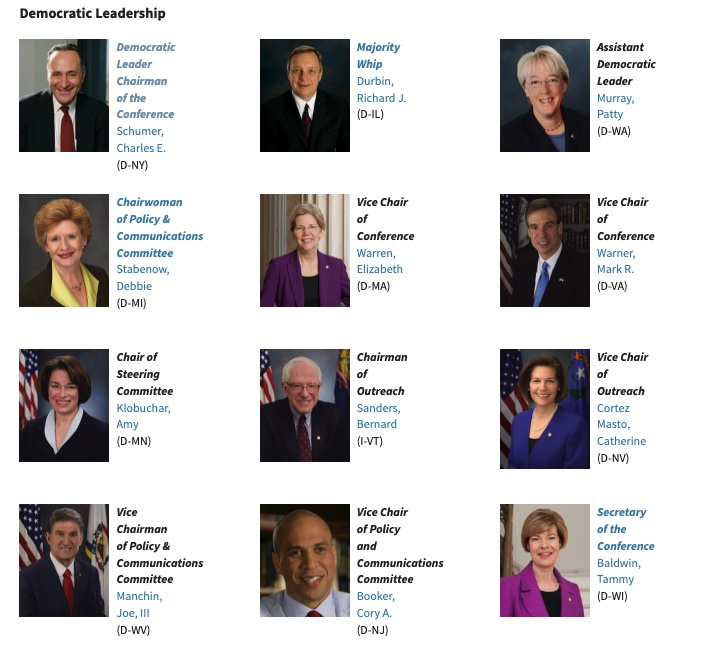
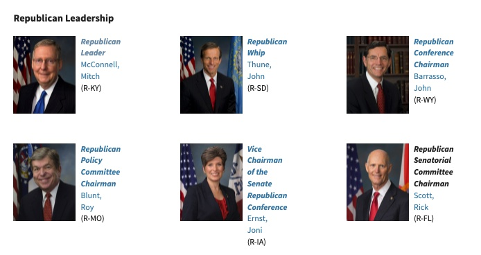

```{r preamble, child = here::here('preamble.Rmd')}
```

---
# Looming Deadlines

.bold[Misinfo Activity] Due Sunday

---


---
class: center, middle, inverse

# Rules and Procedures

---

---
## Powers of Congress

- .vero-red[Enumerated Power]: Powers that are explicitly stated in Constitution
  - 17 powers - Article I Section VIII
  
- .vero-blue[Implied Powers]: powers implied by the Neccessary and Proper (Elastic) Clause beyond those of the enumerated powers 


???
Before we again really explore the powers of Congress, we should remember the two kinds of powers that Congress has. 

The first kind of powers that Congress has are enumerated powers. Remember that enumerated powers are those that are explicitly state in the Constitutions. Congress has 17 enumerated powers, which are all specified in Article 1, Section 8 of the Constitution.

The second kind of powers that Congress has are implied powers. These are powers that are implied by the Necessary and Proper Clause and are powers beyond those that are explicitly enumerated


---

---
## Enumerated Powers of Congress


- Lay and collect taxes 
- To borrow on the credit of the US
- To regulate Commerce 
- To establish uniform rule of Naturalization
- To Coin Money 
- To Provide for Punishment of Counterfeiting Money 
- To Establish Post Offices 
- To Promote the Progress of Science and useful Arts– Copyrights 
- To constitute Tribunals inferior to the  Court 
- To define and punish Piracy and Crimes on the High Seas 
- To Declare War
-  To raise and support Armies 
- To provide and maintain a Navy 
- To make rules for governing and regulating the military 
- To provide for militias to suppress insurrection or repel invasion
- To organize, arm, and discipline the Militia in service to the US
- To make laws  


---

---
## Special Powers of Each Chamber


- House
  - Vote to impeach
  - Origination of all Revenue bills
- Senate
  - Nominations & confirmations 
  - Holds the trial to impeach
  - Ratify all treaties


---


---
## The Ones We Will Focus On

- Impeachment

- War Powers

- Oversight

- Lawmaking

???
We will not be exploring all of the enumerated powers of Congress. Rather, we will be focusing on the five listed here.


Oversight – (key term) – efforts by congress to make sure that laws are implemented correctly by the bureaucracy after they have been passed. 


War powers – Congress has to officially declare war. Does this happen every time? Are there examples of when this did not happen? 
	Fun fact: Last official declared war by Congress was WWII.   

 

---

---
## Impeachement 

- The check that Congress has over the other branches that - allows them to remove officers of the United States for - various different abuses of powers
 
- Does _*NOT*_ mean removal from office
  - 4 Presidents
  - 15 Federal Court Judges
  - 1 Senator


???
Impeachment is the check that Congress has over the other branches that allows them to bring charges against and remove officers of the United States for various different abuses of powers.  

THIS DOES NOT MEAN REMOVAL FROM OFFICE. Impeachment is merely the first step of bringing charges against an individual. Removal from office is a separate procedure.

Impeachment proceedings begin in the House of Representatives. If an impeachment vote is passed in the House, the chargers are forwarded to the Senate. In the Senate, once the charges have been forwarded, a trial takes place on the floor of the Senate, which is presided over by the Chief Justice of the Supreme Court. At the end of the trial, a vote to remove the official is brought and must be passed with a 2/3 majority for the official to be removed from office.

Impeachment proceedings have occurred for three presidents (Clinton, Johnson, and Nixon), senators (1) and Federal Judges (15).  

Some of the offenses for which impeachment charges have been brought include: abuse of power, drunkenness, rebelling against the government, and perjury.  


----


---
## War Powers

- .vero-red[War Powers Clause]: [The Congress shall have Power…] To declare War, grant Letters of Marque and Reprisal, and make Rules - concerning Captures on Land and Water

- .vero-blue[War Powers Act of 1941]
  - American emergency law that increased Federal power during World War II

- .vero-brown[War Powers Resolution of 1973]
  - Federal law intended to check the president’s power to commit - the United States to an armed conflict without the consent of - Congress


???
The second enumerated power of Congress is the War Powers.
Congress has the exclusive power to officially declare war. However, in the modern era, this power has rarely been used. The last time war was officially declared by Congress was during World War II.
Despite it’s rare usage, Congress has passed a number of bills related to it’s war making powers.
The first was the War Powers Act of 1941. This act dramatically increased federal power during World War II, authorizing Franklin Roosevelt to reorganize the Executive branch and the Bureaucracy to streamline the war effort. A subsequent act passed in 1942 which allowed the federal government to acquire any land within the United States for the war effort, among other things.

Following the Executive branches continued willingness to engage in military conflicts without a declaration of war, Congress passed the War Powers Resolution of 1973. This act requires the president to notify Congress within 48 hours of committing armed forces to military action, and requires the president to seek continued approval for troop deployments within the first 60 days.


---


---
## What About...


```{r}

df = tibble::tribble(~Conflict, ~`Legal Basis`,
                     "Korea (1950-1955)", "Police Action",
                      "Vietnam (1961 - 1975)", " Joint Resolution of Congress ",
                     "Lebanon (1982-1983)", "Lebanon Emergency Assistance Act/UN multinational force",
                     "Gulf War (1990 - 1991)", "UN Security Council Resolution", 
                     "Afghanistan (2001 - 2021)", "Authorization for the Use of Military Force 2001",
                     "Iraq (2003 - 2011)", "AUMF")

gt::gt(df) %>% 
  gtExtras::gt_theme_guardian()

```


---

---
## Oversight 

- Oversight – over Bureaucracy
  - Efforts by Congress to make sure that laws are implemented correctly by the bureaucracy after they have been passed


???
Congress’s oversight abilities apply to the Bureaucracy, and refers to their efforts to make sure that laws are implemented correctly after they have been passed. This is usually done through a series of hearings in which members of the bureaucracy are called to Congress to discuss the procedures that they have implemented to enact laws.


---


---
## Leadership Positions in Congress

- Vice President

- Speaker of the House

- Majority/Minority Leaders

- Majority/Minority Whips

- President Pro Tempore

???
Before we dive into the lawmaking powers and process of Congress, we need to take sometime to explore the role that political parties play in Congress. Parties serve to help coordinate the actions of members of their parties, especially in the lawmaking process. By far, the most important parts of parties are the leadership roles that are occupied by high-ranking members of each part.

---

---

## Political Parties in Government

- Unified Government – Presidency, House and the Senate are all controlled by the same party
Fast policy changes

- Divided Government – when one party controls the Presidency, and another party controls the House, the Senate or both
  - Leads to gridlock or slow policy changes
  - Can lead to government shutdowns


---


---
layout: false

```{r out.width= "80%"}




```

???
The first leadership role in the House is the Speaker. The Speaker of the House is the elected leader of the House and their primary role is to lead the majority power and essentially “control the fate” of legislation in the house. She is the second in line for succession after the President and the Vice-President.  Speakers control the fate of legislation by determining which committees bills are assigned to as they work their way through the legislative process. Finally, the Speaker of the House controls the floor schedule, determining when bills will be debated on the floor and for how long they will be debated.

Next, the Majority and Minority Leaders assist leadership by guiding, articulating, planning, and implementing the legislative agenda/strategy of their party. They also determine which committees individuals will serve on. The Majority Leader in the House is currently Steny Hoyer, and the Minority Leader is Kevin McCarthy.

Finally, the Majority and Minority Whips further help leadership in the passage or opposition to proposed pieces of legislation. Their job is literally to “whip” their members into line, and to leverage future pieces of legislation, specific amendments, committee assignments, and future electoral support to encourage their members to vote for/against pieces of legislation. The Majority Whip is currently James Clyburn and the Minority Whip is Steve Scalise.


---


---
layout: false


```{r out.width= "80%"}



```


---

---
## House Partisan Breakdown 


```{r}
pacman::p_load("ggparliament")
data("election_data")


us_house <- election_data %>%
  filter(country == "USA" &
    year == 2020 &
    house == "Representatives")
us_house <- parliament_data(election_data = us_house,
  type = "semicircle",
  parl_rows = 10,
  party_seats = us_house$seats)
representatives <- ggplot(us_house, aes(x, y, colour = party_short)) +
  geom_parliament_seats() + 
  #highlight the party in control of the House with a black line
  geom_highlight_government(government == 1) +
  #draw majority threshold
  draw_majoritythreshold(n = 218, label = TRUE, type = 'semicircle')+
  #set theme_ggparliament
  theme_ggparliament() +
  #other aesthetics
  labs(colour = NULL, 
       title = "United States House of Representatives",
       subtitle = "Party that controls the House highlighted.") +
  scale_colour_manual(values = us_house$colour, 
                      limits = us_house$party_short) 
representatives


```


---


---
layout: false
```{r out.width="58%"}




```

???
The first leadership position in the Senate actually lies in the Executive branch. The Vice President serves as the president of the senate and casts the tie breaking votes within the Senate. 

Next, the President Pro Tempore serves as the president of the Senate when the Vice President is not in Senate session. This position is always given to the longest serving member of the majority party in the Senate. He is the third in line for succession after the speaker of the house. This is generally considered an ornamental title since often the job of senate president is shared among junior senators (of the majority party) in an effort to teach them parliamentary procedure. 

The role of the Majority and Minority Leaders and Whips in the Senate is largely the same as in the House. The only difference is that the Majority Leaders ability to control the floor schedule is minimized in the Senate because of the need for Cloture and the possibility of Fillibusters, but we will talk about both of those in more detail later.


---


---
layout: false

```{r out.width="80%"}

```

---


---
## Senate Partisan Breakdown 

```{r}
us_senate <- election_data %>%
  filter(country == "USA" &
    year == 2020 &
    house == "Senate")

us_senate <- parliament_data(
  election_data = us_senate,
  type = "semicircle",
  parl_rows = 4,
  party_seats = us_senate$seats)


senate <- ggplot(us_senate, aes(x, y, colour = party_long)) +
  geom_parliament_seats() + 
  geom_highlight_government(government == 1) +
  # add bar showing proportion of seats by party in legislature
  geom_parliament_bar(colour = colour, party = party_long) + 
  theme_ggparliament(legend = FALSE) +
  labs(colour = NULL, 
       title = "United States Senate",
       subtitle = "The party that has control of the Senate is encircled in black.",
       caption = "Note Sanders and King Caucus with Dems") +
  scale_colour_manual(values = us_senate$colour,
                      limits = us_senate$party_long)
senate 


```


---


---
## How a Bill Becomes a law


.pull-left[
### Path of Least Resistance
```{r}
vembedr::embed_url("https://www.youtube.com/watch?v=OgVKvqTItto")
```
]


.pull-right[
### How the Sausage Gets Made

```{r}
vembedr::embed_url("https://www.youtube.com/watch?v=s5eILKG5oSE")
```

]

---
## How the Sausage Gets Made


.pull-left[
### House 

- Speaker of the House decides where to send a bill
  - Committee
  - Subcommittee
  - Subcommittee Committee Hearing
- Report to full Chamber of House
- Referred to Rules Committee
  - Here they place a “rule” on the bill
  - OPEN Rule – No limits on Amendments
  - CLOSED Rule – No Amendments at all
- Goes to the House floor for votes
- If approved, the bill goes to the Senate


]

.pull-right[
### Senate
- President of the Senate sends to committee
  - Committee
  - Subcommittee
  - Subcommittee Committee Hearing
  - Report to full Chamber of Senate
- .bold[NO RULES COMMITTEE IN SENATE]
- Goes to Senate floor for votes
  - Here Senators may filibuster bills 
  - Filibusters are ended with a cloture vote
- If Senate version is different from the original House - version the bill is sent to a Conference Committee: 
  - Conference Committee - members _from both chambers review the new bill_ 
- If the Conference Committee’s proposal is approved in both Chambers the bill is sent to the President of the United States


]

???
Now that we’ve watched these two separate examples of two very different ways that laws can be made, let’s look at this process in detail. We are going to assume that bills begin in the House for this step-by-step explanation, but you should note that, with the exception of tax legislation and budgets, bills can begin in either the House or the Senate. The overall process is the same regardless of where a bill begins, though.

So once a bill has been written and proposed, it is presented to the Speakers of the House.

The Speaker of the House then decides which committees to send the bill too. The Speaker can assign the bill to as many committees and subcommittees as they wish. If the Speaker does not want the bill to come to a vote, they will frequently use this process to “kill” the bill by assigning it to as many committees as they can.
Once the bill is assigned a committee, the committee will hold a series of hearings where they ask for testimony from those that may be affected by the legislation and any relevant bureaucratic agencies that will be impacted by the bill. Additionally, each of these committees can propose changes and amendments to the bill. These are all voted on by the committee members and are either added to the bill or rejected at this stage. Once a committee is done with their hearings and proposed changes, they will take one final vote on whether they should report favorably on a bill or not. This is a simple majority vote.

If a bill is reported on favorably in all of the committees it is assigned to, then it (and all of the amendments that the committees may have added) are reported to the full Chamber of the House. However, before the full House can begin debating the bill, the piece of legislation is sent to the Rules Committee

The Rules Committee is unique to the House and determines whether amendments from the full House will be allowed to be debated and added. If the Rules Committee assigns an Open rule, then there are no limits placed on the ability of any member of the House to propose an amendment. However, if the Committee assigns a Closed rule, then no amendments to the bill can be proposed, debated, or added to the piece of legislation.

Assuming that an Open rule has been placed on the legislation, once the bill is reported out of the Rules Committee it goes to the floor of the House where it is debated, and amendments are proposed, debated, and voted on. Remember that the Speaker of the House controls how long legislation is debated in the House, so this can either be a very long or very slow process.

However, once debate on the legislation is ended, the full House votes. If it is approved with a simple majority vote, then the legislation is passed on to the senate. If it is not approved by a majority of the House, then the bill dies, and must be re-proposed in future terms.

If the bill is advanced to the Senate, it’s first stop is to the President of the Senate. The President of the Senate then assigns the committees and subcommittees that the bill will be assigned to. There the same process of hearings, amendments, and changes as in the House takes place. Again, at the end of this process, each committee votes on whether to advance the legislation to the full Senate.

If the legislation is reported favorably out of each of the Senate committees it has been assigned to, it is reported to the full Chamber of the Senate. One major difference between the House and Senate processes is that the Senate does NOT have a Rules Committee. Rather, all pieces of legislation can have amendments from the full Senate proposed and voted on. Additionally, unlike the House, there is no limit on how long the Senate can debate a bill. This is due to the filibuster process that exists in the Senate; we will talk about this more in just a minute, but for now you can think of filibustering as just talking a bill to death. The only way to end debate is with a Cloture vote. Once debate has ended, a full vote on the bill takes place.

Assuming that the bill also passes the Senate, it is not automatically sent to the President, even if it has already been approved by the House. At the end of this process, it is extremely likely that the pieces of legislation that have been passed by the House and the Senate are different from each other. In this case, both versions of the bill are sent to a Conference Committee, which is made up of members from both the House and the Senate. The job of the Conference Committee is not to make the two versions of the bill identical. Once these changes are made, the new version of the bill is sent back to the House AND the Senate to be voted on again.

If this piece of legislation is then passed by both chambers of Congress again, the bill is FINALLY sent to the president’s desk.


---


---
## How the Sausage Gets Made continued

Once a bill reaches the President he has 10 days to act:

- Sign the Bill and it becomes law
  -  Veto
  - 2/3 Support from both chambers may override a veto

- Not Sign
  - Automatically becomes law after 10 days while Congress is in  session
  - Pocket Veto – If Congress adjourns during the 10 day period and the president does NOT sign, then the bill is vetoed and does not become law


---

---
## Committees

 Committee Types:
 
 
 
- Standing: Committees that exist from session to session and have the power to propose and write legislation over a - particular subject matter
Subcommittees

- Select: Non-permanent committees that are established that highlight particular issues that arise within legislation

- Joint: Committees that are formed with joint membership from - the House and the Senate
  - Four are permanent

- Conference: Temporary committees appointed by Speaker and the presiding Senate leadership intended to form a consensus of legislation between the two chambers

???
The last part of Congress’s structure that we need to spend a bit more time discussing. I’ve talked a lot about committees in the last few minutes, there are important difference between different types of committees.

First, committees are specialized units created in Congress to provide functionality and due process to the creation of legislation. These committees are often broken down even further into subcommittee units in order for more specialization on bill content, and take many different forms. 

Standing committees–are committees that exist from session to session and have the power to propose and write legislation over a particular subject matter. They generally correlate in subject matter to specific executive branch departments or agencies. 

Select committees– are non-permanent committees that are established the highlight particular issues that arise within legislation that may or may not be under the jurisdiction of other existing committees. 

Joint committees– are committees that are formed with joint membership from the House and the Senate. There are 4 that exist permanently. They are powerful in the investigative sense but do not have the power to present legislation.

Conference committees– temporary committees appointed by Speaker and the presiding Senate leadership. They are formed in an effort to form a consensus on legislation between the House and the Senate.  These committees are crucial during times when the House and Senate majority are of opposing parties. 

---


---
## Most Powerful Committees in Congress

.pull-left[
### House

- Appropriations 
  - Money - regulate expenditure of US govt 
- Budget 
  - Reviews Federal budget process 
- Rules 
  - Determines all the rules of how a bill can come to the floor 
  - “traffic cop of Congress” 
- Ways and Means 
  - Writes all tax legislation and revenue programs 
  - If a member it is only committee member can serve on 


]

.pull-right[

### Senate

- Appropriations 
  - Money - regulate expenditure of US govt
- Armed Services 
  - Legislative oversight of all US military branches 
- Finance 
  - Legislation concerning taxation and other revenue programs 
- Foreign Relations 
  - Oversees all foreign-policy legislation including foreign aid, funding, and treaty ratification 


]

---

---
## Special Votes

- Filibuster: Tactic used by senators to block a bill by - holding the floor and speaking to extend debate and prevent a  vote.

- Cloture: Procedure in which senators can limit the amount of  debate on a bill with a supermajority (60) votes.

- Override: In the case of a president vetoes a bill each House of Congress can vote for an override (2/3) to pass the bill.


???

Finally, there are a few special kinds of votes that we’ve discussed that you will need specific definitions for.

The first of these is the filibuster vote. Filibustering is a tactic used by senators to block a bill by holding the floor and speaking to extend debate and prevent a vote. Filibusters can only last for as long as a senator, or a group of senators, can hold the floor for and prevent the ending of the debate period.

Cloture is a procedure in which senators can limit the amount of debate on a bill with a supermajority vote.
Cloture was first introduced in 1917 and remained a senate rule until 1949. 
The rule was reinstated in 1959 and required a 2/3 majority. 
This was revised in 1975 so that 3/5 of sworn senators could limit debate, except for changes to Senate rules which still require a 2/3 vote.

Because of the extensive time that filibusters can take, the preference in recent years has been to move to other business when a filibuster has been threatened and cloture attempts have failed.


Finally, override votes are only done in the case of a bill being vetoed by the president. This vote requires a 2/3 majority in both the House and the Senate to be successful.

---