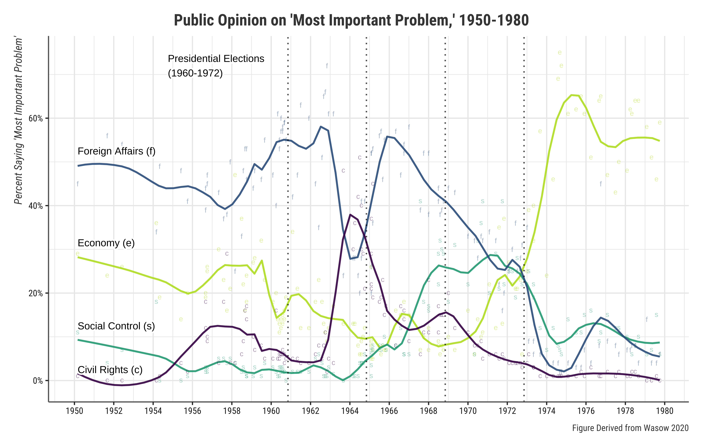

```{r preamble, child = here::here('preamble.Rmd')}
```


---
## Looming Deadlines

- Exam 02 opens .bold[03-21]


---


---
class: center, middle, inverse

# Civil Liberties 

---


---
## The Basics 

- What are they?

- What is incorporation 

--

- How does it work?


???
 Civil Rights Legal rights designed to protect individuals from abuse of power by government.
 
 incorporation:  Name for when the U.S. Supreme Court holds that a civil liberty from the Bill of Rights applies to state governments (rather than only the federal government) through the Fourteenth Amendment Due Process Clause’s command that no “State deprive any person of … liberty … without due process of law.” (See also Selective Incorporation and Total Incorporation

---

---
## First Amendment

- Free Excercise Clause
  - What is it?
  - What are its limits?
--

- Establishment Clause
  - What is it?
  - What are its limits?
  - What are the components of the Lemon Test?

???
Individuals have the right to hold whatever religious beliefs that they would like, but this does not mean that they are exempt from criminal prosecution under other laws. 

Employment division v smith 

the Court decided against the two employees, the law that they had been charged for was not aimed at religious practices specifically. It was a neutral law put in place to protect all the citizens of that state from the repercussions that could have happened from peyote use. 

The government and the church cannot be this entangled in one another, and if it happens again here is a test that will tell us whether or not it is a violation of the Establishment Clause. 

When does the law violate the establishment clause? If it fails the lemon test

Have a non-religious Purpose

Neither Advances nor prohibits religion

Not Promote excessive government entanglement 

---


---
## Freedom of Speech

- How is it limited?
  - Symbolic speech? 
  - Hate speech & Fighting Words?
  - Iminent Lawless Action?
  
???

The government cannot punish inflammatory speech (essentially they thought Brandenburg was just making a bunch of noise he wouldn’t/couldn’t follow through on) unless that speech is directed to inciting, and is likely to incite imminent lawless action (essentially an actual violent over throw of the government/military coup/junta etc.) 


---


---
## Freedom of the Press

- How is it limited
  - "I know it when I see it"
  - Libel/Slander
  - defamation

???
he supreme court said sorry buddy, this is not a protected form of speech and to avoid further confusion we are going to create a test so you know whether your material is safe or not. 


Is the speech of lewd interest to the average person?

 Does the speech depict or describe sexual acts or conduct in an offensive manner?

Does the speech have a serious literary, political, artistic, or scientific interest

slander defamation of an individual that takes place in a transient form. It is most often speech. 

 libel defamation of an individual that takes place by written or printed words or pictures. 
---


---
## 4th Amendment

- Search 


- Seizure
 - Fruit of the poison tree
 
- Expections? 

???

arch – The main point I want you all to take away when we are talking about the fourth amendment and the element concerning search is that an individual has a reasonable expectation of privacy into which the government cannot intrude. This is a moveable bubble, and covers an individual rather then a specific location. (Prior cases had limited to only the home). Privacy is portable!!!

The officers must have cause to issue a warrant. Cause is established when the facts and knowledge the officer has is of trustworthy nature and can lead to an individual that has committed or is in the act of committing a crime.

Police may conduct searches of automobiles without a warrant so long as they have probable cause for believing the owner of the vehicle is guilty of a crime
Exclusionary rule – evidence that is seized during violations of the fourth amendment are excluded from use as evidence in the court of law. As it was stated by one Felix Frankfurter – “it becomes fruit of the poisonous tree” and is useless
---


---
##  5th Amendment 

.hiro-light-blue[Grand Jury]

.hiro-red[Double Jeopardy]


.hiro-orange[Eminent Domain]


.hiro-dark-blue[Habeas Corpus]

- Miranda Warning and the right to remain silent 


---

---
## $6^{th}$ Amendment: Fair Trial

 Gideon 

Trial by Jury

Speedy Trial

Right to an Attorney

???
the Supreme Court heard his case, and decided that despite the type of case (capital or not), all indigent defendants had a right to counsel. After 4 years in prison, Gideon was released from prison when he was found not guilty due to a lack of evidence.

---

---
## $8^{th}$ Amendment 


- Protection from excessive bail and fines 

- Protection from cruel and unusual punishment 
  - The Death Penalty
  - Brennan's Qualification?

???
Brennan's qulification 

The punishment shall not degrade human dignity. 

The punishment shall not be inflicted in an arbitrary fashion 

The punishment shall not be a type that is totally rejected throughout society 

The punishment shall not be considered unnecessary 


---

---
## $9^{th}$ Amendment 

.vero-red[Enumerated Rights]


.vero-blue[Implied Rights]

???
We already discussed the concept of enumerated vs. implied when we were talking about the powers of the branches of government. This same concept applies here. 

The court has found that while the rights in the first 8 amendments are basic and fundamental in liberty they are by no means exhaustive and that there still exist ways and means in society for the government (at first only the federal government with the creation of the Bill of Rights) and then the states (after the addition of the 14th amendment and the Due Process Clause which allowed for selective incorporation).  

---


---
class: center, middle 

# Public Opinion
---


---
## What makes a bad poll?


- .bold[Leading Questions]: 

- .bold[Double Barrelled Questions]: 

- .bold[Social Desirability Bias]: 

- .bold[Priming]


---

---
## Readers Digest
```{r}
library(ggdag)
nice_skill_data = tibble(height = rnorm(10000, mean = 0, sd = 1),
                               skill = rnorm(10000, mean = 0, sd = 1))
plot_labels = tribble(
  ~x, ~y, ~label, 
  -2, 2, "Short and Skilled",
  2, 2, "Tall and Skilled",
  2, -2, "Tall and Not Skilled",
  -2, -2, "Short and Not SKilled",
)
full_sample = ggplot(nice_skill_data, aes(x = height, y = skill)) +
  geom_point(color = "grey40", size = 0.5, alpha = 0.8) +
  geom_smooth(size = 2, method = "lm") +
  labs(x = "height", y = "Number of Points Scored") +
  theme_bw(base_family = "Lato") +
  theme(axis.ticks.x = element_blank(),
        axis.text.x = element_blank(),
        axis.ticks.y = element_blank(),
        axis.text.y = element_blank())
full_sample_annotated = full_sample +
  geom_vline(xintercept = 0) +
  geom_hline(yintercept = 0) +
  geom_label(data = plot_labels, aes(label = label, x = x, y = y),
             fill = "#CF4446", color = "white",
             family = "Lato", fontface = "bold") 
collider_bias = ggplot(filter(nice_skill_data, 
                               !(height <= 0 & skill <= 0)), 
       aes(x = height, y = skill)) +
  geom_point(color = "grey40", size = 0.5, alpha = 0.8) +
  geom_vline(xintercept = 0) +
  geom_hline(yintercept = 0) +
  geom_smooth(size = 2, method = "lm") +
  geom_label(data = plot_labels, aes(label = label, x = x, y = y),
             fill = "#CF4446", color = "white",
             family = "Lato", fontface = "bold") +
  labs(x = "height", y = "Points") +
  theme_bw(base_family = "Lato")
ggsave(full_sample, filename = "collider_bias.png", dpi = 500)
collider_dag = dagify(
  Y ~ X,
  Z ~ X + Y,
  coords = list(x = c(X = 1, Y = 3, Z = 2),
                y = c(X = 1, Y = 1, Z = 2)),
  exposure = "X",
  outcome = "Y"
) %>% 
  tidy_dagitty() %>% 
  node_status() %>% 
  mutate(across(c(name, to), 
                ~recode(., X = "height", Y = "Points Scored", 
                        Z = "Being in the NBA"))) %>% 
  mutate(arrow_color = ifelse(to == "Being in the NBA", "#F012BE", "black"))
plot_dag = ggplot(collider_dag, aes(x = x, y = y, xend = xend, yend = yend)) +
  geom_dag_edges(aes(edge_color = arrow_color)) +
  geom_dag_point(aes(color = status), size = 17) +
  geom_dag_text(data = filter(collider_dag, name != "Being in the NBA"),
                color = "black", size = 5, nudge_y = -0.2,
                family = "Lato", fontface = "bold") +
  geom_dag_text(data = filter(collider_dag, name == "Being in the NBA"),
                color = "black", size = 5, nudge_y = 0.2,
                family = "Lato", fontface = "bold") +
  scale_color_manual(values = c("#2ECC40", "#0074D9"), 
                     na.value = "grey80", guide = "none") +
  coord_cartesian(xlim = c(0.8, 3.2), ylim = c(0.8, 2.2)) +
  theme_dag()
full_sample
```


???
Intuitively this kind of makes sense why the readers digest poll did really poorly because they conditioned on what statisticians call a collider. Let us take an intuitive example of why doing this is bad. Would we think that being taller help you score more point in a basketball game. I learned it like this and throught the example of being nice and attractiveness 
---


---
## What Happened... Kind of 
.pull-left[
```{r  fig.width=4.5, fig.height=3.35, out.width="100%"}
plot_dag
```
]


.pull-right[
```{r  fig.width=4.5, fig.height=3.35, out.width="100%"}
full_sample_annotated
```

]
???
In our toy model what I did was basically included being in the NBA in the model distoring the true effect of 

---

---
## What.. Happened Kind of 

```{r}
collider_bias
```


???
This is what the relationship looks like in the simulation I did when take a representative sample 
---

---
## Some other stuff
Delegate:

Trustee:

Funnel of Causality
???
Normative conception of political representation that holds the first duty of representatives is to follow the opinions of their constituents. By this view, the people who vote for representatives are the ones who should exercise judgment over questions of public policy, and if representatives do not follow their lead, they deserve to be voted out of office in the next election.


Normative conception of political representation that says an elected representative is obligated to act according to their own best judgment of what is just or what will promote the public good even if it is unpopular and leads to their being voted out of office in the next election.


Political scientific theory that posits that over the course of a lifetime, the environmental factors that influence our political predispositions become fewer in number and more limited in impact—just as space becomes more limited as material moves from the wide end of a funnel toward the narrow

---


---
class: middle,center

# Political Participation

---


---
## What does this tell us about voting?


$$
\begin{align}
R = P \times B - C(B	> C)
\end{align}
$$
???
What does this tell us about the benefit of voting 

R- The reward you get from voting
P- The probability that your vote matters
B- The benefit you will directly receive if your candidate wins
C- The cost of voting


---


---
## Consumptive Model of Voting


$$
\begin{align}
R = P \times B - C + D 
\end{align}
$$

???
D is equal to the amount of duty felt by an individual


---


---
class: center, middle 

# Media 

---


--- 
## Power of the Media 

- Agenda Setting 

- Priming

- Framing


---


---
## The Doctrines

## The FCC Regulates Broadcast Media through Various Rules

.panelset[

.panel[.panel-name[Fairness Doctrine]


]

.panel[.panel-name[Equal Time Rule]


]


.panel[.panel-name[Net Neutrality]


]
]


---


---
## Power of the Media

- Agenda Setting:


- Framing

- Priming


---


---
## Agenda Seeding? 
### Wasow(2020)
.pull-left[

<gsu-blockquote-red>

News organization still set public
agendas but social movements, like any group seeking
greater attention or publicity, attempt to entice media to
prioritize their concerns. Southern civil rights protests,
for example, were often planned for mornings so
footage could be flown to New York in time to air
nationally on the evening news 


</gsu-blockquote-red>

]

--

.pull-right[

<gsu-blockquote-blue>

Media attention, however, can be sympathetic or
hostile. Even presented with similar facts, different
reporters and news organizations often structure stories
in systematically different ways
</gsu-blockquote-blue>

]

???
There are lots of arguments about what shifts the needle in public opinion. In particular whether the public is affected more by elites or social movements. The role of one versus the other is the subject of a long debate and is sort of field specific. Political scientists point out that mass opinion and positions are often dominated by elites. However, social movements can pierce these asymmetries


What is interesting in this model is that the strategic timing of these events to not only get maximum coverage but it allows activists to generate a state response that is then covered by the media. This affects not only coverage but the frames that are used. 

---


---
layout: false


```{r  out.width= "80%"}

```


---
