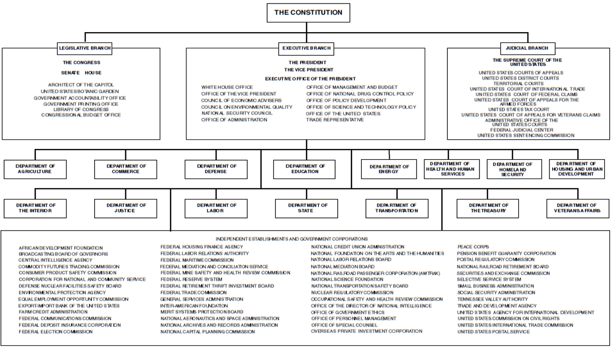

```{r preamble, child = here::here('preamble.Rmd')}
```


---
## Looming Deadlines

.bold[Exam 3]: Next Week


---

---
class: center, middle, inverse 
## Bureacracy

---

---
## Structure of the Bureacracy 


- Cabinet Departments

- Independent executive agencies 

- Independent regulatory commissions 


---


---
layout: false 


```{r out.width= "80%"}

```


---


---
## What is the Point of a Bureacracy 

- Implementation of the law  

- Provide expertise and specialization 

- Provide research and information to the President 

- Provide research and information to Congress

- Quasi-judicial powers and responsibilities


???


implementation – 

the efforts of the bureaucracy to translate sources of law/legislation into specific bureaucratic action and routine 

Standard operating procedures are the rules that lower level bureaucrats must follow when implementing policies which are created through implementation. 

Rule making – 
the quasi-legislative process of “clarifying” or “producing” understanding of government regulations for implementation by other levels of bureaucratic agents. 

Red tape – the excessive or unnecessary regulation that can be imposed by the bureaucracy. 

Administrative adjudication – 

The process of applying rules and precedents to specific cases to settle disputes or problems between or of parties. 


Bureaucracies provide an increased amount of specialization and focus to problems that individuals have when they have issues with the federal government.  This can be beneficial since it speeds up the recommended processes for an action, but it can also be problematic since it lends itself to the possibility of too much oversight and red tape. 

Specialization assists bureaucratic agencies and members the opportunity to provide the most accurate picture to other government officials such as the president or congress when faced with an issue. This specialization may lead to better more focused solutions where as without specialization there would have simply been generality. 


---


---
## What's the Difference? 

.pull-left[
### Independent Regualatory Commissions (IRC)

- Established to regulate specific economic or social interests 

- Created by Congress when they feel legislation does not go “far enough”  to perform a function


]

.pull-right[
### Independent Executive Agencies 


- Bureaucratic agencies that focus on narrow areas within cabinet departments


- They do not regulate or earn revenue from services 


]


???
IRC’s are independent of all three branches of government in what they do, but they are headed by appointees of the president. Their main purpose is to provide regulation for large industries and businesses such as energy and nuclear. 

Independent executive agencies are also headed by presidential appointees but their main interests are to serve the executive branch (guidance) and the people/public interests. 


These differ from what are known as presidential commissions which are basically just task forces that are meant to research or investigate stuff. Like the National Commision on BP oil spills 

---

---


```{r out.width= "60%"}
knitr::include_graphics("iron-triangle.jpg")
```

???
The Iron Triangle – key term - is the conception of bureaucratic policy making in which control is dominated by congressional committees, interest groups, and agencies in a give and take relationship. 

In this relationship these three groups control substantive issue areas and policymaking procedures in an effort to best benefit their own interests. 
Interests groups provide support and insight to congress by garnering/gathering public support for their initiatives. Congress in turn creates agencies that support these interests and their own. They fund and provide all forms of legislative support. In turn the bureaucracy gives congress (effective) results that they can share with their constituents to maintain electoral support and remain in office.  

Central to the concept of an iron triangle is the assumption that bureaucratic agencies, as political entities, seek to create and consolidate their own power base.

The sort of canonical example of this is the DOD. The DOD is a very active policy actor and before the reorganization in the 80's the different branches of the services were very active in their policy making effors  

---

---
class: center, middle, inverse

# The Judiciary


---

---
layout:false 
class: my-one-page-font

SECTION 1.
- The judicial power of the United States, shall be vested in one Supreme Court, and in such inferior courts  as the Congress may from time to time ordain and establish. The judges, both of the supreme and inferior - courts, shall hold their offices during good behaviour, and shall, at stated times, receive for their - services, a compensation, which shall not be diminished during their continuance in office.

SECTION 2.
- The judicial power shall extend to all cases, in law and equity, arising under this Constitution, the laws  of the United States, and treaties made, or which shall be made, under their authority;--to all cases - affecting ambassadors, other public ministers and consuls;--to all cases of admiralty and maritime - jurisdiction;--to controversies to which the United States shall be a party;--to controversies between two - or more states;--between a state and citizens of another state;--between citizens of different - states;--between citizens of the same state claiming lands under grants of different states, and between a - state, or the citizens thereof, and foreign states, citizens or subjects.
- In all cases affecting ambassadors, other public ministers and consuls, and those in which a state shall be - party, the Supreme Court shall have original jurisdiction. In all the other cases before mentioned, the  Supreme Court shall have appellate jurisdiction, both as to law and fact, with such exceptions, and under  such regulations as the Congress shall make.
- The trial of all crimes, except in cases of impeachment, shall be by jury; and such trial shall be held in  the state where the said crimes shall have been committed; but when not committed within any state, the - trial shall be at such place or places as the Congress may by law have directed
 
 SECTION 3.
- Treason against the United States, shall consist only in levying war against them, or in adhering to their  enemies, giving them aid and comfort. No person shall be convicted of treason unless on the testimony of two - witnesses to the same overt act, or on confession in open court.
- The Congress shall have power to declare the punishment of treason, but no attainder of treason shall work corruption of blood, or forfeiture except during the life of the person attainted.

???
This is the entire text of Article III establishing the judicial  branch of government. Compared to all of the articles establishing the other branches of government it appears on some level to be a joke. 
Specifically, the founders considered it the “least dangerous branch” endowed with the least amount of power and structure in comparison to the other branches. If we were to have stuck to the strict constitutional interpretation when creating the judiciary it would have a primary goal, to settle cases or controversies, but no actual structure or ability to implement such actions. 

The founders did not spend a lot of thought on the court structure, basically choosing to mirror the common law system found in Great Britain at the time of the founding. 


---


---
## Systems of Law

.pull-left[
### Civil Law

- Roman Origins 
- “Napoleonic Law” 
- a system of laws based entirely on codified statutes and legislation which judges apply to factual situations of law. This legal tradition rose from natural law) and religious canon. 
- Sources of law: Codes, Statutes, and Legislation 
- Modern Examples: France, Greece, Italy, Germany 


]

.pull-right[
### Common Law

- British Origins 
- “Judge-Made” Law 
- a system of laws based on judge’s decisions, which often supplement the interpretation of statutory laws - established through the processes of the executive and legislative branches. 
  - Precedent  - the interpretation of the law that is reached based on the decisions of judges that have served - before hand. 
- Sources of law: Case law, Statutes, and Legislation 
- Modern Examples: United States, Australia, United Kingdom, India 


]


???


Civil Law System – key term – a system of laws based entirely on codified statutes and legislation which judges apply to factual situations of law. This legal tradition rose from natural law (laws of basic human nature) and canon (religious doctrine). 


Common law system  – key term – a system of laws based on judge’s decisions(precedent) which often supplement the interpretation of statutory laws established through the processes of the executive and legislative branches. 

Precedent – key term – the interpretation of the law that is reached based on the decisions of judges that have served before hand.  It can be developed to create new interpretations, reapplied in the same context, or overturned in an effort to change/develop what the law means.
---


---
## Types of Cases

.pull-left[
### Criminal law 
- The body of law that deals with crime and subsequent legal punishment for violations of criminal offenses 
  - Ex. Murder 
- Cases are filed by government entities 
- Evidence must be proved “beyond a reasonable doubt”
- Only the defendant may appeal a case 

]

.pull-right[
### Civil Law (Law of Torts)

- The body of law that deals with disputes between individuals or organizations. It is generally aimed at - trying to gain compensation for the victim of the action in question 
  - Ex. Damages in a car accident 
- Cases are filed by individuals 
- Claimant must produce evidence that shows liability for actions 
- Either party can appeal a case 


]

---


---
class: center, middle 

```{r out.width= "80%"}

```


???
The Jud. Act of 1789 was the one of the crucial acts of Congress concerning the Judiciary providing structure that had formerly been lacking in Article III of the Constitution 

It provided for 13 district and 3 circuit courts that acted as intermediate trial levels between state courts and the Supreme Court. 

Overtime this has changed drastically. Currently there are 94 different district courts and 13 intermediate appellate courts (shown on map) 

DQ: Looking at this map, does this still appear to be a fair division of the labor of the courts? 
The problem of the 9th Circuit – Should it be split? What consequences would this have on case law that is coming to the Supreme Court? 

It established 6 justices for the Supreme Court as well as the offices of the attorney general and a United States attorney for each district court. 

---

---
## Judicial Review

- Marbury v. Madison (1803)  

- .bold[Judicial Review] - is the implied power of the Supreme Court to have the authority to declare laws of Congress and acts of the executive branch unconstitutional. 


???

The presidential election of 1800 was a critical time in early American politics. The two main parties (review from Foundations) were the Federalist and Anti-Federalist (often called the Democratic-Republican) parties, and each was vying for an extra ounce of power. In a close election, Thomas Jefferson (D-R)  beat out John Adams (F) to become the 3rd president of the United States. The election took place in February, but Jefferson did not assume office until the middle of March. During this time the federalist party was doing everything possible to maintain any political power they could. 

In this case, John Adams went on a spree of appointments of judges since he was still the president and his party still controlled the Congress. In those few weeks he appointed over 60 individuals to federal court judgeships and justice of the peace positions, including one to William Marbury , a wealthy Virginia businessman.  These individuals came to be known as “midnight judges” since their appointments and confirmations occurred in the space of a day. The confirmations all occurred, but Adams ran out of time before all the commissions could be delivered.  

James Madison  assumed the office of Secretary of State under Thomas Jefferson, and he refused to deliver the final commissions which meant that the new justices could not assume their duties and responsibilities.  Marbury sued Madison in the Supreme Court in an effort to get a writ of mandamus (an order of the court to force a particular action) to honor the Adam’s appointments. 

The Supreme Court heard the case, with Chief Justice John Marshall (pictured right) presiding over the case.  The case was decided against Marbury so he did not get the commission declaring the Judiciary Act of 1789 from which his position had originated unconstitutional.  The crucial takeaway from this case is the creation of the concept of judicial review. 

Judicial review – (key term) - is the implied power of the Supreme Court to have the authority to declare laws of Congress and acts of the executive branch unconstitutional. This is the crux of the development of the power of the Supreme Court and the means under when the Judiciary became equivalent in power to the other two branches. 

---

---
## Jurisdiction 


.pull-left[
### Definition


- The power or  authority given to a court to hear a case. 
- Each type of court has one of four types of jurisdiction. 


]

.pull-right[
### Four Types of Jurisdiction 

- .bold[Original] - the power of the court to hear a case for the first time without needing to go through a trial level case.
- .bold[Appellate] - the power of a higher court to review a lower court’s decision
- .bold[Mandatory] - the requirement of appellate jurisdiction that the court hear all the cases that are appealed to the court.
- .bold[Discretionary] -  the power of the Supreme Court to pick and choose which cases it will place on its docket each year.


]

???
Jurisdiction – (key term) – it is the legal authority of a court to hear a case. 

Original – (key term) – the power of the court to hear a case for the first time without needing to go through a trial level case. 

All trial level courts have original jurisdiction. SCOTUS has limited original jurisdiction concerning specific issues such as State vs State or Ambassador cases. 

Appellate – (key term) – the power of a higher court to review a lower court’s decision. This happens in all appellate courts and in most cases heard before the Supreme Court. 

Mandatory – (key term) – the requirement of appellate jurisdiction that the court hear all the cases that are appealed to the court. This happens in all levels of the Federal Appeals Courts except the Supreme Court. This creates a  large dockets and a slow system. 


Discretionary – (key term) – the power of the Supreme Court to pick and choose which cases it will place on its docket each year. They generally choose about 80-100 cases a year to hear in term. 


---

---
## Federal Court Structure

```{r out.width= "80%"}


knitr::include_graphics("federal-court-structure.jpg")

```


???
Trial courts – the first level of the court to hear a case they are found within each district of the United States.  For example, Georgia has 3 Georgia Northern, Middle, and Southern. 


US Court of Federal Claims – has special national jurisdiction and hears cases specifically seeking monetary compensation from the federal government. 


US Court of International Trade – has special matte jurisdiction in which it only hears a limited amount of cases concerning questions on international law and custom 


Appellate courts – 13 courts that hear the appeals for all the cases within their district. Judges sit on 3 person panels (en banc) to hear and decide cases. 
11 regional divisions and two military appellate courts.

---

---
layout:false


```{r out.width= "60%", fig.cap="Front row, left to right: Associate Justice Samuel A. Alito, Jr., Associate Justice Clarence Thomas, Chief Justice John G. Roberts, Jr., Associate Justice Stephen G. Breyer, and Associate Justice Sonia Sotomayor. Back row, left to right: Associate Justice Brett M. Kavanaugh, Associate Justice Elena Kagan, Associate Justice Neil M. Gorsuch, and Associate Justice Amy Coney Barrett. not pictured: Associate Justice Ketanji Brown Jackson"}

```

???
The highest court in the land and considered a court of last resort.  They have Discretionary, Appellate, and Original jurisdiction (over a limited number of cases). 

There are no formal qualifications to serve as a federal judge. Individuals that are usually appointed have legal experience, good character, and share political or ideological views with the president appointing them. 

Good behavior has been interpreted to mean that federal judges have life-long tenure and shall only be removed of office with charges of impeachment. Otherwise they serve until they decide to retire or die. 

---

---
class: center, middle


```{r}
vembedr::embed_url("https://www.youtube.com/watch?v=0xnzGSV66x4")
```


---

---
## Case Selection 

- .bold[Standing ]
  -  the right of an individual to initiate a court case. To be a case their must be a controversy in which the individual has a direct stake in the outcome of the case. 

- .bold[Mootness]
  - the point where a legal proceeding or case can be found to have no effect. 

- .bold[Writ of certiorari]
  - a petition from the lower court for the higher court to look at a case on its merits and see if it deserves to be heard

- .bold[Amicus curie briefs]
  - roughly translate to “friend of the court” – it is a position brief that is filed by individual/groups who are not party to a law suit but who seek to make their position known to the court in an effort to have an effect on the courts ultimate decision. 

???
Review discussion of jurisdiction – Supreme Court has discretionary jurisdiction, meaning that they get to select the cases that they wish to hear.
Any individual that wishes to bring a case before any level of the court is first required to have standing. 

Standing – (key term) – the right of an individual to initiate a court case. To be a case their must be a controversy in which the individual has a direct stake in the outcome of the case. (Example: Brown v. Board – many cases prior to Brown tried to end segregation, but the individuals/organizations that were filing weren’t considered directly harmed by segregation) 

Mootness – (key term) – the point where a legal proceeding or case can be found to have no effect. (Example: Roe vs. Wade – by the time the case reached the SC, Roe would have been pregnant for 56 months; the court decided to hear the case b/c it was such a personal issue) 

Writ of certiorari – (key term)-a petition from the lower court/individual for the higher court to look at a case on its merits and see if it deserves to be heard. 
Nearly 10,000 petitions are received by the court each year, and they grant “cert” to about 100. 

The rule of four – (key term)- is the procedure by which the judges vote whether to hear a case. At least 4 judges are required to vote to hear a case for it to be granted cert and be placed on the docket. 

Amicus briefs – (key term) – roughly translate to “friend of the court” – it is a position brief that is filed by individual/groups who are not party to a law suit but who seek to make their position known to the court in an effort to have an effect on the courts ultimate decision. 


---


---
## Supreme Court Procedures 

- Petitions for Certiorari 

- Certiorari pool 

- Rule of Four 
  - the procedure by which the judges vote whether to hear a case. At least 4 judges are required to vote to - hear a case for it to be granted cert and be placed on the docket

- Oral Arguments 

- Conference

- Opinion Writing 

- Case Decision 


---


---
## Other Court Actors 

- .bold[Solicitor General]: the government’s lawyer in all cases before the Supreme Court in which the government is party.  Often even when the government isn’t a party in the case, he will submit an amicus brief about the government’s opinion on how a case should be decide


- .bold[Attorney General]: the main legal advisor to the government. He is the head of the Justice Department and sits on the presidents cabinet. He may choose to represent the government before the Supreme Court, but that is generally left to the SG. 


- .bold[Law Clerks]: the individuals behind the scene who provide assistance to judges in researching issues before the court, writing/editing briefs, and various other jobs. 

???


Law clerks really important actors in the supreme court. Supreme court law clerks are really prestigious positions that are often the top of their class at some of the most prestigious law schools in the country. They also hold a surprising amount of power.


In the last thirty years, nearly all the Justices have broadened the clerks' duties. The clerks now review cert petitions, write memoranda summarizing the petitions, and recommend whether to grant or deny review; write bench memoranda that prepare the Justices for oral argument; and prepare the first drafts of majority, concurring, and dissenting opinions.


---


---
## Notable Former Supreme Court Law Clerks 

```{r}
df = tibble::tribble(~`Name of Justice`, ~`Clerked For`,
                     "Bryon White", "Fred Vinson",
                     "William Rehnquist", "Robert Jackson",
                     "John Paul Stevens", "Wiley Rutledge",
                     "Stephen Breyer", "Arthur Goldberg",
                     "John Roberts Jr", "William Rehnquist",
                     "Elena Kagan", "Thurgood Marshall",
                     "Neil Gorsuch", "Byron White & Anthony Kennedy",
                     "Amy Coney Barrett", "Antonin Scalia",
                     "Ketanji Brown Jackson", "Stephen Breyer")

gt::gt(df) %>% 
  gtExtras::gt_theme_guardian()
```


---


---
## Decision Making 


- "Rule of Law” 

- Types of law

- Constitutional 

- Statutory 

- Administrative 

- Precedent  - the interpretation of the law that is reached based on the decisions of judges that have served before hand. 
  
  - Stare Decisis  - “let the judgment stand” – the legal principle that requires judges to respect the precedent established in cases before now. 


???

Judges must work within the confines of the law

Types of law


The U.S. Constitution: Highest law of the land

Statutory law: Largest source of law today; comes from Congress.

Administrative law: Comes from bureaucracies/agencies
Common law tradition: Court’s decision on a case should be consistent with earlier rulings (precedent). 

 Precedent – key term – the interpretation of the law that is reached based on the decisions of judges that have served before hand.  It can be developed to create new interpretations, reapplied in the same context, or overturned in an effort to change/develop what the law means. 

Stare decisis – “let the judgment stand” – the legal principle that requires judges to respect the precedent established in cases before now. 

---
 
---

## Types of Opionions 
 
- Majority Opinion 
  - Majority of justices agree on the legal rationale for a decision. At least 5 justices must agree for it to  become precedent.

- Concurring Opinion 
  - Separate opinion by justice who agrees with decision, but disagrees with reason/rationale of the majority - opinion

- Dissenting Opinion 
  - Separate opinion by justices who disagree with the decision.


???
Majority/Court Opinion – (key term) -  Majority of justices agree on the legal rationale for a decision. At least 5 justices must agree for it to become precedent. 

Concurring Opinion- (key term) -  Separate opinion by justice who agrees with decision, but disagrees with reason/rationale of the majority opinion

Per Curium Decision – (key term) – a brief unsigned decision by the court lacking that lacks the majority to become law.  

Dissenting Opinion – (key term) - Separate opinion by justices who disagree with the decision.

Chief justice and/or senior justice in majority decide who writes the majority opinion.

--- 


---
## Judicial Restraint vs. Judicial Activism 


.bold[Judicial Restraint] –  a judicial philosophy which adheres to the thinking that the interpretations of the law should go no further then the words of the Constitution when interpreting its meaning. 

.bold[Judicial Activism] – the opposing belief of judicial philosophy that posits that the Court and justices need to look beyond the words of the Constitution in interpreting the meaning of the law. 


???
Judicial Restraint – (key term) – a judicial philosophy who adheres to the thinking that the interpretations of the law should go no further then the words of the Constitution when interpreting its meaning. 

Judicial Activism – (key term) – the opposing belief of judicial philosophy that posits that the Court and justices need to look beyond the words of the Constitution in interpreting the meaning of the law. 

One way that political scientists and many Con law professors with the exception of ours differ is how we view judges and judicial decision making. The common myth of the supreme court justice and judges in general is that they are these apolitical beings that just call balls and strikes. They look at the case facts and the precedent, intent of the framers, and the then rule based on these things


However, they are just policy makers in robes. They are appointed by ideologically similar presidents so they come in with a view of the world. If a question gets to them that means that the legality of the question is still up for grabs and still murky. So they fall back on these ideological priors. The central concept is that of an “attitude,” which
comprises a relatively enduring “interrelated set of beliefs about an object or situation


They have a life tenure and are honestly generally unconstrained actors. 

---


---
class: center, middle 


```{r}
vembedr::embed_url("https://www.youtube.com/watch?v=hEntVPddsMw&feature=youtu.be")


```


---


---
## Selection of Judges Outside the Federal Level 


- Methods of selecting judges at the state level:
- Gubernatorial appointment
- [Partisan or non-partisan elections](https://www.youtube.com/watch?v=poL7l-Uk3I8)
- Legislative appointment
- Merit system


---

