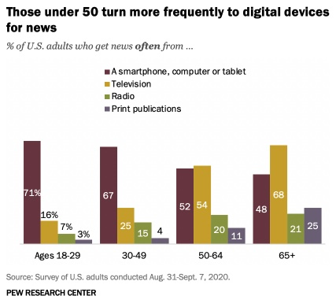

```{r preamble, child = here::here('preamble.Rmd')}
```


---
## Looming Deadlines

- Eh future you problem

- Chapters
---


---
class:center, middle 

## Political Knowledge 

```{r out.width= "80%"}

```


???
Survey after survey has demonstrated that Americans as a whole are not well informed about politics and public affairs.  Some analysts place most of the blame on the press, which, they say, is more concerned with entertaining its audience than informing it.  Other observers place most of the blame on the public. They point out that there is almost no vital piece of information about a policy issue that is not reported by the media at one time or another. From this perspective, the problem rests with the public’s failure to pay close attention to the news. 

 In your opinion, is the press or the public primarily to blame for the citizenry’s low level of political awareness? What changes in news coverage might improve the public’s level of awareness? 

---


---
## Try it out


```{r}
knitr::include_url("https://www.pewresearch.org/politics/quiz/what-do-you-know-about-the-u-s-government/")
```


---


---
## What Role Does the Media Play?

Watchdogs of government

Conveyors of information to the public

Setting the agenda

Promoter of free flow and exchange of ideas


---

---
## Mass Media

All companies, organizations, institutions, and other corporate entities who deliver information on politics and current events to the public at large

Types of Media:
  - Broadcast
  - Print
  - Social 
  - New Media

???

Fourth branch?  The role of the mass media in a democratic society.

Referred to “fourth branch” because of its essential role in a representative democracy. 

Information in the news is the primary source of information about society, politics, and government.


Without a free flow of accurate, timely and useful information, people cannot participate effectively. 

More to the point, a free and active media is the central means through which citizens learn about and assess the claims and actions of government officials.  Essential to accountability. 

Modern problems and their potential solutions are so complicated that the typical citizen must rely on various individuals in the media (experts, politicians, pundits, etc.) to make sense of it all.   

  


---


----
## History of the Media

- The Era of Sensationalism and Muckraking: 1860-1920
  - .bold[Yellow Journalism]: a style of reporting in which journalists exaggerate or even fabricate news stories to increase circulation.
  - .bold[Muckraking]: journalism focused on exposing corruption in government or industry

- 1920's and the Rise of the Radio  
  - Introduction as a new sources of news. Significant rise in the use of the term, “Breaking News” 

- The Rise of Television
  - Communication Act of 1934
  - The airways are public property and commercial broadcasters goal is to “serve the public interest, convenience, and necessity
  - Freedom of Information Act(FOIA)
  - Allows any citizen to get information from government records after filing an official request for the release of documents  
- Television becomes primary source of news for citizens


???

Joseph Pulitzer and the New York World gave them what they wanted in the 1890s. The tabloid-style paper included editorial pages, cartoons, and pictures, while the front page news was sensational and scandalous, appealing to audience emotion and less on the substantive aspects of the important issues of the day. This style of coverage became known as yellow journalism. Ads quickly sold thanks to the paper’s popularity, and the Sunday edition became a regular feature of the newspaper. As the New York World’s circulation increased, other papers copied Pulitzer’s style in an effort to increase circulation. Competition between newspapers led to increasingly sensationalized covers and crude issues

In 1896, Adolph Ochs purchased the New York Times with the goal of creating a dignified newspaper that would provide readers with important news about the economy, politics, and the world rather than gossip and comics. The New York Times brought back the informational model, which exhibits impartiality and accuracy while promoting transparency in government and politics.


The Communicaion act of 1934 establishes the FCC how the airwaves work first starting 


powerful entity to monitor the airwaves—a seven-member (now five-member) FCC to oversee both radio and telephone communication. The FCC requires radio stations to apply for licenses, which are granted only if stations follow rules about limiting advertising, providing a public forum for discussion, and serving local and minority communities. With the advent of television, the FCC was given the same authority to license and monitor television stations. The FCC now also enforces ownership limits to avoid monopolies and censors materials deemed inappropriate


---

---
layout: false

- Watchdog Journalism(1973-1991)
  - The media adopts a much more aggressive and critical posture towards government 
  - Ushered in by the release of The Pentagon Papers (1971) and Watergate Scandal 

- The Era of Infotainment(1992-Present)
- .bold[Soft News]: a type of media that provides a combination of information and entertainment.
- Ex. Trevor Noah, Samantha Bee, John Oliver

???
IN 1996 a new communication act was passed that  dropped the limit on the number of radio stations (forty) and television stations (twelve) a single company could own. It also allowed networks to
  
---

---
## Types of Media

- Television or Radio Media
  - Provide Pictures or Scripts with a level of Immediacy to assist the viewing public 
- Print Media
  - most common form are newspapers (print or online)
  - The depth nd accuracy of sources is given more attention
- Social Media
  - Provides social interaction among people in which they create, share, or exchange info in virtual communities and networks
  - It is considered a coordinating mechanism for political action 
  - Studies show rather than polarizing political views, it moderates them due to the diversity of exposure. 


???
The internet has lead to a drastic increase in the consumption of online news in the last 15-20 years 
It solves many of the problems of print media by increasing the depth, but by limiting the time consumption 
It is the most threatening form of media especially to print media. 
50% of all social media users have posted about politics. 
1/3 of all of those that have been surveyed have  changed their opinions or that of their friends based on a political comment made on Facebook or twitter.  

---


---
## Where do People get their news

.pull-left[

```{r out.width= "60%"}

```


]


.pull-right[

```{r out.width= "60%"}

```


]
---

---
## Regulation of the Media

- The print press enjoys relative freedom from government regulation thanks to the provision of the 1st Amendment 
  - Content can be regulated when questions of libel and slander are brought forward 
  - Must reach standard of .bold[”Actual Malice”] 
  - Content can also be regulated sometimes via prior restraint 
- .bold[Prior Restraint]: censorship imposed, usually by a government, on publication of documents or specific information. 
  - Unconstitutional in the United States except in extremely limited circumstances such as national security. 


???
Remember the media has the right to get stuff wrong

New York Times v. Sullivan – established the standard of actual malice in First amendment standards concerning the press. When discussing/writing/etc. about an individual the press much avoid making statements of malice (knowledge that they are false or in reckless disregard of their truth or falsity) especially against public figures. If such statements are made then the individual has the right to sue/you are not protected by first amendment.  This is partially where the Snyder v. Phelps decision rises from. 


page report on the history of the United States’ political and military involvement in Vietnam between 1945 and 1967. The report, which was produced by the Department of Defense for internal purposes and was not intended to be made public, contained information demonstrating, among other things, that President Lyndon Johnson had lied repeatedly to Congress and the American public in an effort to build public support for a military escalation in Vietnam.

The U.S. Supreme Court affirmed that the government’s power to prevent the publication of information, even classified information, is strongly limited by the First Amendment. The Court ruled the newspapers had a right to publish most of the Pentagon Papers. The Court also held, however, that revelations of troop movements and the names of undercover operatives are some of the few approved reasons for which the government can stop publication or reporting


Some exceptions are stuff like troop movements, identities of like spies, etc things that would likely result in the loss of life 

---


---

```{r}

```

???
The 2018 world press freedom index compiled by Reporters without Borders (RSF) is based on incidents and types of attacks on the media across the world. The RSF classifies this time period as the “age of post truth” and propaganda. The suppression of these freedoms has become especially problematic in democracies. 


The obsession with surveillance and violations of the right to the confidentiality of sources have contributed to the continuing decline of many countries previously regarded as virtuous. The rise of authoritarian strongman in democracies across the world (United States, Poland, Hungary, Turkey, etc.) combined with toxic anti-media discourse (United Kingdom, US, Poland, Chile, and New Zealand) have also led to significant drops in the position of many of these countries. 

---


---

## Regulation of The Media

- The Federal Communications Commission (FCC), the government issues licenses and regulates the business and content of broadcast media.
  - Licenses are granted on a 1, 3, or 5 year term for TV 
  - Radio Licenses are 17 year terms

- It is an Independent Regulatory Commission 
  - Members are appointed  by the President 
  - 5 member commission 
    - Chairman and 4 Commissioners 
    - 5 year terms

???
The FCC’s goal is to regulate communications by radio, television, wire, satellite, and cable. It was created by the Communications Act of 1934.  It ensures that we all have access to affordable and reliable broadband services, that the market for such is competitive, it promotes growth in industry and technology, promotes a diversity of media, and provides media and communications during emergencies and national crisis. 

---


---
## The FCC Regulates Broadcast Media through Various Rules

.panelset[

.panel[.panel-name[Fairness Doctrine]
- Rule requiring holders of broadcast licenses to present controversial issues of public importance in a manner that is honest, equitable, and balanced 

- Eliminated in 1987


]

.panel[.panel-name[Equal Time Rule]

- Rule requiring radio and television stations to provide an equivalent opportunity to any opposing political candidate that request it 

  Exceptions : 
- Airing a documentary 
- Talk Shows and News Syndicates 
- Scheduled  “live” newscast or on-the-spot events 
- News interviews 
- Political debates not hosted by the media station  


]


.panel[.panel-name[Net Neutrality]

- Internet service providers and governments must treat all data on the internet the same and not discriminate or charge differently by user, content, or website 


]
]

???
Introduced by the FCC in 1949 and suspended in 1987

Where as the equal time rule is concerned with equal access, the fairness doctrine was concerned with making sure broadcasters provided a free and open discussion of public issues. 

The Fairness Doctrine requires that stations (1) provide a reasonable amount of air time to coverage of controversial issues of public important, and (2) accord a reasonable opportunity for the voicing of contrasting viewpoints concerning these issues.

Enforced through the license renewal process in which the states were required to document their compliance.

FCC gradually extended the rules of the Fairness Doctrine to apply to statements about individuals rather than just abstract issues.  


Thus, when a broadcast included a personal attack on a public figure, the station that aired the attack was required to notify the person who was attacked and offer him or her a reasonable opportunity to respond.
Reagan appointed several new members to the FCC, all of whom were strongly committed to a free market approach to broadcasting.  In 1987 the FCC decided to repeal the fairness doctrine, on the grounds that technological advances had made it possible to accommodate many stations in a given local, making it unnecessary to force stations to present opposing viewpoints. 

The F.C.C. says that the old rules are no longer necessary because the marketplace has changed. According to the official line, new media -- first cable television, then the Internet -- have given the public access to a diversity of news sources, eliminating the need for public guidelines. 


 The equal-time rule, for instance, states that registered candidates running for office must be given equal opportunities for airtime and advertisements at non-cable television and radio stations beginning forty-five days before a primary election and sixty days before a general election. If WBNS in Columbus, Ohio, agreed to sell Joe Biden thirty seconds of airtime for a presidential campaign commercial in 2020, the station would also need to sell President Donald Trump thirty seconds of airtime at the same price.

---


---
## Media Credibility and Bias


- Goals of (Ethical) Journalism: 
  - Seek Truth and Provide a Fair and Comprehensive Account 
  - Minimize harm 
  - Serve the public with thoroughness and honesty 
  - Be Accountable and Be dedicated to standards of ethical behavior 

.footnote[[1]: Journalistic Ethics outlined [here](https://www.spj.org/ethicscode.asp)]

???
minimize harm 
Balance the public’s need for information against potential harm or discomfort. Pursuit of the news is not a license for arrogance or undue intrusiveness. 


---


---
layout: false

```{r out.width= "70%"}

```


---

---
## Sources of Media Power

.bold[Agenda Setting]:  The power of the media to bring public attention to particular issues and problems

.bold[Framing]: The power of the media to influence how events and issues are interpreted
  - the  words,  images,  phrases,  and  presentation  styles  that  a speaker  (e.g.,  a  politician,  a  media  outlet)  uses  when  relaying  information  about an issue or event to an audience


???
Agenda setting is imporant because the media can start to affect what we think of as important throught just the very act of covering things. There are sort of some issues that we can think of as sort of inherently news worthy. While other stuff maybe escape our attention because the public just isn't paying attention 


Framing you can kind of think of it as the how it is being covered
---


---
## Attitude Formation

$$
\begin{align}
\overbrace{A}^{\text{Attitude}} = \Sigma\overbrace{V_{i}}^\text{Dimensions used to evaluate something on} \underbrace{W_{i}}_{\text{Weight you give to individucal dimensions }}
\end{align}
$$
???
So how do we get our attitudes about issues? When someone asks, what do you think of president Biden? How do you decide how to answer? Well political scientists have come up with a mathematical model which we think best explains the ways in which people form their attitudes?

An attitude is an evaluation of an attitude object

Draw the big head on the board.
Use the example of presidential approval (Obama)

Race 

PartyID

Charisma

Policy positions – ObamaCare, Foreign Policy, Economic Stimulas

Spouse – maybe they like Michelle

---


---
## Attitude Formation


$$
\begin{align}
\overbrace{A}^{\text{Attitude}} = \Sigma\overbrace{V_{i}}^\text{Dimensions used to evaluate something on} \underbrace{W_{i}}_{\text{Weight you give to individucal dimensions }}
\end{align}
$$

- .bold[Frame]: communication that highlights some subset of the possible dimensions to evaluate an attitude object
- .bold[Framing Effect]: Occurs when $W_{i}$ changes
  - Influences the value of the dimension you look at when forming an attitude
  
  
???

Framing – the process by which media encourages viewers to interpret journalistic stories in a particular way. Media can frame stories for the public using selective presentation of facts or specific descriptive language.

---

---
## Public Opinion Experiment

Imagine the US is preparing for the outbreak of an unusual respiratory disease, which is expected to kill 600 people. Two alternative programs to combat the disease have been proposed. 


.pull-left[

### Program A

200 People Die

]

.pull-right[

### Program B

1/3 probability that everyone is saved. 
2/3 probability no one is saved. 


]


???
An “overwhelming majority” of people chose Program A which saves 200 lives for sure.

An “overwhelming majority” of the group given problem 2 chose Program D. Note that Program A and C are identical in their outcomes as are B and D. The questions are just framed differently. When A was framed as a gain, people chose it; when it was phrased as a loss (as it is in C), people rejected it.

---


---
layout: false 

Imagine the US is preparing for the outbreak of an unusual respiratory disease, which is expected to kill 600 people. Two alternative programs to combat the disease have been proposed. 


.pull-left[

### Program C

400 People Die

]

.pull-right[

### Program D

1/3 probability that everyone is saved. 
2/3 probability no one is saved. 


]

???
An “overwhelming majority” of people chose Program A which saves 200 lives for sure.

An “overwhelming majority” of the group given problem 2 chose Program D. Note that Program A and C are identical in their outcomes as are B and D. The questions are just framed differently. When A was framed as a gain, people chose it; when it was phrased as a loss (as it is in C), people rejected it.


---


---
## Why Does This Happen?

.bold[Risk Averse]: the behavior of individuals that when exposed to uncertainty will attempt to lower that uncertainty. 

.bold[Risk Seeking]: the behavior of individuals that when exposed to uncertainty will choose greater volatility in exchange for anticipated higher returns.  


???
A framing effect occurs when transparently and objectively identical situations generate dramatically different decisions depending on whether the situations are presented or perceived as either potential losses or gains

This messes with peoples utility function making them either risk averse or risk seeking because of their perceived benefit or the percevied losses 


---

---
class: middle
## Real World Example


```{r}
vembedr::embed_url("https://www.youtube.com/watch?v=lAz-F1QnyCk&t=5s")
```


---

