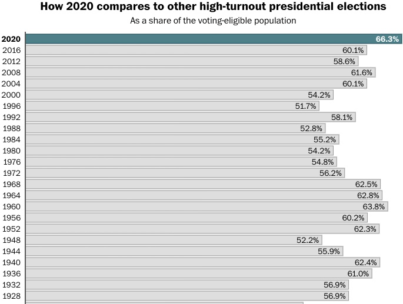
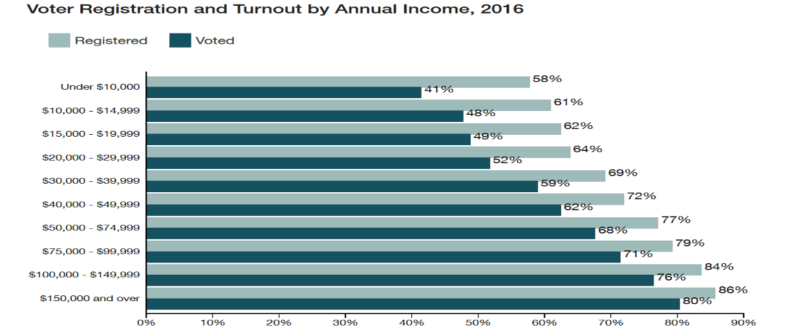
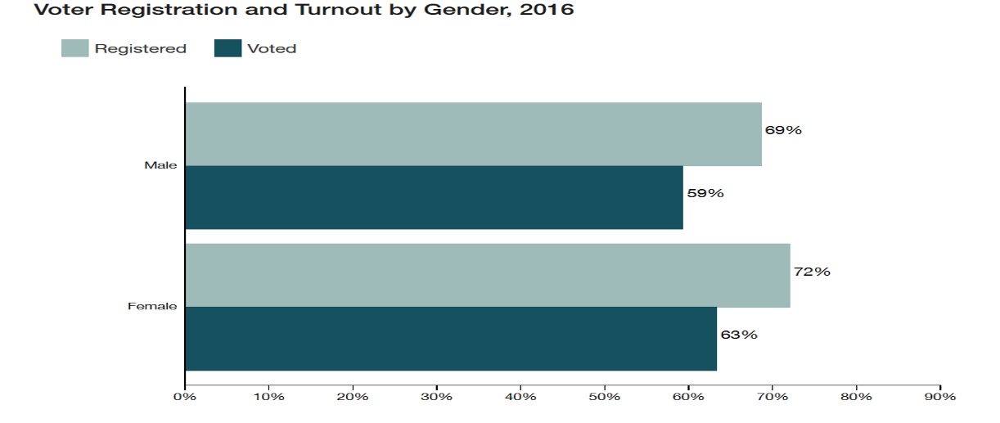
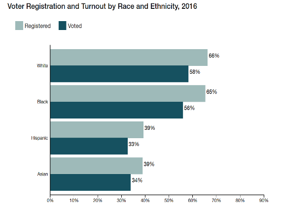
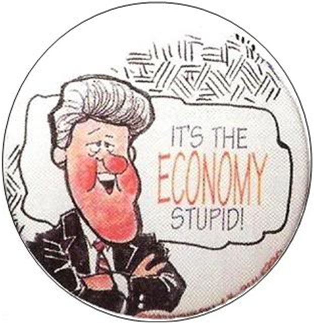

```{r preamble, child = here::here('preamble.Rmd')}
```


---
## Looming Deadlines 


- .bold[NCCHR] Extra Credit 02-27


----

---
class:center, middle,inverse

.col[ # Political Participation]


---

---
class:middle, center
## What is it?


---

---
## Types of Political Participation 

.bold[Political Participation]: Any action aimed at changing or supporting the actions of political agents and officials 

.pull-left[

.hiro-red[Conventional Participation]: Common actions considered culturally acceptable political activity that communicates preferences through established institutions


]


.pull-right[
.hiro-dark-blue[Unconventional Participation]: Political activity that takes place outside of established institutions and challenges cultural norms

]
???
What is an example of each? 
---

---
## What is Political Participation?

Participating in politics can take many forms

- Voting

- Working for campaigns

- Contributing to campaigns

- Contributing to political movements or interest groups 

- Contacting public/political officials

- Protesting

- Community work

- Serving on local boards or councils 

- Joining political organizations 

- Political conversations 


???
These are all specific acts of political participation. Which of these would be considered Conventional? Which would be Unconventional?

Beyond that, are all of these forms of participation equal, in terms of costs (time, money) and benefit (how much you get back from politicians for participating in these activities (ie. listen to your concerns, address policies that are important to you)?

In other words, are all people equally capable of participating in these different activities? And if not, are all these activities equal in the messages they convey to politicians?

---


---
## Types of Participation 


.pull-left[

### Conventional 

- Voting

- Volunteering

- Working on campaigns 

- Writing your Congressman

- Writing the editor of a paper

- Signing petitions


]

.pull-right[
### Unconventional 

- Protests

- Strikes

- Boycotts

- Sit-ins

- Riots

- Marches

- Political Violence 
]

???
As a political violence scholar I would remissed if I didnt add that political violence is a form of political participation. The use of violence by groups and by people is often used in the pursuit of political goals. 

---

---
## Political Participation the Volume it speaks

```{r}

pol_par = tibble::tribble(~Activity, ~`Capacity for conveying Info`, ~Impact, ~`Requirments`,
                          "Voting", "Low", "Low", "Time",
                          "Campaign Work", "Mixed", "High", "Time and Skill",
                          "Campaign Contributions", "Mixed", "Highest", "Money",
                          "Interst Group Contribution", "Mixed", "Highest", "Money", "Contacting Public/Political Officials", "High", "Medium", "Time, Skill",
                          "Protesting", "High", "Medium", "Time",
                          "Community Work", "High", "High", "Time and Skill",
                          "Serving on Local Boards/Councils", "High", "High", "Time and Skills", "Joining Political Organizations", "Mixed", "High", "Time, Skills, and Money")

gt::gt(pol_par) %>% 
  gtExtras::gt_theme_guardian()


```

???
So not all political participation is equal

They require different things and they accomplish different things. This chart is taken from a book called Voice and Equality, which surveyed 15,000 Americans about political participation.

Here we see the different levels of information that forms of participation can communicate to public officials, which communicate the loudest (in other words, which do public officials and politicians pay the most attention to) and what each form of participation requires.

So looking at this table, we can see that while voting is the easiest form of participation (requiring only time) it is the lowest in its ability to convey specific information (because it is so general) and in its volume (because so many people vote). Voting is often called “the great equalizer” because every citizen has the same voice with voting, but when voting does not speak as specifically or loudly to public officials as less equal activities, there may be a reason to be concerned.

So why does this matter? What’s the big deal about the variation in these types of participation?

Because different groups of people participate in different activities to different extents. Those that participate in the most information rich and loudest activities will have their needs heard the most by public officials, and will receive more representation than those that participate in the least loud and information rich activities


Today we are focusing on row one. mostly 

---

---
class: center, middle, inverse

# Voting


---

---
## Voting

- Who votes? 

- What drives people to vote?

- What determines vote choice

???
Picking up on a broad theme of this class is you could take a graduate class just on voting and then dedicate an entire academic career to that. Today will be a tour de force of this and will largely think of it as like a neat little prediction problem. Than we are going to move onto next week where we will focus on the barriers in practice 

---

---
## Voting

```{r}
vembedr::embed_url("https://youtu.be/Vr-ZeToI4R8?t=738")
```


???
end 22:22
---


---
## Two Types of Voting

- .bold[Prospective Voting]: voter behavior that evaluates candidates based on forecasts of their future political behavior.


- .bold[Retrospective Voting]: voter behavior that evaluates candidates based on their experience or past performance. 

Mediated Retrospective Evaluations


Simple Retrospective Evaluations


???

prospective voting: voting on the promise of the future 

Retrospective voting tends to be used more by voters, and can be used in two ways

MRE’s: Mediated through personal predispositions (PID) and experiences

SRE’s: Has a direct effect on vote choice

---


---
## Why Do We Not  Vote? 

Lack of Mandatory registration

Lack of mandatory voting

Lack of proportional representation

Too many elections

It’s irrational


???
Americans have much lower turnout that citizens in many other advanced industrialized democracies. This is often though of as a surprise because Americans generally have equal or higher education levels and high levels of political efficacy, trust in government, and sense of civic duty (all things that increase turnout at the individual level).
So why don’t Americans vote as much?

Mandatory registration: Citizens in the United States are not automatically registered, they have to register themselves when they turn 18. Registration also has to be updated every time you move. Additionally, states have their own rules about registration deadlines, the information that is required to register, the information that you have to take with you to vote, who can register, etc.
Mandatory voting: Several other countries REQUIRE their citizens to vote, like Australia and Belgium where citizens are fined for not voting

Some people blame it on the lack or proportional representation. Under winner-take-all systems if you vote for the losing candidate you may feel that you wasted resources because you didn’t receive the benefit of electing your preferred candidate


The US holds A LOT of elections: Presidential, Midterm, Gubernatorial, State, Local, Special, Run-offs (Ex. Georgia)
It’s irrational: We’ll return to this concept in just a little


---

---
## Rational Voting Calculus


$$
\begin{align}
\overbrace{R}^\text{Reward for Voting} = \underbrace{\text{P}}_{\text{Probability Vote Decides Election}} \times \overbrace{\text{B}}^{\text{Benefit Received if your Candidate Wins}} - \underbrace{\text{C}}_{\text{Cost of Voting}}(B	> C)
\end{align}
$$

???
In the 50's a guy named Anthony Downs came up with this little diddy. We assume that voters are rational actors. meaning that voters are profit maximizing individuals. They want to make sure they derive the most amount of benefit from voting. They do not want the benefit to exceed the cost of voting 


P denotes the probability that your vote will be the deciding vote. You, me and Big Downes know the likelihood of this being the case is pretty low. 

Costs are fairly intuitive: They can be a simple as the amount of time it takes to commute to the polling place, the amount of time it takes to commute to the both 

So people end up being free riders, because their individual vote will not influence the outcome of the election – therefore it is more rational for you to stay home and enjoy the benefit of other people voting, rather than vote yourself. 

Downs essentially argues that the indivdual is better of free-riding 

---

---
## Consumptive Model of Voting


$$
\begin{align}
\overbrace{R}^\text{Reward for Voting} = \underbrace{\text{P}}_{\text{Probability Vote Decides Election}} \times \overbrace{\text{B}}^{\text{Benefit Received if your Candidate Wins}} - \underbrace{\text{C}}_{\text{Cost of Voting}} + \overbrace{\text{D}}^\text{Duty}
\end{align}
$$


???
Riker and Ordeshook don't neccessarily disagree with Downes if you view voting solely through the lens of this strict rational choice lens. But we vote because of lots things and those things can be squishier than just does my paycheck increase. They introduce what is known as the d term

The D term can be a whole host of stuff like a sense of civic duty, social pressure, patriotism etc essentially D is the satisfaction that people derive from the act of voting. My kind of rough heuristic for understanding the D term is that there is inherent non-material benefit to voting. There is nothing quite like telling somebody fuck you. And in this case if you are voting against somebody it is a form of the middle finger 
---

---
## Who Votes?


```{r out.width= "90%"}

```


???
So before we go any further we need to talk about two distinct populations that go out and vote. 

There is the Voting Age Population (VAP) – which is all the voters who are eligible based on age (18+) to vote. This does not take into account legal or citizen status. Thanks to a variety of different amendments this is possible. Review: 

15th Amendment – made it possible for any adult male citizen to vote despite his race. 

19th Amendment – made it possible for any adult female to vote. 

23rd – DC citizens can vote/ be represented in EC 

24th – Abolished Poll Taxes 

26th Amendment - make it possible for anyone 18 and older to vote. It lowered the voting age from 21. 

Then there is the Voting Eligible Population (VEP) – which is all the voters who are eligible to vote based on voting status. This includes all individuals who are citizens, who are registered to vote, and in some states that are not convicted felons
---


---
## Who is *most likely* to vote?


```{r out.width="90%"}

```


???
For this portion we are going to think about what are consistent predictors of voting. 

Wealth vs. Poverty 
Those with higher economic status are most likely to go out and vote.  This is because they possess the resources and the time to be able to not only vote but to participate in political events. 

As you can see from this graph those that have higher incomes are most likely to vote. Roughly incomes that make more than $50,000 per year increase the likelihood well above 60% of those that are eligible. 

This is a strong predictor of voting behavior, and is dependent of all other factors that influence voting behavior. 

There are three key factors to determine whether an individual will vote or not. 
1. Resources 
2. Interest 
3. Motivation. 

Think of it as: People can’t (resources), won’t (don’t care/not interested) or haven’t been asked to participate (motivation)
Socioeconomic status = the combination of education, occupation, and income that can be used to gauge one’s position in society. 

---

---
layout: false 


```{r out.width="90%"}

```

???
Men versus Women 

Women have on average a higher political participation rate then men consistently since the 1960’s, but there average voting rates are roughly the same.  This graph is from the turnout rates from the 2008 election and woman and men were almost equally represented in every age group, but in this election women were the more likely voters. 

This is a weak predictor of voting behavior. It is often a codependent factor of voting behavior. (meaning that it is only effective when taken into account with other factors). 

---


---
layout: false 

```{r out.width="80%"}
knitr::include_graphics("images/education'.png")
```

???
Education level is the strongest predictor of an individuals voting behavior. The more educated a person is, the more likely they are to vote, as they have a better understanding of how the system works, how to influence the system, and why participation is important.


---

---
layout: false 


```{r out.width="80%"}

```

???
Race: 
African American: While African American turnout is the highest it has ever been historical in the last two elections (2008 and 2012) it still is generally well below that of the national average. 

Latino: On average, Latino citizens continue to vote at significantly lower rates that non-Latino white voters. However, in recent years, a larger number of organizations that serve immigrant and Latino communities have become involved in political participation. The Language Minority Provision of the Voting Rights Act, first introduced in 1975, aims to lower the cost of participation for Latino voters by requiring election material be provided in Spanish where appropriate.


Asian American: This diversity and polarization makes it difficult to generalize the voting patterns for the Asian American community. Specifically in certain areas of the country the voting rates are much higher. 

Religion:  Is a codependent factor of voting. We often associate voting with religion since it is so deeply tied to political identity specifically of the Republican Party, but more often then not it has little effect on voting by itself.  

Marital Status: Those that are married are far more likely (10x) to vote than those that are single or divorced
---


---
class: center, middle


---

---
## What factors in Influence our Vote 

- PID


- Partisan Loyalty

???
Yeah I'll admit that this is kind of an anti climatic answer but for the most part PID is a pretty good indicator. Indpendents tend to lean toward one party or another and tend to vote like their partisan couterparts 


Since the 1960s, more people have chosen to be independents rather than identify with either Republicans or Democrats, which means that less and less people vote based on their identification with a specific party. This graph shows the party identification based on voters identification in the 2004 election. 

Party identification is not just an individual identity; it can also be important for groups. Social, economic, racial, and other similar groups can become aligned to certain parties, and then vote according to that party identification. When people identify very strongly with one party, they tend to vote for that party consistently. This can lead to straight-ticket voting.

---

---
## What Factors Influence our Vote

- Different issues may affect individual voters
- Nationally salient issues may significantly impact vote choice
- Major event
- Media
- Candidate

One issue that always influences vote choice:


```{r out.width="40%"}

```


???

Different issues hold meaning for different voters
Issues that sway elections on a national level include salient issues (issues that are important to the American public)

What makes an issue salient?

Major Events (Obama and McCain and the Economic Collapse of 2008)

Media (Clinton and Benghazi)

Candidates also set the agenda (Sanders and Income Inequality; Trump and Immigration)

One issue that is always salient to American voters is the economy, but economic well being effects voting in varied ways
Sociotropic: How well you think the nation is doing economically

Pocketbook: How well are you doing personally?

People tend to blame themselves for their own financial state, so your own situation does not effect your vote that much, BUT people ten to blame the government for how well the nation as a whole is doing- so that significantly impacts vote choice (Republicans and Pres. Bush punished in 2008)


Political scientist to disagree what economy we consider the most. Does the broader health of the economy matter or is it just self interst all the way down? Comparative political scientists definitely still fight about this.

The Economy – single more important flux topic when it comes to voter decision. If the economy is good, voter support the incumbent. If economy is bad, voters (undecided) are more likely to support challenger. 


---


---
## Declining Voters 

- Growing Mobility of Voters

- The decline of social capital

- Declines in party attachment and external efficacy during this period
  - Watergate
  - Assassinations
  - 

???
Why would party attachment and external efficacy decline during this period?
Four Major Things Happened

Assassinations

Remember, that during this time period there was a LOT of political activity happening. There were a lot of marches and calls for a lot of social and political changes. Some of the big movements included the Civil Rights movement, the black power movement, the brown power movement, the women’s rights movement, etc. 
As a result, there were several prominent political activists and public figures that had a lot of support during this time period, and were ultimately assassinated.

Beginning with President Kennedy, who was shot Nov. 22, 1963 in Dallas, the Kennedy’s were America’s golden family. JFK was young, he was the first Catholic president. Jackie Kennedy was adored. They had several young children. So this assassination was particularly shocking
O
nly two years later, Malcolm X, who was prominent leader of the black nationalist movement, a prominent leader died on Feb. 21, 1965, shocking the nation.

Martin Luther King, Jr., the most prominent civil rights leader of the 1960s, was instrumental in the Birmingham bus boycott, pushed for the passage of the Civil Rights Act, was the youngest man, at the time, to be awarded the Nobel Peace Prize, was assassinated April 4, 1968 in Memphis, where he was working to secure safer working conditions for the city’s sanitation workers
.
Finally, Robert F. Kennedy (JFK’s brother) was died June 5, 1968. He was prominent as a presidential candidate, his opposition to the Vietnam War, and had recently taken on urban poverty as an issue.
These assassinations shocked people who supported these men, discourage Americans (because these were enthusiastic, popular leaders, who were all killed in their prime), and created a general sense of apathy on the part of voters (why support a candidate if they are just going to be assassinated?).

The Vietnam War

This war was fought to halt the spread of communism from Northern Vietnam to Southern Vietnam. Approximately 500,000 troops were there by 1969. 
Americans were divided on this war, but had largely come to dislike the war by the late 1960s. Ultimately, there were two sides to the war, Hawks (who supported escalation of the war) and Doves (who support withdrawal from the war).

This effected party attachment and external efficacy because politicians from both political parties ran on a platform of winning the war in Vietnam, however, neither did during this period.
This alienated Doves because neither parties politicians withdrew, and alienated Hawks because neither side would escalate the war to a full on attack, meaning that territory was frequently won and lost because troops were unable to hold their positions.

Civil Rights Movement Turns Violent
Although the Civil Rights movement had been non-violent and peaceful during the late 1950s and early 1960s, following the passage of the 1964 Civil Rights Act aspects of the movement became increasingly violent. 

The tipping point here is when race riots began breaking out, starting in 1965 with Harlem and Watts, with more occurring in later years in Atlanta, Detroit, etc. These were in reaction to police officers and in some cases private citizens. Depressingly the congressional reports that these 

On one side of the issue were some people that thought the Civil Rights movement was moving too slow, not enough was getting done to get rid of discrimination. These people were frustrated by the riots, but still felt that politicians (both Republicans and Democrats) weren’t moving fast enough on the issue of race and discrimination.

On the other side were people that thought the Civil Rights movement was moving too fast and were frightened by riots and felt that more needed to be done to control population, and were also not satisfied with government (again both Republicans and Democrats)
So no matter how you feel about Civil Rights, your party and government was letting you down.

Watergate

The break in and resulting scandal totally obliterated trust in government
Conclusion: No matter who you were or what you thought during this time period, you were let down by your party and your government, decreasing PID and efficacy for everyone. This trend was stuck for Baby Boomers who still vote less than other generations. As a result, turnout continues to stay low because of generational replacement (Boomers outnumber New Dealers 2:1)


---


