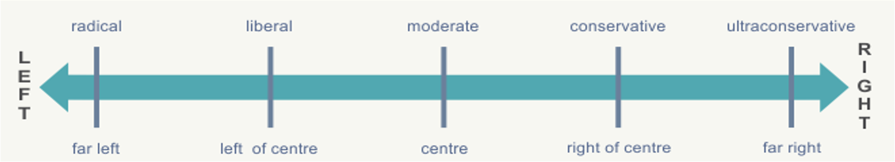
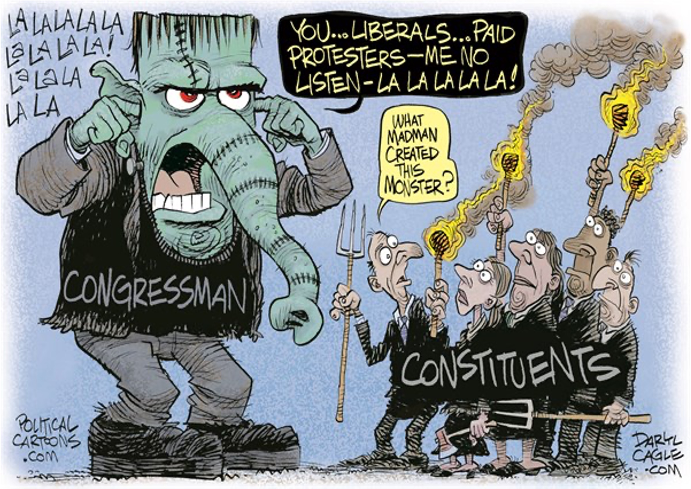

```{r preamble, child = here::here('preamble.Rmd')}
```

---

## Looming Deadlines 

- Extra Credit for completing NCCHR early .bold[02/27]

- Chapters

---


---
class: center, middle

# Public Opinion
--

# The Stats Part

---

---
class: center, middle

<gsu-blockquote-red>
It seems to me that statistics is often sold as a sort
of alchemy that transmutes randomness into certainty, an “uncertainty laundering” that begins with data and concludes with success as measured by statistical significance - Andrew Gelman(2016)
</gsu-blockquote-red>

???
The book tends to spend a bit to much time on the stats part of public opinion while not really giving you guys an intuition. If you have questions speak up. I also kind of decided to put this before everything else because I figured this would be painful for some of you and just to get it over with.
---

---

## The Basics 

- .bold[Population]: all the cases of interest in existence, all of something, group, large or small, that we are interested in

- .bold[Sample]: a selected subset of the population from which data is collected for study

- .bold[Parameter]: measurements of population quantities

- .bold[Statistics]: measurements of the sample quantities are called


???
The book tries to skirt around "scary concepts like these". In public opinion we are trying to understand what the broader population of the United States feels like but it is a bit more difficult than asking each and every person what they think about the something. In the next few classes we will cover why that is. What is important to keep in mind that the book doesn't talk about is that it covers one very widely used paradigm very poorly. The paradigm that it uses is what is known as frequentism. In frequentism we assume that the sample is random but the world is fixed. The population parameter in frequentist statistics is essentially an unknowable thing that we are trying to figure out. 
---

---
## Basics Continued

-  .bold[Probability]: is the proportion of times that the outcome would occur in a very long sequence of observations


- .bold[Confidence-Interval]: the probability that a population parameter will fall between a set of values for a certain proportion of times. 

- .bold[Random Sampling]: With random selection, every person in the population has equal probability of being selected into the sample.

???
These concept s are depeely interconnected not only to how we conduct statistics in polling but to each other. The p-value is a threshold that we apply all the time in when doing statististics in political science, economics, sociology, psychology, epidemiology, education, and biostatistics literature. The p-value is a threshold that we often use to set a minimal standard that there is a relationship between our variables. If we reject the null hypothesis than this is a weak test that the thing we say is there is there. 


The confidence interval is just essentially a net. What ever quanitity of interst we are calculating there is going to be some error in real life analysis that will make our sample quantity differ from the population quanitity. The key question is whether or not that deviation is so extreme that we aren't actually capturing the population parameter.

The problem with the statistics we normally used and what is widely taught is kind of encapsulated for bu the confidence interval. What do you think that the plain english interpretation of the confidence interval is? 


The problem is that the confidence interval is us saying that 95% of the time we believe that our net captures the true population parameter. The stats we use do not really track with how we think or in practice what we are doing. 
---

---
## Confidence Intervals in Practice

```{r}
p <- 0.45
N <- 1000
B <- 10000
inside <- replicate(B, {
  x <- sample(c(0,1), size = N, replace = TRUE, prob = c(1-p, p))
  x_hat <- mean(x)
  se_hat <- sqrt(x_hat * (1 - x_hat) / N)
  between(p, x_hat - 1.96 * se_hat, x_hat + 1.96 * se_hat)
})

tab <- replicate(100, {
  x <- sample(c(0,1), size = N, replace = TRUE, prob = c(1-p, p))
  x_hat <- mean(x)
  se_hat <- sqrt(x_hat * (1 - x_hat) / N)
  hit <- between(p, x_hat - 1.96 * se_hat, x_hat + 1.96 * se_hat)
  c(x_hat, x_hat - 1.96 * se_hat, x_hat + 2 * se_hat, hit)
})


tab <- data.frame(poll=1:ncol(tab), t(tab))
names(tab)<-c("poll", "estimate", "low", "high", "hit")
tab <- mutate(tab, p_inside = ifelse(hit, "Yes", "No") )

ggplot(tab, aes(poll, estimate, ymin=low, ymax=high, color = p_inside)) + 
  geom_point()+
  geom_errorbar(alpha = 0.7) + 
  coord_flip() + 
  geom_hline(yintercept = p) +
  labs(title = "Look at how often our confidence intervals\n capture what we say it captures", 
       caption = "The line in this case denotes the  0.45") +
  theme_allen() +
  scale_color_manual(values = c("#e76254", "#1e466e")) +
  guides(color = guide_legend("0.45 Inside The Net"))

```


???
You are going to see a lot of simulations because that is what I find most intuitive. Here is what is going on. I set a value for the population parameter and then took random samples from that population. Than what i did was calculte the 95% confidence intervals. About 95% of the time I capture the true value with my net. There are a few times where I don't. Effectively when polls report margin of errors they are in effect reporting a confidence interval

Even when we are conducting polls in the best way possible our net is not going to capture what we say it captures from time to time. Or even if we say that it is .45 due to things out of control the quanitity in our sample will be slightly off

---


---
## Probability 

.pull-left[

-	We think of probability is indicated as number between 0 (never happens) and 1 (always happened) repeated over an infinite number of times

- The probability of picking a certain color candy from a jar given a set of candies in the jar

- Lets say we have 2 red candies and 3 blue candies and we want to know the probability of picking a red one. 
]

--


.pull-right[

```{r echo = TRUE}

set.seed(1994)

candies = rep(c("red","blue"), times = c(2,3))

candies 


```

]


???
This is pretty easy! it is just 2/5 or 40% and this should be true as we pick candies. So lets test this out with some simulations! 


---

---
layout: false

.pull-left[
### Sampling Once
```{r echo = TRUE}
sample(candies, 1)

sample(candies, 1)

sample(candies,1)

sample(candies,1)
```


]

.pull-right[
### Sampling 100,000 Times

```{r echo =TRUE}

b = 100000

events = replicate(b, sample(candies),1)

tab = table(events)


prop.table(tab )


```


]
???


This is pretty neat! with our simple math we can show this holds in our toy problem! 


However this can start to change if the events are not independent of each other. Think of a deck of card. Where there are 52 cards with 4 face cards for each suit. As the dealer deals out cards the probabilty of you getting a face card goes down. Or in the case we are about to see what is the probability of something happening given that something else happened. 


---

---
## Monty Hall

```{r}
vembedr::embed_url("https://youtu.be/QGxyIQzLeUc")
```


---


---
## So Who Was Right

.pull-left[
```{r echo = TRUE}
B = 10000
monty_hall = function(strategy){
  doors = as.character(1:3)
  prize = sample(c("car", "goat", "goat"))
  prize_door = doors[prize == "car"]
  my_pick  = sample(doors, 1)
  show = sample(doors[!doors %in% c(my_pick, prize_door)],1)
  stick = my_pick
  stick == prize_door
  switch = doors[!doors%in%c(my_pick, show)]
  choice = ifelse(strategy == "stick", stick, switch)
  choice == prize_door
}

```


]

--

```{r echo = TRUE}
stick = replicate(B, monty_hall("stick"))
mean(stick)

switch = replicate(B, monty_hall("switch"))

mean(switch)

```

???
In the 1970s, there was a game show called “Let’s Make a Deal” and Monty Hall was the host. At some point in the game, contestants were asked to pick one of three doors. Behind one door there was a prize. The other doors had a goat behind them to show the contestant they had lost. After the contestant picked a door, before revealing whether the chosen door contained a prize, Monty Hall would open one of the two remaining doors and show the contestant there was no prize behind that door. Then he would ask “Do you want to switch doors?” What would you do?

We can use probability to show that if you stick with the original door choice, your chances of winning a prize remain 1 in 3. However, if you switch to the other door, your chances of winning double to 2 in 3!
 
Monty hall is a good demonstration that we don't always have a good intuition on the probability of things because we are using conditional probabilities and Bayes rule to plug in where our numbers go. So there is just a bit more math that goes into it


---


---
## Polling 

.pull-left[
<gsu-blockquote-red>

Happy families are all alike; every unhappy family is unhappy in its own way.” –– Leo Tolstoy

</gsu-blockquote-red>
]

--


.pull-right[
<gsu-blockquote-blue>
Good pools are all alike; every bad poll is bad in its own way.” –– Professor Allen
</gsu-blockquote-blue>
]
???
This is a bit of an embellisment on my part but good polls rely on what is referred to random sampling. If we think back to our candy jar each candy has a relatively equal probability of getting picked. Good polls adopt strategies that ensure that we can get a representative sample of the different kinds of people. Good polls employ questions that are valid meaning they are measuring what we think they are meausring and are reliable meaning they produce the same response 


---


---
## Bad Polls 

- .bold[Leading Questions]: encourage the respondent to give a certain answer

- .bold[Double Barrelled Questions]: Ask for opinions about more than one issue

- .bold[Social Desirability Bias]: Frames questions in a way that it makes one believe tthat a certain answer is not preferred

- .bold[Priming]: a previous question which influences answers to future questions

???
We find some some subset of problems in polling that lead us toward problems whether they are intentional or unitentional 

Double Barrelled question 

Do you agree or disagree with this statement? ‘In a democracy, citizens have a duty to vote and a duty to always follow the law even when they think a law is unjust.’”


---

---
## How Questions are Worded


.pull-left[

### Free Speach
<gsu-blockquote-alt>
Considering the importance of the First Amendment right to free speech, do you think the KKK should be allowed to express their opinions freely at public events?

</gsu-blockquote-alt>
]

.pull-right[
### Public Safety

<gsu-blockquote-red>

Considering the fact that KKK rallies often lead to violent outbursts, do you think the KKK should be allowed to express their opinions freely at public events?


</gsu-blockquote-red>

]


???
These are examples of Framing Effects.

Definition: When people react to a particular choice in different ways depending on how information is presented. 

These kinds of questions can really affect what we can actually say about our quantity of interest. However just as critically how we get our sample matters

---

---
## Literary Digest vs. George Gallup


```{r}
vembedr::embed_url("https://www.youtube.com/watch?v=R2vhjC5qCQk")
```


???
Would you charecterize asking what your friends think about the president a good reperesentation of the feelings of president writ large? Probably not but that is kind of the literay digest poll did 

---


---
## Normal Distributions 

```{r message=FALSE, warning=FALSE}
pacman::p_load("stevemisc", "dqrng")
ggplot(data.frame(x = c(-4, 4)), aes(x)) +
         stat_function(fun = dnorm, color = "#0039A6", size = 1.5) +
  labs(title = "A Simple Normal Density Function",
       subtitle = "The mean parameter determines the central tendency\n and standard deviation parameter determines the width.",
       x = "", y="") + 
  theme_allen()


```


???
The coolest part about when you do sampling well is that we can approximate the population parameter. There are lots of sampling distributions but today we will cover the what is called the normal distribution or the Gaussian distribution. The normal distribution is defined by the mean and standard deviation. The mean sets the center of the distribution and the standard deviation sets the width.


---


---
## Central Limit Theorum


```{r }


normal_dist("#e76254", "#1e466e", "Open Sans") + 
  theme_steve_web() + post_bg() +
  # ^ all from stevemisc
    labs(title = "The Area Underneath a Normal Distribution",
       y = "Density",
       x = "")
```


???
If you have taken basic stats you know that the spread of the distribution can be described like this 

Importantly, central limit theorem, itself a foundation of a lot of classical statistical testing, states that sampling distributions are effectively normal as well. I’ll belabor this one next

This puppy is sort of what holds this whole thing together

What is cool about the central limit theorum is that if we keep retaking random samples of the larger population throught random sampling the sample means will not only be normally distributed but we would converge to the population mean and the random sampling error would equal the standard error of the sample means. Even this one! This is just a therometer rating where people either really like trump in 2018 or really do not like him. This likely hold true for Biden as well but I didn't want to pull and clean the latest ANES data

---


---
## The Central Limit Theorem


```{r}

 load("data/therms18.rda")

Therms18 %>%
  group_by(fttrump) %>%
  tally() %>% 
  ggplot(.,aes(fttrump, n)) + geom_bar(stat="identity", fill="#619cff",color="black") +
  theme_allen() + 
  scale_x_continuous(breaks = seq(0, 100, by=10)) +
  labs(x = "Thermometer Rating for Donald Trump",
       y = "Observations",
       caption = "Data: ANES Pilot Study, 2018. Number of observations: 2,471.",
       title = "The Thermometer Ratings for Donald Trump")

```


---


---
layout: false 


.pull-left[

```{r echo = TRUE}
Population = rbnorm(250000, mean = 40.01578, sd = 40.24403,
                     lowerbound = 0, 
                     upperbound = 100,
                     round = TRUE,
                     seed = 1994)


Popsamples = tibble(
  samplemean=sapply(1:1000000, 
           function(i){ x = mean(
             dqsample(Population, 10, 
                    replace = FALSE)) 
           })) 

```

]

.pull-right[
```{r}


Popsamples %>%
  ggplot(.,aes(samplemean)) + geom_histogram(binwidth=.5,aes(y=..density..),alpha=0.7) +
  theme_steve_web() + post_bg() +
  geom_vline(xintercept = mean(Population), linetype="dashed") +
  stat_function(fun=dnorm,
                color="#522d80", size=1.5,
                args=list(mean=mean(Popsamples$samplemean), 
                          sd=sd(Popsamples$samplemean))) +
  labs(x = "Sample Mean", y = "Density",
       title = "The Distribution of 1,000,000 Sample Means",
       subtitle = "Notice the distribution is normal and the mean of sample means converges on the \nknown population mean (vertical line).",
       caption = "Data and Code from svmiller.com")
```
]
???
We are going to do this by just making up some data, setting the sample mean equal to 40 and a standard deviation of 40. Than we are going to run this a million times! Each sample size is only 10 observations which generally will invite trouble if you only do it once. Put since we are doing it a million times the central limit will kick in and help us out.

This is honestly still super cool to me. 

---

---
## Why Should You care

- In practice  we can't ever do this 

- Samples are very expensive

- Attitudes change so often

- Sampling Error

???
Polls are insanely expensive to run and we never know the "truth" so this brings us to sampling error. The cost of doing this work is that we are bound to 

of trying to infer properties of the population given a sample of it. Indeed, random sampling purposely introduces random sampling error to our estimate since there will always be differences in the sample from the population that occur just by the chance sample we obtained. This may seem bad, but statisticians and social scientists will note that random sampling error is always the lesser evil to systematic error

We conceptualize random sampling error as having two components. The first is the amount of variation in the population parameter. We can’t do anything about this. Real world data can be noisy as hell, like the thermometer ratings for divisive public officials in the United States. The second component of random sampling error is the sample size component. We can do something about this: increase the number of observations in the sample. 

---


---
## Sample Sizes 

```{r echo = TRUE}
sample_sizes = c(10, 25, 100, 400, 1000, 2000)

Samps = list() 
set.seed(1994)
for (j in sample_sizes) {
   Samps[[paste0("Sample size: ", j)]] = data.frame(sampsize=j, samp=sapply(1:10, function(i){ x = sample(Population, j, replace = TRUE) }))
}

Samps = Samps %>%
  map_df(as_tibble) %>%
  gather(samp, value, samp.1:samp.10)


```


---

---
layout:false


```{r}
Samps %>%
  group_by(sampsize, samp) %>%
  summarize(sampmean = mean(value)) %>%
  ggplot(., aes(as.factor(sampsize),sampmean)) + 
  geom_point(size=3, color="black", alpha=0.5) +
  theme_allen() +
  geom_hline(yintercept = mean(Population), linetype="dashed") +
  labs(x = "Sample Size",
       y = "Sample Means",
       title = "Ten Sample Means of Varying Sample Sizes from a Population",
       subtitle = "The diminishing returns of increasing sample size emerge around 1,000 observations.")
```


???
With this in mind, what is an ideal sample size in a situation like this (and likely other cases in a social scientific application) where there is high variation in the population and infinity trials—or even multiple trials—are not possible? In the case of the Population data we simulated above, let’s get 10 sample means from samples of varying sizes: 10, 25, 100, 400, 1000, 2000, 4000, and 10000 from this population of 250,000 observations. The following code will both execute that code and chart the 10 different sample means for each different sample size noted on the x-axis.

---


---
## What Does that Buy us?


- We calculate what are known as standard errors by $SE = \frac{\sigma}{\sqrt{n}}$

- This affects our confidence because we calculate it $CI = \bar{x}\pm z \frac{\sigma}{\sqrt{n}}$

???
If you remember back to the first few slides we talked about confidence intervals/Margins of error. We know that a lot of the time that we can't always capture the population parameter but a lot of the time our net will one way to sure that net is tighter is to increase our sample. Our standard deviations are calculated by taking the sqrt of our sample size. our confidence interval than is just adding or subtracting a critical value typically 1.96. Notice that N appears in the denominator. This will shrink our confidence intervals! As we divide a small number by a super big number than we get a small number 
---

---
layout:false 

```{r}
Samps %>%
  group_by(sampsize, samp) %>%
  mutate(sampmean = mean(value),
         se = sd(Population)/sqrt((sampsize)),
         lb95 = sampmean - 1.96*se,
         ub95 = sampmean + 1.96*se) %>%
  distinct(sampsize, samp, sampmean, se, lb95, ub95) %>%
  ungroup() %>%
  mutate(sampsize = fct_inorder(paste0("Sample Size: ", sampsize)),
         samp = as.numeric(str_replace(samp, "samp.", ""))) %>%
  ggplot(.,aes(as.factor(samp), sampmean, ymax=ub95, ymin=lb95)) +
  theme_steve_web() + post_bg() + 
  facet_wrap(~sampsize) +
  geom_hline(yintercept = mean(Population), linetype="dashed") +
  geom_pointrange() + coord_flip() +
  labs(y = "Sample Mean (with 95% Intervals)",
       x = "Sample Number [1:10]",
       title = "Ten Sample Means of Varying Sizes (with 95% Intervals) from a Population")
```


---

---
## Rough Heuristics

- Consider possible motives of the poll organizers

- Examine how questions are worded 

- Check the target population and how it is sampled

- Asess the sample size and margin of error 

- Compare across survey houses and look at poll aggregators 

???
These are about as rough of heuristics as you can come by. As we have seen sample size doesnt neccessarily get you anywhere if the poll is junk. A junk poll with huge sample sizes will naturally have tigher margins of error, but not actually get you a good indicator of public opinion

---

---
class: center, middle, inverse

# Public Opinion

--

# Non-Stats Part
---

---
## What is Public Opinion?

We generally think of it as politically relevant opinions held by citizens that are expressed openly

--

- .bold[Political Values]: The basic principles that people hold about government 

- .bold[Attitude]: The predisposition to act on a particular issue

- .bold[Opinion]: Expression or judgement on a particular issue 


---


---
## Political Socialization 

<gsu-blockquote-alt> 

The process through which individuals and citizens acquire their political opinions

</gsu-blockquote-alt> 


???
The process through which individuals and citizens acquire their political opinions

This is a learned effect. You ARE NOT born with a political identity!


---


---
## Agents of Socialization

Primary agents – Those agents of socialization that are closest to you. They are often the most influential in an individual’s formative years.

Secondary agents – 	Those agents of socialization that have less intimate relations with an individual. They are often most important in an individual’s later life.

???
Primary agents – think face to face interaction
Secondary agents – groups that people are exposed to 

---

---
## Types of Effects 


.bold[Primacy Effect]: the phenomenon of aging and growth in which the ideas that an individual learns at a young age (primacy) are more likely to stick. 

.bold[Cumulative Effect]: the phenomenon of political socialization in which an individual’s political orientation will become more firm or solidified with age. 


???
Primacy vs. Cumulative Effects

Primacy Effect – the phenomenon of aging and growth in which the ideas that an individual learns at a young age (primacy) are more likely to stick


Cumulative Effect – the phenomenon of political socialization in which an individual’s political orientation will become more firm or solidified with age
---


---
## Frames of Reference 

.bold[Frames of Reference] – the lens through which an individual or group thinks about things politically 

  - Party Identification(PID)
  - Political Ideology
  - Group Orientation

---

---
## Frames of Reference
### Party Identification 

- Loyalty or affection of an individual has for a specific political party
- This can lead to selective perception on a specific issue or topic


???
Ideology and PIDare two DIFFERENT concepts. Do not conflate the two! We have had multiple realignments over the course of American history where these and other parties that have died out have aligned in various places across the political spectrum. 

Parties sit on the ideological spectrum.  Draw the conservative Liberal spectrum 

So how do people think about politics?
Through frames of reference which are the means by which an individual or a  group thinks about something politically 

Party identification
Loyalty or affection an individual has for a specific political party 
Ex. Republican or Democrat 

Citizens use party cues not only in deciding how to vote, but also in deciding whose statements to trust. For example, there is a sharp partisan divide in American politics today over trust in the mainstream media

Political Ideology 
A coherent set of political beliefs that an individual has over a range of issues 
Conservative-Liberal Spectrum 

Group Orientation – 
The phenomenon of viewing politics through a group lens 
This may be influenced by age, race, gender, religion, etc. 


---


---
## PID General Trends

```{r}
pid = tibble::tribble(~`Republican Pary`, ~`Democratic Party`, ~`Libertarian Party`,
                     "Favors Small Gov", "Favors larger Gov", "Favors minimal Gov", "Lower Taxes", "Higher Taxes", "Lower Taxes", "Lower Spending on Social Programs", "Higher Spending on Social Programs", "Elimination of the Welfare State", "Decreasing Government regulation", "Increased government regulation", " Elimination of Government regulation")

pid %>% 
  gt() %>% 
  gtExtras::gt_theme_guardian()
```


---

---
## Frames of Reference 
### Political Ideology

 A coherent set of Political beliefs that an individaul has over a range of issues


```{r}

```


???
These are two DIFFERENT concepts. Do not conflate the two! We have had multiple realignments over the course of American history where these and other parties that have died out have aligned in various places across the political spectrum. 

Parties sit on the ideological spectrum.  Draw the conservative Liberal spectrum 

So how do people think about politics?
Through frames of reference which are the means by which an individual or a  group thinks about something politically 

Party identification
Loyalty or affection an individual has for a specific political party 
Ex. Republican or Democrat 

Political Ideology 
A coherent set of political beliefs that an individual has over a range of issues 

Conservative-Liberal Spectrum 
Group Orientation – 
The phenomenon of viewing politics through a group lens 
This may be influenced by age, race, gender, religion, etc. 


---


---
## Ideology


```{r}
ideology_dt = tibble::tribble(~`Issue Area`, ~Liberals, ~Conservatives, 
                       "Regulating the Economy", "Supports Govt Regulations", "Supports Less Govt Regulation",
                       "Economic Security", "More Supportive Programs", "Supports Programs but at lower levels",
                       "Government Promotion of Social Equality", "Wants laws/programs to increase social standing of historically oppressed groups", "Generally favor the status quo",
                       "Traditional Moral Values(Abortion, prayer in schools, same-sex marriage etc", "Generally oppose", "Supports laws/programs that uphold these traditional values",
                       "Law Enforcement and Criminal Justice", "Want body cams on police/dashboard.  Oppose: death penalty, long prison sentence, mandatory minimum sentencing laws, restrictions of felons after serving their time.", 
                       "Greater leeway to police.  More likely to support “Law & Order” policies like the death penalty, long prison sentences, mandatory minimums, restricted rights for former felons.")


gt(ideology_dt) %>% 
 gtExtras::gt_theme_guardian()

```


---


---
## Frames of Reference 
### Group Orientation

The phenomenon of viewing politics through a group lens 

This may be influenced by age, race, gender, religion, etc

---

---
## Should Public Opinion Matter  

.pull-left[
```{r}

```

]

.pull-right[
- YES!
--

- But

- Lots of people don't care or are not informed 
]
---


---
## What Influences Public Opinion?
- Generational Effects

- Political Knowledge 

- Political Values 
  - What the scope and function of government should be?

- Attitude Consistency

???
If we put together all this stuff than this gets us toward how we answer the question "how do you think about insert topic x
---


---
## Generational Effects


<gsu-blockquote-alt>

Environmental phenomenon outside of our control that can influence how we think about the world

</gsu-blockquote-alt>
???

Generataional effects entail a bunch of stuff like how changing social attituds around us shape how we feel, how the economic conditions shape how we feel and how crises shape how we feel and how we express that.K
---


---
## Attiude Consistency

.pull-left[
<gsu-blockquote-red>
when a person’s political opinions are founded on a coherent set of principles about the purpose and scope of government.


</gsu-blockquote-red>

]

.pull-right[

Studies on public opinion show that people’s opinions are unstable and inconsistent because they lack the resources to be informed 


]
???
Broadly, if someone is an ideological thinker, their attitudes will all fall in generally the same place on the “left-right spectrum” (draw on board)- this spectrum describes attitudes- on the far left, is the most liberal someone’s attitudes may be, on the far right is the most conservative someone’s attitudes may be (*in the middle would be very moderate attitudes). For example, someone who believes in very little government spending or intrusion would be very conservative (right), while someone who believes in a lot of government programs and involvement in society would be very liberal on that issue. 

It’s not that people don’t have any means of organizing their attitudes about politics…But, very few of them are ideologically consistent with their beliefs, and even fewer think about politics using the ideological (left-right) spectrum


Political elites (those who know a lot about politics)-tend to have well-structured ideologies-their ideologies bind together their positions on different policy issues- so, for example, if they are liberal, all their issue positions will be liberal. 

Non-elites (average citizens) may rely on other methods of organizing their political attitudes. For example, some people know a lot about the few issue areas they think are important (ex. Teachers know a lot about education policies), others organize their opinions based on their affiliation with a particular religion or other group.

---

---
## How Does This Thing Work Without an Informed Citzenry?

.bold[Heuristics]: Cues or shortcuts individuals follow to make decisions in the absence of complete information 

- Citizen make a limited number of choices within a constrained set of options

- They form a "coherent mass in the aggregate"


---


---
## Motivated Reasoning 

<gsu-blockquote-blue>
the unconscious tendency of individuals to fit their processing of information to conclusions that suite some end or goal.

</gsu-blockquote-blue>


---

---
## Motivated Reasoning

- Biased Information Search 
  - Seeking out evidence that supports your prior position

- Biased Confirmation of Information
  - Crediting or discrediting evidence that conforms to that postion
  
  
- Identity Protection
  The tendency of individuals to ract negatively/dismiss things that would cause them anxiety or cognitive dissonance 
  
???
biased information search - which involves seeking out (or disproportionally attending to) evidence that is congruent rather than incongruent with the motivating goal

biased assimilation - which refers to the tendency to credit and discredit evidence selectively in patterns that promote rather than frustrate the goal

identity-protective cognition - which reflects the tendency of people to react dismissively to information when accepting it would cause them to experience dissonance or anxiety. 

cognitive dissonance The psychological discomfort somebody feels when trying to process contradictory feelings or thoughts
---

---
## How Does Public Opinion Constrain?

- Sets boundaries for policymakers to  act 
  - Varies across issues depending on salience of issue 
  - Salience – importance of an issue 


---
